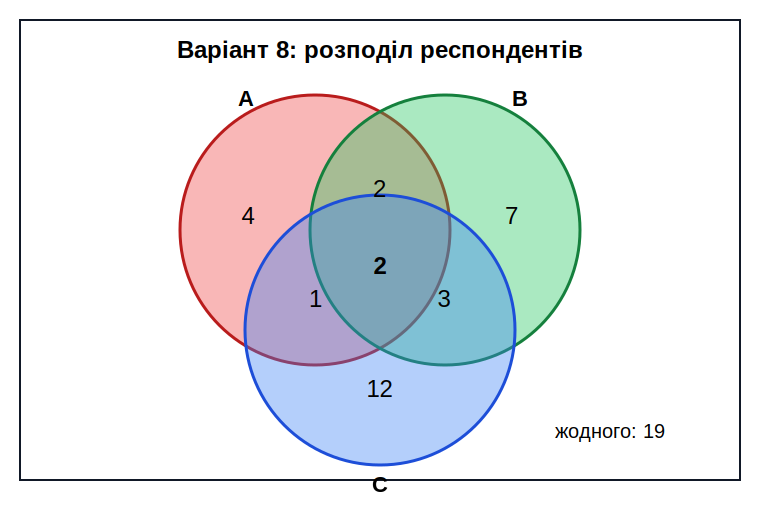

<div align="center">

# Вінницький національний технічний університет

Факультет інтелектуальних інформаційних технологій та автоматизації

<br><br><br><br><br><br><br><br>

## Звіт до лабораторної роботи №1

**«Множини. Основні поняття та операції над множинами»**

<br><br>

**Курс:** 1  
**Група:** 4КН-25б  
**Варіант лабораторної роботи:** №8  
**Практичний варіант для перевірки:** №29  

</div>

<br><br><br><br><br>

<div align="right">

**Виконав:** Саволюк Микола Миколайович  

**Викладач:** Шевчук Олександр Федорович

</div>

<br><br>

<div align="center">

**Рік:** 2026

</div>

<div style="page-break-after: always;"></div>

## Мета роботи

Набути навичок реалізації основних операцій над множинами мовою програмування Python.

## Короткі теоретичні відомості

Множина — це сукупність різних елементів. У Python множини реалізуються типом `set`, який зберігає тільки унікальні елементи. Елементи множини мають бути незмінними типами даних, наприклад числами, рядками або кортежами.

Для множин використовуються такі основні операції:

| Операція | Позначення | Python |
| -------- | ---------- | ------ |
| Об'єднання | `A ∪ B` | `A | B`, `A.union(B)` |
| Перетин | `A ∩ B` | `A & B`, `A.intersection(B)` |
| Різниця | `A \ B` | `A - B`, `A.difference(B)` |
| Симетрична різниця | `A Δ B` | `A ^ B`, `A.symmetric_difference(B)` |
| Доповнення до універсальної множини | `Ā` | `U - A` |
| Перевірка підмножини | `A ⊆ B` | `A <= B`, `A.issubset(B)` |
| Перевірка надмножини | `A ⊇ B` | `A >= B`, `A.issuperset(B)` |

У цій роботі для обчислень використано Python 3.14.4. Повний скрипт збережено у файлі `lab1_sets.py`, а результат виконання — у файлі `lab1_results.txt`.

---

## Завдання 1

За умовою потрібно задати універсальну множину `U`, яка містить 10 довільних елементів. Оскільки мій лабораторний варіант №8 є парним, елементами універсальної множини обрано літери алфавіту.

Для формування множин використано такі параметри:

- `n = 6`, оскільки ім'я **Микола** містить 6 літер;
- `m = 4`, оскільки номер групи — 4;
- `k = 2`, оскільки номер підгрупи — 2.

Тому:

```
|A| = n = 6
|B| = m = 4
|C| = n - k = 6 - 2 = 4
|D| = 5
```

Було задано такі множини:

```
U = {a, b, c, d, e, f, g, h, i, j}
A = {a, b, c, f, g, i}
B = {b, d, g, j}
C = {a, e, g, h}
D = {c, d, e, i, j}
```

Для варіанта №8 з таблиці Л1.1 потрібно обчислити:

```
X = ((A ∩ B) ∪ C) ∪ D
```

### Обчислення вручну

Спочатку знаходжу перетин множин `A` і `B`:

```
A ∩ B = {b, g}
```

Далі об'єдную отриману множину з `C`:

```
(A ∩ B) ∪ C = {b, g} ∪ {a, e, g, h}
```

```
(A ∩ B) ∪ C = {a, b, e, g, h}
```

Після цього об'єдную результат із множиною `D`:

```
X = {a, b, e, g, h} ∪ {c, d, e, i, j}
```

```
X = {a, b, c, d, e, g, h, i, j}
```

### Перевірка в Python

```python
U = set("abcdefghij")
A = {"a", "b", "c", "f", "g", "i"}
B = {"b", "d", "g", "j"}
C = {"a", "e", "g", "h"}
D = {"c", "d", "e", "i", "j"}

X = ((A & B) | C) | D
print(X)
```

Результат:

```
X = {a, b, c, d, e, g, h, i, j}
```

---

## Завдання 2

За умовою лабораторної роботи потрібно за допомогою Python перевірити виконання індивідуального практичного завдання №1. Згідно з локальним файлом варіантів практичних робіт для задачі 1 задано варіант №29.

У таблиці практичного завдання після варіанта №28 є друкарська помилка в нумерації: наступний рядок знову підписано як №27. За послідовністю таблиці цей рядок відповідає варіанту №29, тому використано вираз:

```
X = (A ∪ B) ∪ (C̄ ∩ D̄)
```

Вхідні множини з практичного завдання №1:

```
U = {1, 2, 3, 4, 5, 6, 7, 8, 9, 10, 11, 12, 13, 14}
A = {1, 2, 3, 4, 7, 9}
B = {3, 4, 5, 6, 11, 12, 13}
C = {2, 3, 4, 7, 8, 12, 13, 14}
D = {1, 7, 14}
```

### Обчислення вручну

Спочатку знаходжу об'єднання множин `A` і `B`:

```
A ∪ B = {1, 2, 3, 4, 5, 6, 7, 9, 11, 12, 13}
```

Знаходжу доповнення множини `C` до універсальної множини:

```
C̄ = U \ C = {1, 5, 6, 9, 10, 11}
```

Знаходжу доповнення множини `D`:

```
D̄ = U \ D = {2, 3, 4, 5, 6, 8, 9, 10, 11, 12, 13}
```

Тепер знаходжу перетин доповнень:

```
C̄ ∩ D̄ = {5, 6, 9, 10, 11}
```

Остаточно:

```
X = (A ∪ B) ∪ (C̄ ∩ D̄)
```

```
X = {1, 2, 3, 4, 5, 6, 7, 9, 11, 12, 13} ∪ {5, 6, 9, 10, 11}
```

```
X = {1, 2, 3, 4, 5, 6, 7, 9, 10, 11, 12, 13}
```

### Перевірка в Python

```python
U = set(range(1, 15))
A = {1, 2, 3, 4, 7, 9}
B = {3, 4, 5, 6, 11, 12, 13}
C = {2, 3, 4, 7, 8, 12, 13, 14}
D = {1, 7, 14}

X = (A | B) | ((U - C) & (U - D))
print(X)
```

Результат:

```
X = {1, 2, 3, 4, 5, 6, 7, 9, 10, 11, 12, 13}
```

---

## Завдання 3

Потрібно за допомогою діаграми Венна розв'язати задачу про використання трьох мобільних додатків:

- `A` — додаток для навчання мов;
- `B` — додаток для фізичних вправ;
- `C` — додаток для фінансового планування.

Для варіанта №8 з таблиці Л1.2 задано:

| Параметр | Значення |
| -------- | -------: |
| `n1`, потужність `A` | 9 |
| `n2`, потужність `B` | 14 |
| `n3`, потужність `C` | 18 |
| `n12`, потужність `A ∩ B` | 4 |
| `n13`, потужність `A ∩ C` | 3 |
| `n23`, потужність `B ∩ C` | 5 |
| `n123`, потужність `A ∩ B ∩ C` | 2 |
| `n`, загальна кількість респондентів | 50 |

### Обчислення областей діаграми Венна

Кількість респондентів, які використовують тільки додаток `A`:

```
|A only| = n1 - n12 - n13 + n123
```

```
|A only| = 9 - 4 - 3 + 2 = 4
```

Тільки додаток `B`:

```
|B only| = n2 - n12 - n23 + n123
```

```
|B only| = 14 - 4 - 5 + 2 = 7
```

Тільки додаток `C`:

```
|C only| = n3 - n13 - n23 + n123
```

```
|C only| = 18 - 3 - 5 + 2 = 12
```

Попарні перетини без третьої множини:

```
|A ∩ B only| = n12 - n123 = 4 - 2 = 2
```

```
|A ∩ C only| = n13 - n123 = 3 - 2 = 1
```

```
|B ∩ C only| = n23 - n123 = 5 - 2 = 3
```

Перетин усіх трьох множин:

```
|A ∩ B ∩ C| = 2
```

Кількість респондентів, які використовують принаймні один із додатків:

```
|A ∪ B ∪ C| = n1 + n2 + n3 - n12 - n13 - n23 + n123
```

```
|A ∪ B ∪ C| = 9 + 14 + 18 - 4 - 3 - 5 + 2 = 31
```

Кількість респондентів, які використовують лише один конкретний додаток:

```
4 + 7 + 12 = 23
```

Кількість респондентів, які не користуються жодним із указаних додатків:

```
50 - 31 = 19
```

### Діаграма Венна



---

## Результати виконання програми

Після запуску скрипта `lab1_sets.py` отримано такі основні результати:

| Частина роботи | Результат |
| -------------- | --------- |
| Завдання 1 | `X = {a, b, c, d, e, g, h, i, j}` |
| Завдання 2 | `X = {1, 2, 3, 4, 5, 6, 7, 9, 10, 11, 12, 13}` |
| Завдання 3, принаймні один додаток | `31` |
| Завдання 3, лише один додаток | `23` |
| Завдання 3, жодного додатка | `19` |

---

## Аналіз результатів

У першому завданні було створено універсальну множину з 10 літер і чотири множини `A`, `B`, `C`, `D` заданої потужності. Обчислення виразу `((A ∩ B) ∪ C) ∪ D` вручну збіглося з результатом, отриманим у Python.

У другому завданні виконано перевірку практичного варіанта №29. Для доповнень множин використано універсальну множину `U`, тобто `C̄ = U \ C` і `D̄ = U \ D`. Після обчислення виразу `(A ∪ B) ∪ (C̄ ∩ D̄)` отримано множину з 12 елементів.

У третьому завданні застосовано принцип включення-виключення для трьох множин. Результати показали, що з 50 опитаних 31 респондент використовує принаймні один із трьох додатків, 23 респонденти використовують тільки один конкретний додаток, а 19 респондентів не використовують жодного з указаних додатків.

---

## Висновок

У цій лабораторній роботі я опрацював основні операції над множинами та реалізував їх мовою Python. Було створено множини потрібної потужності, виконано операції перетину, об'єднання, доповнення та різниці, а також перевірено результат ручним обчисленням.

Для лабораторного варіанта №8 отримано:

```
X = {a, b, c, d, e, g, h, i, j}
```

Для практичного варіанта №29 отримано:

```
X = {1, 2, 3, 4, 5, 6, 7, 9, 10, 11, 12, 13}
```

Для задачі з діаграмою Венна встановлено, що `31` респондент використовує принаймні один додаток, `23` респонденти використовують тільки один конкретний додаток, а `19` респондентів не використовують жодного з наведених додатків.

---

## Відповіді на контрольні запитання

### 1. Як створити множину в Python? Наведіть приклади.

Множину в Python можна створити за допомогою фігурних дужок або функції `set()`:

```python
A = {1, 2, 3}
B = set([1, 2, 3])
```

Порожню множину створюють тільки через `set()`, бо `{}` створює словник.

### 2. Чим відрізняються методи `add()` і `update()` при роботі з множинами?

Метод `add()` додає до множини один елемент:

```python
A.add(4)
```

Метод `update()` додає одразу кілька елементів з іншого ітерабельного об'єкта:

```python
A.update([4, 5, 6])
```

### 3. Як перевірити, чи є один набір елементів підмножиною або надмножиною іншого?

Для перевірки підмножини використовують оператор `<=` або метод `issubset()`:

```python
A <= B
A.issubset(B)
```

Для перевірки надмножини використовують `>=` або `issuperset()`:

```python
B >= A
B.issuperset(A)
```

### 4. Які функції або методи використовуються для видалення елементів із множини?

Для видалення елементів використовують `remove()`, `discard()`, `pop()` і `clear()`. Метод `remove()` викликає помилку, якщо елемента немає, а `discard()` просто нічого не змінює.

### 5. Що станеться, якщо спробувати додати до множини елемент, який уже існує?

Якщо додати елемент, який уже є в множині, множина не зміниться. Помилки не буде, бо множина зберігає тільки унікальні елементи.

### 6. Чи можна використовувати списки або інші змінні типи даних як елементи множини?

Ні, списки не можна використовувати як елементи множини, бо вони є змінними та нехешованими. Як елементи множини можна використовувати незмінні типи, наприклад числа, рядки або кортежі.

### 7. Як знайти кількість елементів у множині? Яка функція для цього використовується?

Кількість елементів у множині знаходять за допомогою функції `len()`:

```python
len(A)
```

### 8. Як реалізувати перевірку наявності елемента в множині?

Для перевірки належності елемента множині використовують оператор `in`:

```python
if 3 in A:
    print("Елемент є в множині")
```

### 9. Що таке порожня множина, і як її створити в Python?

Порожня множина — це множина, яка не містить жодного елемента. У Python її створюють так:

```python
empty_set = set()
```

### 10. Як можна використати множини для виявлення унікальних елементів у списку?

Щоб отримати унікальні елементи списку, можна перетворити список на множину:

```python
items = [1, 2, 2, 3, 3, 3]
unique_items = set(items)
```

У результаті буде `{1, 2, 3}`.

### 11. Які переваги множин у Python порівняно з іншими структурами даних?

Множини автоматично прибирають дублікати, швидко перевіряють наявність елемента та зручно підтримують математичні операції над множинами: об'єднання, перетин, різницю й симетричну різницю.

### 12. Чим множини відрізняються від списків і словників у Python?

Множина зберігає унікальні неупорядковані елементи. Список зберігає елементи у визначеному порядку й допускає дублікати. Словник зберігає пари `ключ: значення`, а не просто окремі елементи.

### 13. Як множини можна застосовувати для розв'язання реальних задач?

Множини можна використовувати для пошуку спільних або відмінних елементів у наборах даних, видалення дублікатів, аналізу опитувань, перевірки доступів користувачів, порівняння списків і побудови логіки на основі діаграм Венна.
