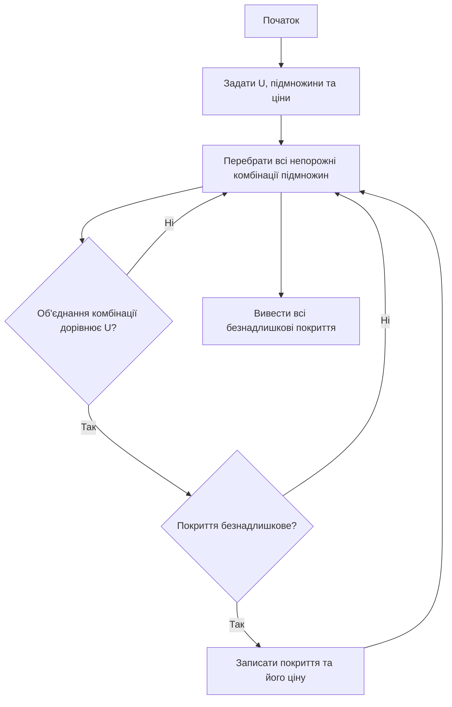
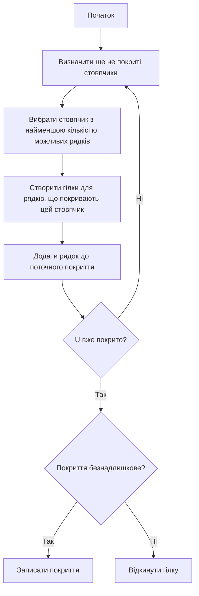
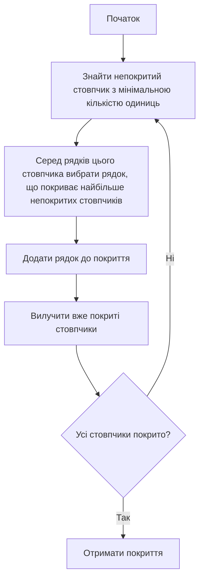
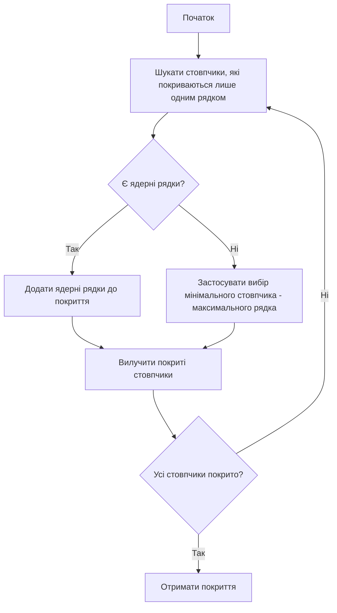

<div align="center">

# Вінницький національний технічний університет

Факультет інтелектуальних інформаційних технологій та автоматизації

<br><br><br><br><br><br><br><br>

## Звіт до лабораторної роботи №2

**«Задача про покриття. Основні методи розв'язання задачі про покриття на множинах»**

<br><br>

**Курс:** 1  
**Група:** 4КН-25б  
**Варіант:** №4  

</div>

<br><br><br><br><br>

<div align="right">

**Виконав:** Саволюк Микола Миколайович  

**Викладач:** Шевчук Олександр Федорович

</div>

<br><br>

<div align="center">

**Рік:** 2026

</div>

<div style="page-break-after: always;"></div>

## Мета роботи

Набути практичних навичок реалізації основних методів розв'язання задачі про покриття на множинах за допомогою мови програмування Python.

## Короткі теоретичні відомості

Задача про покриття полягає в тому, щоб з набору підмножин `A1, A2, ..., Am` вибрати такі підмножини, об'єднання яких дорівнює універсальній множині `U`.

Покриттям множини `U` називається набір підмножин:

```
A_{i1} ∪ A_{i2} ∪ ... ∪ A_{ik} = U
```

Покриття називається безнадлишковим, якщо з нього не можна вилучити жодну підмножину без втрати властивості покривати `U`. Тобто для кожної підмножини з покриття її видалення робить об'єднання неповним.

Ціна покриття визначається як сума цін підмножин, що входять до нього:

```
C = a_{i1} + a_{i2} + ... + a_{ik}
```

У роботі використано такі методи:

- метод повного перебору;
- метод граничного перебору;
- метод мінімального стовпчика - максимального рядка;
- метод ядерних рядків.

Повний код програми збережено у файлі `lab2_covering.py`, а результати виконання — у файлі `lab2_results.txt`.

---

## Вхідні дані варіанта №4

Для варіанта №4 з таблиці `B4` маємо універсальну множину:

```
U = {1, 2, 3, 4, 5, 6, 7, 8, 9}
```

Таблиця покриття:

| Підмножина | 1 | 2 | 3 | 4 | 5 | 6 | 7 | 8 | 9 | Ціна |
| --- | --- | --- | --- | --- | --- | --- | --- | --- | --- | ---: |
| A | 1 | 1 |  |  |  | 1 |  |  |  | 1 |
| B |  | 1 | 1 | 1 | 1 |  |  |  |  | 2 |
| C |  |  |  |  |  | 1 | 1 | 1 |  | 1 |
| D |  | 1 | 1 |  |  |  | 1 |  | 1 | 3 |
| E | 1 |  | 1 | 1 |  |  |  |  |  | 2 |
| F | 1 |  |  | 1 | 1 | 1 |  | 1 |  | 3 |
| G |  |  |  |  | 1 |  |  | 1 | 1 | 1 |
| H | 1 |  |  |  |  | 1 |  |  |  | 1 |

У вигляді множин:

```
A = {1, 2, 6},       a(A) = 1
B = {2, 3, 4, 5},    a(B) = 2
C = {6, 7, 8},       a(C) = 1
D = {2, 3, 7, 9},    a(D) = 3
E = {1, 3, 4},       a(E) = 2
F = {1, 4, 5, 6, 8}, a(F) = 3
G = {5, 8, 9},       a(G) = 1
H = {1, 6},          a(H) = 1
```

---

## Схеми алгоритмів

### Метод повного перебору



### Метод граничного перебору



### Метод мінімального стовпчика - максимального рядка



### Метод ядерних рядків



---

## Програмна реалізація

Для роботи було створено Python-скрипт. Основні фрагменти програми:

```python
UNIVERSE = set(range(1, 10))
SETS = {
    "A": {1, 2, 6},
    "B": {2, 3, 4, 5},
    "C": {6, 7, 8},
    "D": {2, 3, 7, 9},
    "E": {1, 3, 4},
    "F": {1, 4, 5, 6, 8},
    "G": {5, 8, 9},
    "H": {1, 6},
}
COSTS = {"A": 1, "B": 2, "C": 1, "D": 3, "E": 2, "F": 3, "G": 1, "H": 1}
```

Функція перевірки покриття:

```python
def is_cover(names):
    return union_of(names) == UNIVERSE
```

Функція перевірки безнадлишковості:

```python
def is_irredundant(names):
    if not is_cover(names):
        return False
    return all(not is_cover([item for item in names if item != name]) for name in names)
```

---

## Метод повного перебору

У методі повного перебору програма аналізує всі непорожні комбінації з 8 підмножин. Загальна кількість таких комбінацій:

```
2^8 - 1 = 255
```

Для кожної комбінації перевіряється:

1. чи дорівнює об'єднання підмножин універсальній множині `U`;
2. чи є покриття безнадлишковим;
3. яка ціна покриття.

Отримано такі безнадлишкові покриття:

| № | Покриття | Ціна |
| -: | -------- | ---: |
| 1 | `D ∪ F` | 6 |
| 2 | `A ∪ B ∪ C ∪ D` | 7 |
| 3 | `A ∪ B ∪ C ∪ G` | 5 |
| 4 | `A ∪ B ∪ D ∪ G` | 7 |
| 5 | `A ∪ C ∪ E ∪ G` | 5 |
| 6 | `A ∪ D ∪ E ∪ G` | 7 |
| 7 | `B ∪ C ∪ D ∪ E` | 8 |
| 8 | `B ∪ C ∪ D ∪ H` | 7 |
| 9 | `B ∪ C ∪ E ∪ G` | 6 |
| 10 | `B ∪ C ∪ F ∪ G` | 7 |
| 11 | `B ∪ C ∪ G ∪ H` | 5 |
| 12 | `B ∪ D ∪ G ∪ H` | 7 |
| 13 | `C ∪ D ∪ E ∪ G` | 7 |
| 14 | `D ∪ E ∪ G ∪ H` | 7 |

Отже, методом повного перебору знайдено `14` безнадлишкових покриттів.

---

## Метод граничного перебору

Для парного варіанта за методичкою потрібно розробити алгоритм і програму побудови безнадлишкових покриттів методом граничного перебору.

У реалізованому алгоритмі використано таку ідею:

- на кожному кроці береться ще не покритий стовпчик з найменшою кількістю можливих рядків;
- для рядків, які покривають цей стовпчик, будуються гілки перебору;
- якщо поточна гілка вже містить відоме покриття як підмножину, вона відкидається;
- після покриття всього `U` перевіряється безнадлишковість.

Результати граничного перебору збігаються з результатами повного перебору:

| № | Покриття | Ціна |
| -: | -------- | ---: |
| 1 | `D ∪ F` | 6 |
| 2 | `A ∪ B ∪ C ∪ G` | 5 |
| 3 | `A ∪ C ∪ E ∪ G` | 5 |
| 4 | `B ∪ C ∪ G ∪ H` | 5 |
| 5 | `B ∪ C ∪ E ∪ G` | 6 |
| 6 | `A ∪ B ∪ C ∪ D` | 7 |
| 7 | `A ∪ B ∪ D ∪ G` | 7 |
| 8 | `A ∪ D ∪ E ∪ G` | 7 |
| 9 | `B ∪ C ∪ D ∪ H` | 7 |
| 10 | `B ∪ C ∪ F ∪ G` | 7 |
| 11 | `B ∪ D ∪ G ∪ H` | 7 |
| 12 | `C ∪ D ∪ E ∪ G` | 7 |
| 13 | `D ∪ E ∪ G ∪ H` | 7 |
| 14 | `B ∪ C ∪ D ∪ E` | 8 |

Таким чином, метод граничного перебору також знайшов `14` безнадлишкових покриттів, але робить це через послідовне звуження простору пошуку.

---

## Побудова найкоротшого покриття

Найкоротшим покриттям вважаю покриття з мінімальною кількістю підмножин. Повний перебір показав, що найкоротше покриття має потужність `2`:

```
D ∪ F
```

Перевірка:

```
D = {2, 3, 7, 9}
```

```
F = {1, 4, 5, 6, 8}
```

Об'єднання:

```
D ∪ F = {1, 2, 3, 4, 5, 6, 7, 8, 9} = U
```

Ціна:

```
a(D ∪ F) = a(D) + a(F) = 3 + 3 = 6
```

Покриття є безнадлишковим, оскільки окремо `D` не покриває елементи `{1, 4, 5, 6, 8}`, а окремо `F` не покриває елементи `{2, 3, 7, 9}`.

### Метод мінімального стовпчика - максимального рядка

Підраховую кількість одиниць у стовпчиках:

| Стовпчик | Рядки, що його покривають | Кількість |
| -------- | ------------------------- | --------: |
| 1 | `A, E, F, H` | 4 |
| 2 | `A, B, D` | 3 |
| 3 | `B, D, E` | 3 |
| 4 | `B, E, F` | 3 |
| 5 | `B, F, G` | 3 |
| 6 | `A, C, F, H` | 4 |
| 7 | `C, D` | 2 |
| 8 | `C, F, G` | 3 |
| 9 | `D, G` | 2 |

Найменшу кількість одиниць мають стовпчики `7` і `9`. Обираю стовпчик `7`. Його покривають рядки `C` і `D`:

```
C = {6, 7, 8}
D = {2, 3, 7, 9}
```

Рядок `D` покриває більше ще не покритих елементів, тому обираю:

```
D
```

Після цього непокритими залишаються:

```
U \ D = {1, 4, 5, 6, 8}
```

Для стовпчика `4` серед можливих рядків `B`, `E`, `F` найбільше непокритих елементів покриває рядок `F`:

```
F = {1, 4, 5, 6, 8}
```

Отже:

```
D ∪ F = U
```

Результат методу:

```
D ∪ F, ціна = 6
```

### Метод ядерних рядків

Ядерний рядок виникає тоді, коли деякий стовпчик покривається тільки одним рядком. Для початкової таблиці варіанта `B4` таких стовпчиків немає: кожен елемент універсальної множини входить щонайменше до двох рядків.

Тому програма переходить до допоміжного вибору за правилом мінімального стовпчика:

1. Для стовпчика `7` обрано рядок `D`, бо він покриває найбільше непокритих елементів.
2. Після цього для решти елементів обрано рядок `F`.

Отже, метод ядерних рядків для цього варіанта також дає:

```
D ∪ F, ціна = 6
```

---

## Результати виконання програми

Після запуску скрипта `lab2_covering.py` отримано:

| Показник | Значення |
| -------- | -------- |
| Кількість безнадлишкових покриттів методом повного перебору | `14` |
| Кількість безнадлишкових покриттів методом граничного перебору | `14` |
| Найкоротше покриття | `D ∪ F` |
| Потужність найкоротшого покриття | `2` |
| Ціна найкоротшого покриття | `6` |
| Результат методу мінімального стовпчика - максимального рядка | `D ∪ F` |
| Результат методу ядерних рядків | `D ∪ F` |

---

## Аналіз результатів

Метод повного перебору дав повний список усіх безнадлишкових покриттів, однак для цього довелося перевірити всі `255` непорожніх комбінацій підмножин. Для невеликої задачі це прийнятно, але при збільшенні кількості рядків обсяг перебору швидко зростає.

Метод граничного перебору дав той самий набір безнадлишкових покриттів, але пошук був організований раціональніше: спочатку розглядалися найбільш обмежені стовпчики, а зайві гілки відкидалися.

Для побудови найкоротшого покриття обидва застосовані методи дали однаковий результат:

```
D ∪ F
```

Це покриття складається лише з двох підмножин і повністю покриває універсальну множину `U`. Його ціна дорівнює `6`.

---

## Висновок

У лабораторній роботі було досліджено задачу про покриття на множинах для варіанта №4. Я реалізував метод повного перебору, метод граничного перебору, метод мінімального стовпчика - максимального рядка та метод ядерних рядків.

Методами повного та граничного перебору знайдено `14` безнадлишкових покриттів. Найкоротшим покриттям є:

```
D ∪ F
```

Його ціна:

```
6
```

Результати ручного аналізу збіглися з результатами виконання Python-програми, тому реалізацію можна вважати коректною для заданого варіанта.

---

## Відповіді на контрольні запитання

### 1. Що таке задача про покриття, та які її основні приклади технічного застосування?

Задача про покриття полягає у виборі набору підмножин, об'єднання яких покриває всю універсальну множину. Приклади застосування: розміщення датчиків, вибір маршрутів, планування покриття мережі, тестування програмного забезпечення, вибір обладнання або ресурсів для виконання набору вимог.

### 2. Яке покриття називається безнадлишковим, та яка умова використовується для перевірки безнадлишковості?

Безнадлишковим називається покриття, з якого не можна вилучити жодну підмножину без втрати повного покриття `U`. Умова перевірки: для кожного рядка з покриття об'єднання решти рядків уже не повинно дорівнювати `U`.

### 3. Дайте визначення мінімального та найкоротшого покриття.

Мінімальне покриття за ціною — це покриття з найменшою сумарною ціною рядків. Найкоротше покриття — це покриття з найменшою кількістю підмножин.

### 4. Розкрийте зміст алгоритму граничного перебору.

Алгоритм граничного перебору будує покриття не шляхом сліпого аналізу всіх комбінацій, а через послідовне розгалуження за найбільш обмеженими елементами. На кожному кроці обирається непокритий стовпчик, для нього розглядаються можливі рядки, а гілки, які вже не можуть дати новий корисний результат, відкидаються.

### 5. Який ваш критерій завершення перебору?

Перебір завершується тоді, коли всі можливі гілки розглянуто або відкинуто. Для окремої гілки завершення настає, коли об'єднання вибраних підмножин дорівнює `U`; після цього перевіряється безнадлишковість покриття.

### 6. Проведіть порівняльний аналіз методів повного і граничного переборів.

Метод повного перебору простий і гарантує знаходження всіх покриттів, але аналізує всі комбінації. Метод граничного перебору також може знаходити всі потрібні покриття, але робить це раціональніше: вибирає проблемні стовпчики, обмежує гілки пошуку й не витрачає час на очевидно надлишкові напрямки.

### 7. Скільки підмножин аналізується в методі повного перебору?

Якщо задано `m` підмножин, то метод повного перебору аналізує всі непорожні комбінації:

```
2^m - 1
```

У цій роботі `m = 8`, тому:

```
2^8 - 1 = 255
```

### 8. Як у вашому алгоритмі вирішується задача повторів?

Повтори усуваються за рахунок нормалізації покриття: кожне покриття зберігається як впорядкований набір назв рядків. Крім того, якщо поточна гілка вже містить знайдене покриття як підмножину, вона не розглядається далі.

### 9. Розкрийте суть методу мінімального стовпчика - максимального рядка.

Спочатку обирається непокритий стовпчик з мінімальною кількістю одиниць. Потім серед рядків, які покривають цей стовпчик, обирається рядок, що покриває найбільшу кількість ще не покритих стовпчиків. Процес повторюється, доки вся універсальна множина не буде покрита.

### 10. В чому зміст методу ядерних рядків?

Метод ядерних рядків шукає стовпчики, які можуть бути покриті тільки одним рядком. Такий рядок обов'язково має входити до покриття, тому його називають ядерним. Після додавання ядерного рядка покриті стовпчики вилучаються, і процедура повторюється.

### 11. Який рядок називають антиядерним?

Антиядерним називають рядок, який не є необхідним для покриття, бо всі його елементи можуть бути покриті іншими рядками, часто ще й з меншою або рівною ціною. Такий рядок можна не включати до оптимального покриття.
