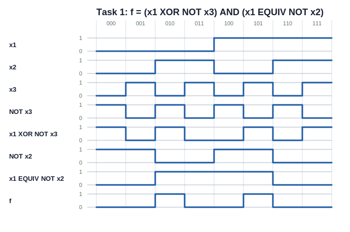
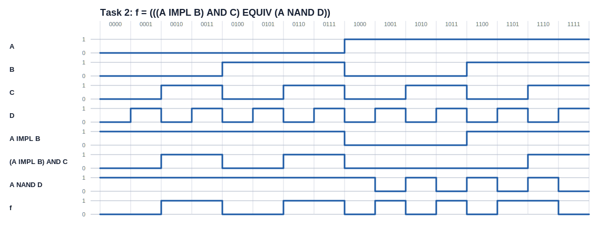

<div align="center">

# Вінницький національний технічний університет

Факультет інтелектуальних інформаційних технологій та автоматизації

<br><br><br><br><br><br><br><br>

## Звіт до лабораторної роботи №3

**«Булеві функції. Реалізація функцій алгебри логіки в середовищі програмування»**

<br><br>

**Курс:** 1  
**Група:** 4КН-25б  
**Варіант:** №7  
**Практичний варіант для завдання №2:** №24  

</div>

<br><br><br><br><br>

<div align="right">

**Виконав:** Саволюк Микола Миколайович  

**Викладач:** Шевчук Олександр Федорович

</div>

<br><br>

<div align="center">

**Рік:** 2026

</div>

<div style="page-break-after: always;"></div>

## Мета роботи

Набути практичних навичок побудови функцій алгебри логіки мовою програмування Python з використанням бібліотеки NumPy.

## Короткі теоретичні відомості

Булева функція — це функція, аргументи й значення якої належать множині `{0, 1}`. У лабораторній роботі булеві значення подано як логічні масиви NumPy, а операції над ними виконано поелементно.

Основні операції, використані в роботі:

| Позначення | Назва операції | Реалізація в Python/NumPy |
| --- | --- | --- |
| `¬A` | заперечення | `np.logical_not(A)` |
| `A ∧ B` | кон'юнкція | `np.logical_and(A, B)` |
| `A ∨ B` | диз'юнкція | `np.logical_or(A, B)` |
| `A ⊕ B` | виключне АБО | `np.logical_xor(A, B)` |
| `A ~ B` | рівнозначність | `np.equal(A, B)` |
| `A → B` | імплікація | `np.logical_or(np.logical_not(A), B)` |
| `A | B` | штрих Шеффера, NAND | `np.logical_not(np.logical_and(A, B))` |

Повний код обчислень і побудови часових діаграм збережено у файлі `lab3_boolean.py`. Результати виконання програми збережено у файлі `lab3_results.txt`.

---

## Завдання 1

Для варіанта №7 з таблиці Л3.2 задано функцію:

```
f = (x1 ⊕ ¬x3) · (x1 ~ ¬x2)
```

Потрібно покроково виконати логічні операції над трьома булевими змінними `x1`, `x2`, `x3`, побудувати часові діаграми та перевірити результат вручну.

### Покрокове виконання

Задаю всі набори значень трьох змінних у порядку від `000` до `111`:

| № | x1 | x2 | x3 |
| --- | --- | --- | --- |
| 0 | 0 | 0 | 0 |
| 1 | 0 | 0 | 1 |
| 2 | 0 | 1 | 0 |
| 3 | 0 | 1 | 1 |
| 4 | 1 | 0 | 0 |
| 5 | 1 | 0 | 1 |
| 6 | 1 | 1 | 0 |
| 7 | 1 | 1 | 1 |

У програмі послідовність дій має вигляд:

```python
not_x3 = np.logical_not(x3)
xor_part = np.logical_xor(x1, not_x3)
not_x2 = np.logical_not(x2)
eq_part = np.equal(x1, not_x2)
f = np.logical_and(xor_part, eq_part)
```

Отже, обчислюю такі проміжні значення:

| i | x1 | x2 | x3 | ¬x3 | x1 ⊕ ¬x3 | ¬x2 | x1 ~ ¬x2 | f |
| --- | --- | --- | --- | --- | --- | --- | --- | --- |
| 0 | 0 | 0 | 0 | 1 | 1 | 1 | 0 | 0 |
| 1 | 0 | 0 | 1 | 0 | 0 | 1 | 0 | 0 |
| 2 | 0 | 1 | 0 | 1 | 1 | 0 | 1 | 1 |
| 3 | 0 | 1 | 1 | 0 | 0 | 0 | 1 | 0 |
| 4 | 1 | 0 | 0 | 1 | 0 | 1 | 1 | 0 |
| 5 | 1 | 0 | 1 | 0 | 1 | 1 | 1 | 1 |
| 6 | 1 | 1 | 0 | 1 | 0 | 0 | 0 | 0 |
| 7 | 1 | 1 | 1 | 0 | 1 | 0 | 0 | 0 |

Вектор значень кінцевої функції:

```
f = [0, 0, 1, 0, 0, 1, 0, 0]
```

### Ручна перевірка

Функція дорівнює одиниці тільки тоді, коли обидві частини добутку дорівнюють одиниці:

```
(x1 ⊕ ¬x3) = 1
(x1 ~ ¬x2) = 1
```

Для набору `010`: `¬x3 = 1`, тому `x1 ⊕ ¬x3 = 0 ⊕ 1 = 1`; також `¬x2 = 0`, тому `x1 ~ ¬x2 = 0 ~ 0 = 1`. Отже, `f = 1`.

Для набору `101`: `¬x3 = 0`, тому `x1 ⊕ ¬x3 = 1 ⊕ 0 = 1`; також `¬x2 = 1`, тому `x1 ~ ¬x2 = 1 ~ 1 = 1`. Отже, `f = 1`.

В усіх інших наборах хоча б один із множників дорівнює нулю, тому `f = 0`. Ручна перевірка збігається з результатом NumPy.

### Часова діаграма



---

## Завдання 2

У другому завданні потрібно перевірити за допомогою NumPy ручний розв'язок індивідуального практичного завдання №5 для булевої функції чотирьох змінних `A`, `B`, `C`, `D`.

Для практичного варіанта №24 з таблиці 5.1 задано:

```
f = (A → B) ∧ C ~ A | D
```

За прийнятою пріоритетністю операцій і структурою запису в таблиці читаю цю формулу як:

```
f = ((A → B) ∧ C) ~ (A | D)
```

де `A | D` — штрих Шеффера, тобто:

```
A | D = ¬(A ∧ D)
```

### Покрокове виконання

Послідовно обчислюю:

```python
impl_part = np.logical_or(np.logical_not(A), B)
and_part = np.logical_and(impl_part, C)
nand_part = np.logical_not(np.logical_and(A, D))
f = np.equal(and_part, nand_part)
```

Повна таблиця істинності:

| i | A | B | C | D | A → B | (A → B) ∧ C | A \| D | f |
| --- | --- | --- | --- | --- | --- | --- | --- | --- |
| 0 | 0 | 0 | 0 | 0 | 1 | 0 | 1 | 0 |
| 1 | 0 | 0 | 0 | 1 | 1 | 0 | 1 | 0 |
| 2 | 0 | 0 | 1 | 0 | 1 | 1 | 1 | 1 |
| 3 | 0 | 0 | 1 | 1 | 1 | 1 | 1 | 1 |
| 4 | 0 | 1 | 0 | 0 | 1 | 0 | 1 | 0 |
| 5 | 0 | 1 | 0 | 1 | 1 | 0 | 1 | 0 |
| 6 | 0 | 1 | 1 | 0 | 1 | 1 | 1 | 1 |
| 7 | 0 | 1 | 1 | 1 | 1 | 1 | 1 | 1 |
| 8 | 1 | 0 | 0 | 0 | 0 | 0 | 1 | 0 |
| 9 | 1 | 0 | 0 | 1 | 0 | 0 | 0 | 1 |
| 10 | 1 | 0 | 1 | 0 | 0 | 0 | 1 | 0 |
| 11 | 1 | 0 | 1 | 1 | 0 | 0 | 0 | 1 |
| 12 | 1 | 1 | 0 | 0 | 1 | 0 | 1 | 0 |
| 13 | 1 | 1 | 0 | 1 | 1 | 0 | 0 | 1 |
| 14 | 1 | 1 | 1 | 0 | 1 | 1 | 1 | 1 |
| 15 | 1 | 1 | 1 | 1 | 1 | 1 | 0 | 0 |

Вектор значень кінцевої функції:

```
f = [0, 0, 1, 1, 0, 0, 1, 1, 0, 1, 0, 1, 0, 1, 1, 0]
```

### Перевірка результату

Імплікація `A → B` дорівнює нулю лише тоді, коли `A = 1`, а `B = 0`. Штрих Шеффера `A | D` дорівнює нулю лише тоді, коли `A = 1` і `D = 1`. Кінцева операція `~` є рівнозначністю, тому функція `f` дорівнює одиниці саме в тих рядках, де проміжні значення `(A → B) ∧ C` і `A | D` однакові. Це видно в рядках `2`, `3`, `6`, `7`, `9`, `11`, `13`, `14`.

### Часова діаграма



---

## Контрольні запитання

**1. Що таке перемикаюча функція?**  
Перемикаюча функція — це булева функція, аргументи й значення якої можуть набувати лише двох значень: `0` або `1`.

**2. На скількох наборах визначена перемикаюча функція?**  
Якщо функція має `n` аргументів, то вона визначена на `2^n` наборах значень. Для трьох аргументів це `8` наборів, для чотирьох — `16`.

**3. Які способи задання перемикаючої функції існують?**  
Перемикаючу функцію можна задати формулою, таблицею істинності, вектором значень, словесним описом, аналітичною нормальною формою, ДДНФ або ДКНФ.

**4. Яке призначення функції `plot_boolean_function` у коді? Як її використовувати для побудови графіків?**  
Функція `plot_boolean_function` будує ступінчастий графік значень булевої функції для всіх наборів аргументів. Їй передають масив значень функції, підпис і колір, після чого вона відображає значення `0` та `1` на часовій діаграмі.

**5. Що означає логічна операція XOR і як вона реалізується у Python?**  
XOR, або виключне АБО, дорівнює `1`, якщо аргументи різні, і дорівнює `0`, якщо аргументи однакові. У NumPy вона реалізується як `np.logical_xor(A, B)`.

**6. Як змінюється результат булевої функції при застосуванні операції NOT до одного з її аргументів?**  
Операція NOT інвертує значення аргументу: `0` переходить у `1`, а `1` переходить у `0`. Через це можуть змінитися проміжні та кінцеві значення функції в тих рядках таблиці істинності, де використовується інвертований аргумент.

**7. Які особливості потрібно враховувати при розширенні булевої функції до чотирьох аргументів?**  
Кількість наборів значень збільшується з `8` до `16`, тому потрібно правильно сформувати всі комбінації аргументів, зберегти порядок змінних і виконувати операції поелементно для масивів однакової довжини.

**8. Який результат роботи функції `np.logical_and` і як вона використовується для булевих функцій?**  
`np.logical_and(A, B)` повертає масив, у якому кожний елемент дорівнює `True` лише тоді, коли відповідні елементи `A` і `B` одночасно дорівнюють `True`. Для булевих функцій це реалізація кон'юнкції.

**9. Чим відрізняються логічні операції OR і XOR? Наведіть приклади.**  
OR дорівнює `1`, якщо хоча б один аргумент дорівнює `1`. XOR дорівнює `1`, якщо рівно один з аргументів дорівнює `1`. Наприклад, `1 OR 1 = 1`, але `1 XOR 1 = 0`; водночас `1 OR 0 = 1` і `1 XOR 0 = 1`.

---

## Висновок

У лабораторній роботі реалізовано булеві функції засобами Python і NumPy. Для варіанта №7 покроково обчислено функцію трьох змінних, отримано вектор `f = [0, 0, 1, 0, 0, 1, 0, 0]` і виконано ручну перевірку. Для практичного варіанта №24 перевірено функцію чотирьох змінних, отримано вектор `f = [0, 0, 1, 1, 0, 0, 1, 1, 0, 1, 0, 1, 0, 1, 1, 0]`. Для обох завдань побудовано часові діаграми.
