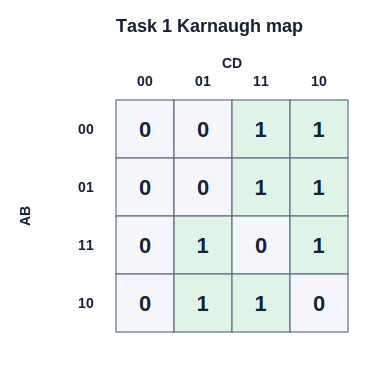
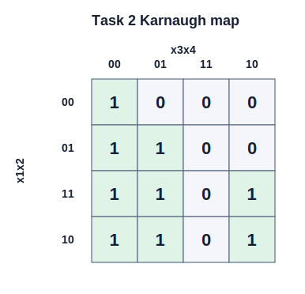
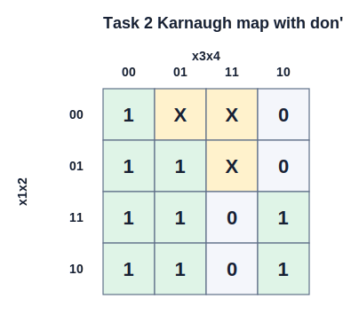

<div align="center">

# Вінницький національний технічний університет

Факультет інтелектуальних інформаційних технологій та автоматизації

<br><br><br><br><br><br><br><br>

## Звіт до лабораторної роботи №4

**«Мінімізація булевих функцій алгебри логіки за допомогою методів спрощення логічних виразів»**

<br><br>

**Курс:** 1  
**Група:** 4КН-25б  
**Варіант:** №24  

</div>

<br><br><br><br><br>

<div align="right">

**Виконав:** Саволюк Микола Миколайович  

**Викладач:** Шевчук Олександр Федорович

</div>

<br><br>

<div align="center">

**Рік:** 2026

</div>

<div style="page-break-after: always;"></div>

## Мета роботи

Набути практичних навичок мінімізації булевих функцій алгебри логіки з використанням мови програмування Python та функцій бібліотеки SymPy.

## Короткі теоретичні відомості

Мінімізація булевої функції полягає у знаходженні рівносильного логічного виразу з меншою кількістю операцій, змінних або логічних елементів. Це корисно під час проєктування цифрових схем і спрощення логічних умов у програмному коді.

У роботі використано такі функції SymPy:

| Функція | Призначення |
| --- | --- |
| `simplify_logic` | автоматично спрощує булевий вираз і може повертати результат у ДНФ або КНФ |
| `SOPform` | будує мінімізовану ДНФ за списком мінтермів |
| `POSform` | будує мінімізовану КНФ за списком мінтермів |

Мінтерм відповідає набору змінних, на якому функція дорівнює `1`. Макстерм відповідає набору, на якому функція дорівнює `0`. Неважливі терми, або don't-care терми, — це набори, для яких значення функції можна обрати як `0` або `1`, якщо це допомагає отримати простіший вираз.

Повний код виконання лабораторної роботи збережено у файлі `lab4_minimization.py`, а результати виконання — у файлі `lab4_results.txt`.

---

## Завдання 1

За таблицею 5.1 для варіанта №24 задано функцію:

```
f = (A → B) ∧ C ~ A | D
```

У таблиці `|` означає штрих Шеффера, тобто NAND. Тому формулу читаю як:

```
f = ((A → B) ∧ C) ~ (A | D)
```

де:

```
A → B = ¬A ∨ B
A | D = ¬(A ∧ D)
```

### Реалізація в Python

Для символьного задання функції використано такі конструкції SymPy:

```python
A, B, C, D = symbols("A B C D")
F = Equivalent(And(Implies(A, B), C), Not(And(A, D)))

F_dnf = simplify_logic(F, form="dnf")
F_cnf = simplify_logic(F, form="cnf")
```

### Таблиця істинності

| i | A | B | C | D | f |
| --- | --- | --- | --- | --- | --- |
| 0 | 0 | 0 | 0 | 0 | 0 |
| 1 | 0 | 0 | 0 | 1 | 0 |
| 2 | 0 | 0 | 1 | 0 | 1 |
| 3 | 0 | 0 | 1 | 1 | 1 |
| 4 | 0 | 1 | 0 | 0 | 0 |
| 5 | 0 | 1 | 0 | 1 | 0 |
| 6 | 0 | 1 | 1 | 0 | 1 |
| 7 | 0 | 1 | 1 | 1 | 1 |
| 8 | 1 | 0 | 0 | 0 | 0 |
| 9 | 1 | 0 | 0 | 1 | 1 |
| 10 | 1 | 0 | 1 | 0 | 0 |
| 11 | 1 | 0 | 1 | 1 | 1 |
| 12 | 1 | 1 | 0 | 0 | 0 |
| 13 | 1 | 1 | 0 | 1 | 1 |
| 14 | 1 | 1 | 1 | 0 | 1 |
| 15 | 1 | 1 | 1 | 1 | 0 |

Отже, функція дорівнює одиниці на наборах:

```
F = (2, 3, 6, 7, 9, 11, 13, 14)
```

### Карта Карно



За картою Карно для одиниць можна виділити такі групи:

| Група | Набори | Імпліканта |
| --- | --- | --- |
| 1 | `2, 3, 6, 7` | `C ∧ ¬A` |
| 2 | `9, 13` | `A ∧ D ∧ ¬C` |
| 3 | `6, 14` | `B ∧ C ∧ ¬D` |
| 4 | `3, 11` | `C ∧ D ∧ ¬B` |

Тому ручна мінДНФ:

```
f_minDNF = (C ∧ ¬A) ∨ (A ∧ D ∧ ¬C) ∨ (B ∧ C ∧ ¬D) ∨ (C ∧ D ∧ ¬B)
```

Результат `simplify_logic` для ДНФ:

```
(C & ~A) | (A & D & ~C) | (B & C & ~D) | (C & D & ~B)
```

Для нульових наборів карта Карно дає мінКНФ:

```
f_minCNF = (A ∨ C) ∧ (C ∨ D) ∧ (B ∨ D ∨ ¬A) ∧ (¬A ∨ ¬B ∨ ¬C ∨ ¬D)
```

Результат `simplify_logic` для КНФ:

```
(A | C) & (C | D) & (B | D | ~A) & (~A | ~B | ~C | ~D)
```

Результат ручної мінімізації збігається з результатом `simplify_logic`. Обидві форми мають по `11` літералів, тому за кількістю літералів вони рівноцінні.

---

## Завдання 2

За таблицею 6.2 для варіанта №24 задано функцію чотирьох змінних:

```
F = (0, 4, 5, 8, 9, 10, 12, 13, 14)
```

Тобто функція дорівнює `1` на перелічених мінтермах.

### Таблиця істинності

| i | x1 | x2 | x3 | x4 | F |
| --- | --- | --- | --- | --- | --- |
| 0 | 0 | 0 | 0 | 0 | 1 |
| 1 | 0 | 0 | 0 | 1 | 0 |
| 2 | 0 | 0 | 1 | 0 | 0 |
| 3 | 0 | 0 | 1 | 1 | 0 |
| 4 | 0 | 1 | 0 | 0 | 1 |
| 5 | 0 | 1 | 0 | 1 | 1 |
| 6 | 0 | 1 | 1 | 0 | 0 |
| 7 | 0 | 1 | 1 | 1 | 0 |
| 8 | 1 | 0 | 0 | 0 | 1 |
| 9 | 1 | 0 | 0 | 1 | 1 |
| 10 | 1 | 0 | 1 | 0 | 1 |
| 11 | 1 | 0 | 1 | 1 | 0 |
| 12 | 1 | 1 | 0 | 0 | 1 |
| 13 | 1 | 1 | 0 | 1 | 1 |
| 14 | 1 | 1 | 1 | 0 | 1 |
| 15 | 1 | 1 | 1 | 1 | 0 |

### Реалізація через SOPform і POSform

```python
x1, x2, x3, x4 = symbols("x1 x2 x3 x4")
minterms = [0, 4, 5, 8, 9, 10, 12, 13, 14]

F_sop = SOPform([x1, x2, x3, x4], minterms)
F_pos = POSform([x1, x2, x3, x4], minterms)
```

### Карта Карно без неважливих термів



За групуванням одиниць отримано мінДНФ:

```
F_minDNF = (x1 ∧ ¬x3) ∨ (x1 ∧ ¬x4) ∨ (x2 ∧ ¬x3) ∨ (¬x3 ∧ ¬x4)
```

Результат `SOPform`:

```
(x1 & ~x3) | (x1 & ~x4) | (x2 & ~x3) | (~x3 & ~x4)
```

За групуванням нулів отримано мінКНФ:

```
F_minCNF = (x1 ∨ ¬x3) ∧ (¬x3 ∨ ¬x4) ∧ (x1 ∨ x2 ∨ ¬x4)
```

Результат `POSform`:

```
(x1 | ~x3) & (~x3 | ~x4) & (x1 | x2 | ~x4)
```

Порівняння складності:

| Форма | Кількість груп/дужок | Кількість літералів |
| --- | ---: | ---: |
| мінДНФ | 4 | 8 |
| мінКНФ | 3 | 7 |

Отже, для цієї функції мінКНФ є трохи компактнішою за мінДНФ.

### Додавання неважливих термів

Довільно обираю неважливі терми:

```
don't-cares = (1, 3, 7)
```

Тоді таблиця істинності з урахуванням неважливих наборів:

| i | x1 | x2 | x3 | x4 | F |
| --- | --- | --- | --- | --- | --- |
| 0 | 0 | 0 | 0 | 0 | 1 |
| 1 | 0 | 0 | 0 | 1 | X |
| 2 | 0 | 0 | 1 | 0 | 0 |
| 3 | 0 | 0 | 1 | 1 | X |
| 4 | 0 | 1 | 0 | 0 | 1 |
| 5 | 0 | 1 | 0 | 1 | 1 |
| 6 | 0 | 1 | 1 | 0 | 0 |
| 7 | 0 | 1 | 1 | 1 | X |
| 8 | 1 | 0 | 0 | 0 | 1 |
| 9 | 1 | 0 | 0 | 1 | 1 |
| 10 | 1 | 0 | 1 | 0 | 1 |
| 11 | 1 | 0 | 1 | 1 | 0 |
| 12 | 1 | 1 | 0 | 0 | 1 |
| 13 | 1 | 1 | 0 | 1 | 1 |
| 14 | 1 | 1 | 1 | 0 | 1 |
| 15 | 1 | 1 | 1 | 1 | 0 |

Карта Карно з неважливими термами:



Програма:

```python
dontcares = [1, 3, 7]

F_sop_dc = SOPform([x1, x2, x3, x4], minterms, dontcares)
F_pos_dc = POSform([x1, x2, x3, x4], minterms, dontcares)
```

Результат `SOPform` з неважливими термами:

```
~x3 | (x1 & ~x4)
```

У логічних позначеннях:

```
F_minDNF_dc = ¬x3 ∨ (x1 ∧ ¬x4)
```

Результат `POSform` з неважливими термами:

```
(x1 | ~x3) & (~x3 | ~x4)
```

У логічних позначеннях:

```
F_minCNF_dc = (x1 ∨ ¬x3) ∧ (¬x3 ∨ ¬x4)
```

Порівняння після додавання неважливих термів:

| Форма | Кількість груп/дужок | Кількість літералів |
| --- | ---: | ---: |
| мінДНФ з don't-cares | 2 | 3 |
| мінКНФ з don't-cares | 2 | 4 |

Неважливі терми дали змогу об'єднати більші групи на карті Карно, тому вираз суттєво спростився. Найкомпактнішою стала ДНФ:

```
F = ¬x3 ∨ (x1 ∧ ¬x4)
```

---

## Контрольні запитання

**1. Що таке булевий вираз? Наведіть приклади.**  
Булевий вираз — це вираз, складений із булевих змінних, констант `0`, `1` та логічних операцій. Наприклад: `A ∧ B`, `¬A ∨ C`, `(A → B) ∧ C`.

**2. У чому полягає різниця між ДНФ (СДНФ) і КНФ (СКНФ)?**  
ДНФ є диз'юнкцією кон'юнкцій, тобто сумою добутків. КНФ є кон'юнкцією диз'юнкцій, тобто добутком сум. СДНФ і СКНФ є досконалими формами, де кожний мінтерм або макстерм містить усі змінні функції.

**3. Що таке мінтерми та макстерми? Як вони використовуються при побудові ДНФ і КНФ?**  
Мінтерм описує один набір змінних, на якому функція дорівнює `1`; з мінтермів будують ДНФ. Макстерм описує набір, на якому функція дорівнює `0`; з макстермів будують КНФ.

**4. Яка мета мінімізації булевих виразів? Наведіть приклади її практичного застосування.**  
Мета мінімізації — отримати простіший рівносильний вираз із меншою кількістю логічних операцій і змінних. Це зменшує кількість логічних елементів у цифровій схемі, спрощує програмні умови та може підвищити швидкодію.

**5. Чим відрізняється функція `SOPform` від `simplify_logic`?**  
`SOPform` будує мінімізовану ДНФ за списком мінтермів і, за потреби, don't-care термів. `simplify_logic` спрощує уже заданий символьний булевий вираз і може повертати форму `dnf` або `cnf`.

**6. Як враховувати неважливі значення булевої функції при мінімізації булевих функцій?**  
Неважливі значення передаються окремим списком у `SOPform`, `POSform` або враховуються під час ручного групування на карті Карно. Їх можна приєднувати до груп одиниць або нулів так, щоб отримати більші групи й простіший вираз.

**7. Які функції SymPy можна використати для автоматичного спрощення складного булевого виразу? Чим вони відрізняються?**  
Для автоматичного спрощення можна використати `simplify_logic`, `SOPform` і `POSform`. `simplify_logic` працює з готовим логічним виразом, `SOPform` будує форму суми добутків за мінтермами, а `POSform` будує форму добутку сум.

**8. Які переваги має спрощення булевих виразів у ДНФ або КНФ перед їх використанням у цифровій логіці?**  
Спрощені ДНФ і КНФ потребують менше логічних елементів, мають меншу апаратну складність, простіші для перевірки та зручніші для реалізації в комбінаційних схемах.

**9. Як неважливі значення булевої функції впливають на результат мінімізації?**  
Неважливі значення розширюють можливості групування на карті Карно. Завдяки цьому можна отримати більші групи та коротші імпліканти, але отриманий вираз коректний лише за умови, що ці набори справді не впливають на поведінку системи.

**10. Порівняйте результати мінімізації булевого виразу за допомогою функцій `SOPform`, `POSform` і `simplify_logic`.**  
`simplify_logic` зручно застосовувати, коли функція задана формулою. `SOPform` і `POSform` зручні, коли функція задана списком мінтермів. У цій роботі `simplify_logic` для завдання 1 дав мінДНФ і мінКНФ, що збіглися з ручним групуванням; для завдання 2 `POSform` без don't-care термів був компактнішим за `SOPform`, а після додавання don't-care термів найпростішою стала ДНФ.

---

## Висновок

У лабораторній роботі виконано мінімізацію булевих функцій для варіанта №24. Для функції з таблиці 5.1 отримано мінДНФ і мінКНФ за допомогою `simplify_logic`; результати збіглися з ручним групуванням на карті Карно. Для функції з таблиці 6.2 отримано мінДНФ через `SOPform` і мінКНФ через `POSform`. Додавання неважливих термів `(1, 3, 7)` суттєво спростило результат до форми `F = ¬x3 ∨ (x1 ∧ ¬x4)`.
