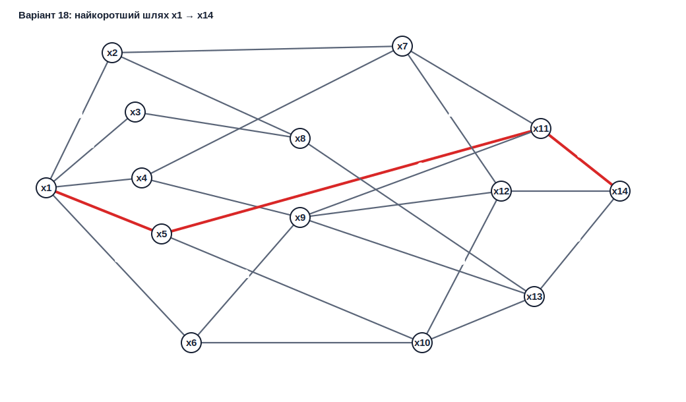
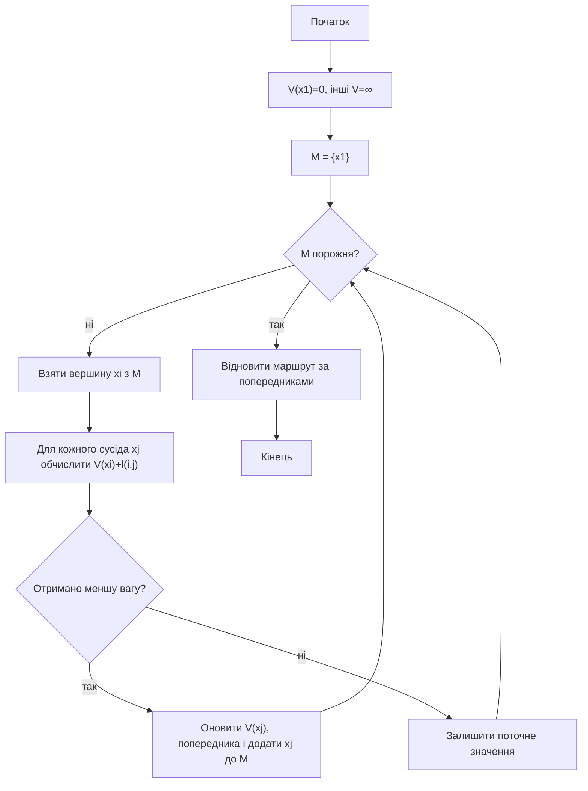
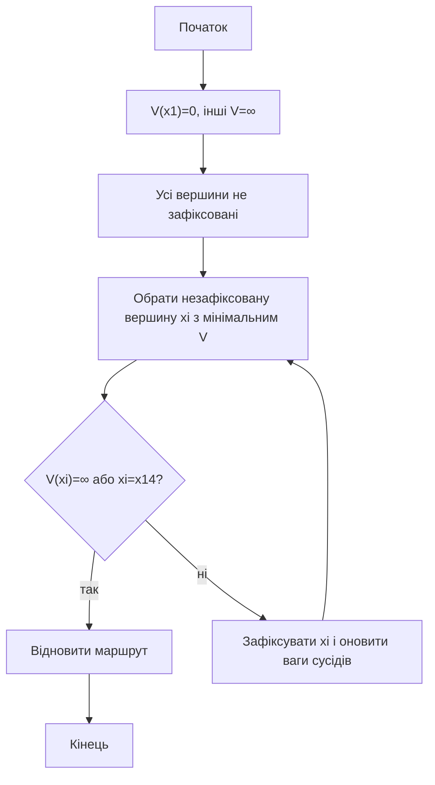

<div align="center">

# Вінницький національний технічний університет

Факультет інтелектуальних інформаційних технологій та автоматизації

<br><br><br><br><br><br><br><br>

## Звіт до лабораторної роботи №5

**«Розробка алгоритму і програми побудови найкоротшого шляху у графі»**

<br><br>

**Курс:** 1  
**Група:** 4КН-25б  
**Варіант:** №18  

</div>

<br><br><br><br><br>

<div align="right">

**Виконав:** Саволюк Микола Миколайович  

**Викладач:** Шевчук Олександр Федорович

</div>

<br><br>

<div align="center">

**Рік:** 2026

</div>

<div style="page-break-after: always;"></div>

## Мета роботи

Набути навичок побудови найкоротшого шляху в зваженому графі за допомогою хвильового алгоритму та алгоритму Дейкстри.

## Короткі теоретичні відомості

Найкоротший шлях у зваженому графі — це маршрут між двома вершинами, для якого сума довжин ребер є мінімальною.

Хвильовий алгоритм для зваженого графа працює як послідовне поширення поточної найменшої знайденої ваги. Якщо для вершини знайдено меншу відстань, її значення оновлюється і вершина знову додається до множини вершин, через які потрібно поширити хвилю.

Алгоритм Дейкстри на кожному кроці фіксує ще не оброблену вершину з найменшою поточною вагою. Після фіксації ця вершина більше не змінює своєї ваги, тому алгоритм працює ефективніше для графів із невід'ємними довжинами ребер.

У роботі граф варіанта №18 розглядається як неорієнтований зважений граф. На рисунку варіанта ребра мають позначення виду `a(b)`: для цієї лабораторної роботи як довжину ребра використано число `a`, тобто число перед дужками.

Повний код програми збережено у файлі `lab5_shortest_path.py`, а результати виконання — у файлі `lab5_results.txt`.

---

## Вхідні дані варіанта №18

Початкова вершина:

```
x1
```

Кінцева вершина:

```
x14
```

Граф варіанта з виділеним найкоротшим шляхом:



Список ребер, знятий зі схеми варіанта:

| Вершина 1 | Вершина 2 | Довжина |
| --- | --- | ---: |
| x1 | x2 | 3 |
| x1 | x3 | 2 |
| x1 | x4 | 2 |
| x1 | x5 | 3 |
| x1 | x6 | 4 |
| x2 | x7 | 2 |
| x2 | x8 | 1 |
| x3 | x8 | 1 |
| x4 | x7 | 2 |
| x4 | x9 | 3 |
| x5 | x10 | 1 |
| x5 | x11 | 2 |
| x6 | x9 | 1 |
| x6 | x10 | 2 |
| x7 | x11 | 2 |
| x7 | x12 | 2 |
| x8 | x13 | 3 |
| x9 | x11 | 1 |
| x9 | x12 | 1 |
| x9 | x13 | 1 |
| x10 | x12 | 3 |
| x10 | x13 | 4 |
| x11 | x14 | 3 |
| x12 | x14 | 6 |
| x13 | x14 | 3 |

---

## Схеми алгоритмів

### Хвильовий алгоритм для зваженого графа



### Алгоритм Дейкстри



---

## Реалізація програми

Граф задано списком ребер:

```python
EDGES = [
    ("x1", "x2", 3),
    ("x1", "x3", 2),
    ("x1", "x4", 2),
    ("x1", "x5", 3),
    ("x1", "x6", 4),
    ...
    ("x11", "x14", 3),
    ("x12", "x14", 6),
    ("x13", "x14", 3),
]
```

Для хвильового алгоритму використано чергу `M`, куди додаються вершини, для яких щойно вдалося покращити поточну відстань. Для алгоритму Дейкстри використано пріоритетну чергу, з якої щоразу береться вершина з найменшим поточним значенням `V`.

---

## Хвильовий алгоритм

Початкові значення:

```
V(x1)=0, V(x2)=...=V(x14)=∞
M={x1}
```

Покрокове поширення хвилі:

| Крок | Вершина | Оновлення | M після кроку |
| --- | --- | --- | --- |
| 0 | - | `x1=0` | `x1` |
| 1 | x1 | `x2=3`, `x3=2`, `x4=2`, `x5=3`, `x6=4` | `x2, x3, x4, x5, x6` |
| 2 | x2 | `x7=5`, `x8=4` | `x3, x4, x5, x6, x7, x8` |
| 3 | x3 | `x8=3` | `x4, x5, x6, x7, x8` |
| 4 | x4 | `x7=4`, `x9=5` | `x5, x6, x7, x8, x9` |
| 5 | x5 | `x10=4`, `x11=5` | `x6, x7, x8, x9, x10, x11` |
| 6 | x6 | додано ще одного попередника для `x9=5` | `x7, x8, x9, x10, x11` |
| 7 | x7 | `x12=6` | `x8, x9, x10, x11, x12` |
| 8 | x8 | `x13=6` | `x9, x10, x11, x12, x13` |
| 9 | x9 | додано попередників для `x12=6`, `x13=6` | `x10, x11, x12, x13` |
| 10 | x10 | змін немає | `x11, x12, x13` |
| 11 | x11 | `x14=8` | `x12, x13, x14` |
| 12 | x12 | змін немає | `x13, x14` |
| 13 | x13 | змін немає | `x14` |
| 14 | x14 | змін немає | `∅` |

Остаточний вектор ваг:

```
V = (0, 3, 2, 2, 3, 4, 4, 3, 5, 4, 5, 6, 6, 8)
```

Отже, хвильовий алгоритм дає:

```
Lmin = 8
```

Відновлення маршруту з кінцевої вершини:

```
x14 ← x11 ← x5 ← x1
```

Найкоротший шлях:

```
x1 → x5 → x11 → x14
```

Перевірка довжини:

```
L = l(x1,x5) + l(x5,x11) + l(x11,x14)
L = 3 + 2 + 3 = 8
```

---

## Алгоритм Дейкстри

Покрокове виконання алгоритму:

| Крок | Обрана вершина | Оновлення | Зафіксовані вершини |
| --- | --- | --- | --- |
| 1 | x1 | `x2=3`, `x3=2`, `x4=2`, `x5=3`, `x6=4` | `x1` |
| 2 | x3 | `x8=3` | `x1, x3` |
| 3 | x4 | `x7=4`, `x9=5` | `x1, x3, x4` |
| 4 | x2 | змін немає | `x1, x2, x3, x4` |
| 5 | x5 | `x10=4`, `x11=5` | `x1, x2, x3, x4, x5` |
| 6 | x8 | `x13=6` | `x1, x2, x3, x4, x5, x8` |
| 7 | x6 | додано ще одного попередника для `x9=5` | `x1, x2, x3, x4, x5, x6, x8` |
| 8 | x7 | `x12=6` | `x1, x2, x3, x4, x5, x6, x7, x8` |
| 9 | x10 | змін немає | `x1, x2, x3, x4, x5, x6, x7, x8, x10` |
| 10 | x9 | додано попередників для `x12=6`, `x13=6` | `x1, x2, x3, x4, x5, x6, x7, x8, x9, x10` |
| 11 | x11 | `x14=8` | `x1, x2, x3, x4, x5, x6, x7, x8, x9, x10, x11` |
| 12 | x12 | змін немає | `x1, x2, x3, x4, x5, x6, x7, x8, x9, x10, x11, x12` |
| 13 | x13 | змін немає | `x1, x2, x3, x4, x5, x6, x7, x8, x9, x10, x11, x12, x13` |
| 14 | x14 | кінцеву вершину досягнуто | `x1, x2, x3, x4, x5, x6, x7, x8, x9, x10, x11, x12, x13, x14` |

Остаточний вектор ваг:

```
V = (0, 3, 2, 2, 3, 4, 4, 3, 5, 4, 5, 6, 6, 8)
```

Алгоритм Дейкстри також дає:

```
Lmin = 8
```

Найкоротший шлях:

```
x1 → x5 → x11 → x14
```

---

## Порівняння результатів

| Алгоритм | Довжина найкоротшого шляху | Знайдений маршрут |
| --- | ---: | --- |
| Хвильовий алгоритм | 8 | `x1 → x5 → x11 → x14` |
| Алгоритм Дейкстри | 8 | `x1 → x5 → x11 → x14` |

Обидва алгоритми дали однаковий результат. Алгоритм Дейкстри має перевагу в тому, що на кожному кроці фіксує вершину з найменшою поточною вагою, тому для графів із невід'ємними вагами не потребує повторної обробки вже зафіксованих вершин.

---

## Інструкція користувача

1. Відкрити каталог `discrete-math/lab-05`.
2. Запустити програму командою:

```powershell
python lab5_shortest_path.py
```

3. Після запуску програма виведе список ребер, таблицю кроків хвильового алгоритму, таблицю кроків алгоритму Дейкстри та найкоротший шлях.
4. Результати також автоматично зберігаються у файлі `lab5_results.txt`.
5. SVG-схема графа з виділеним найкоротшим шляхом зберігається у файлі `variant18_shortest_path.svg`.

---

## Висновок

У лабораторній роботі проаналізовано зважений граф варіанта №18 і реалізовано два методи пошуку найкоротшого шляху: хвильовий алгоритм для зваженого графа та алгоритм Дейкстри. Для маршруту з `x1` до `x14` обидва алгоритми дали однаковий результат: найкоротший шлях `x1 → x5 → x11 → x14` має довжину `8`. Розроблена програма коректно будує таблиці кроків, відновлює маршрут за попередниками та генерує схему графа з виділеним результатом.
