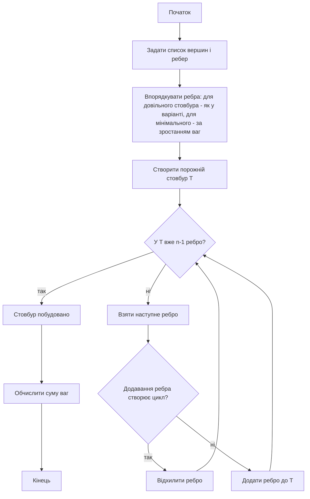
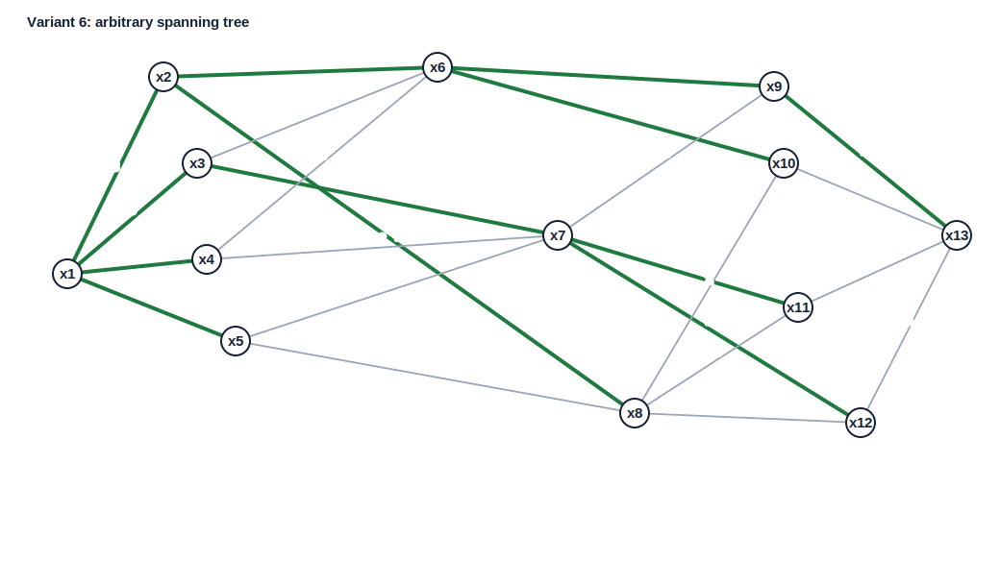
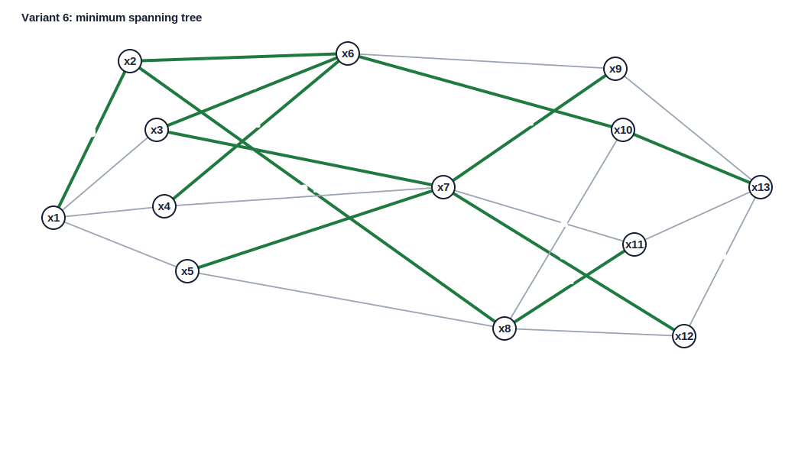

<div align="center">

# Вінницький національний технічний університет

Факультет інтелектуальних інформаційних технологій та автоматизації

<br><br><br><br><br><br><br><br>

## Звіт до лабораторної роботи №6

**«Розробка алгоритму і програми побудови стовбура графа»**

<br><br>

**Курс:** 1  
**Група:** 4КН-25б  
**Варіант:** №6  

</div>

<br><br><br><br><br>

<div align="right">

**Виконав:** Саволюк Микола Миколайович  

**Викладач:** Шевчук Олександр Федорович

</div>

<br><br>

<div align="center">

**Рік:** 2026

</div>

<div style="page-break-after: always;"></div>

## Мета роботи

Набути навичок побудови довільного і мінімального стовбура графа та реалізувати відповідний алгоритм програмно.

## Короткі теоретичні відомості

Дерево — це скінченний зв'язний граф без циклів. Якщо дерево має `n` вершин, то воно містить `n-1` ребро.

Стовбур графа — це частковий граф, який містить усі вершини початкового графа і є деревом. Якщо граф зважений, то стовбур із найменшою сумою ваг ребер називається мінімальним стовбуром.

Для побудови стовбура використано підхід із поступовим переглядом ребер:

1. Починаю з порожнього часткового графа.
2. Послідовно переглядаю ребра.
3. Якщо додавання ребра не створює цикл, включаю його до стовбура.
4. Якщо ребро створює цикл, відхиляю його.
5. Завершую, коли в стовбурі є `n-1` ребро.

Для мінімального стовбура використано той самий принцип, але ребра розглядаються в порядку зростання ваг. Це відповідає алгоритму Краскала.

Повний код програми збережено у файлі `lab6_spanning_tree.py`, а результати виконання — у файлі `lab6_results.txt`.

---

## Вхідні дані варіанта №6

Для лабораторної роботи використано граф варіанта №6 з ЛР5. Граф розглядається як неорієнтований. У позначеннях ребер виду `a(b)` як вагу ребра використано число `a`, тобто перше число в підписі ребра.

Список ребер графа:

| Вершина 1 | Вершина 2 | Вага |
| --- | --- | ---: |
| x1 | x2 | 3 |
| x1 | x3 | 3 |
| x1 | x4 | 3 |
| x1 | x5 | 3 |
| x2 | x6 | 2 |
| x2 | x8 | 2 |
| x3 | x6 | 1 |
| x3 | x7 | 2 |
| x4 | x6 | 1 |
| x4 | x7 | 2 |
| x5 | x7 | 1 |
| x5 | x8 | 3 |
| x6 | x9 | 3 |
| x6 | x10 | 2 |
| x7 | x9 | 1 |
| x7 | x11 | 2 |
| x7 | x12 | 1 |
| x8 | x10 | 2 |
| x8 | x11 | 1 |
| x8 | x12 | 3 |
| x9 | x13 | 4 |
| x10 | x13 | 3 |
| x11 | x13 | 4 |
| x12 | x13 | 3 |

Кількість вершин:

```
n = 13
```

Тому будь-який стовбур цього зв'язного графа повинен містити:

```
n - 1 = 12
```

ребер.

---

## Схема алгоритму



Для перевірки циклів у програмі використано структуру неперетинних множин `DisjointSet`. Якщо вершини ребра вже належать одній компоненті, ребро створює цикл і не додається.

---

## Довільний стовбур

Довільний стовбур будую в порядку перегляду ребер, у якому вони були зняті зі схеми варіанта.



Покрокове включення ребер:

| Крок | Ребро | Вага | Рішення | К-сть ребер |
| --- | --- | ---: | --- | ---: |
| 1 | x1-x2 | 3 | включено | 1 |
| 2 | x1-x3 | 3 | включено | 2 |
| 3 | x1-x4 | 3 | включено | 3 |
| 4 | x1-x5 | 3 | включено | 4 |
| 5 | x2-x6 | 2 | включено | 5 |
| 6 | x2-x8 | 2 | включено | 6 |
| 7 | x3-x6 | 1 | відхилено, створює цикл | 6 |
| 8 | x3-x7 | 2 | включено | 7 |
| 9 | x4-x6 | 1 | відхилено, створює цикл | 7 |
| 10 | x4-x7 | 2 | відхилено, створює цикл | 7 |
| 11 | x5-x7 | 1 | відхилено, створює цикл | 7 |
| 12 | x5-x8 | 3 | відхилено, створює цикл | 7 |
| 13 | x6-x9 | 3 | включено | 8 |
| 14 | x6-x10 | 2 | включено | 9 |
| 15 | x7-x9 | 1 | відхилено, створює цикл | 9 |
| 16 | x7-x11 | 2 | включено | 10 |
| 17 | x7-x12 | 1 | включено | 11 |
| 18 | x8-x10 | 2 | відхилено, створює цикл | 11 |
| 19 | x8-x11 | 1 | відхилено, створює цикл | 11 |
| 20 | x8-x12 | 3 | відхилено, створює цикл | 11 |
| 21 | x9-x13 | 4 | включено | 12 |

Отриманий довільний стовбур:

| Вершина 1 | Вершина 2 | Вага |
| --- | --- | ---: |
| x1 | x2 | 3 |
| x1 | x3 | 3 |
| x1 | x4 | 3 |
| x1 | x5 | 3 |
| x2 | x6 | 2 |
| x2 | x8 | 2 |
| x3 | x7 | 2 |
| x6 | x9 | 3 |
| x6 | x10 | 2 |
| x7 | x11 | 2 |
| x7 | x12 | 1 |
| x9 | x13 | 4 |

Перевірка:

```
Кількість ребер = 12 = n - 1
```

Сума ваг довільного стовбура:

```
3 + 3 + 3 + 3 + 2 + 2 + 2 + 3 + 2 + 2 + 1 + 4 = 30
```

---

## Мінімальний стовбур

Для побудови мінімального стовбура ребра розглядаються у порядку зростання ваг.



Покрокове виконання алгоритму Краскала:

| Крок | Ребро | Вага | Рішення | К-сть ребер |
| --- | --- | ---: | --- | ---: |
| 1 | x3-x6 | 1 | включено | 1 |
| 2 | x4-x6 | 1 | включено | 2 |
| 3 | x5-x7 | 1 | включено | 3 |
| 4 | x7-x9 | 1 | включено | 4 |
| 5 | x7-x12 | 1 | включено | 5 |
| 6 | x8-x11 | 1 | включено | 6 |
| 7 | x2-x6 | 2 | включено | 7 |
| 8 | x2-x8 | 2 | включено | 8 |
| 9 | x3-x7 | 2 | включено | 9 |
| 10 | x4-x7 | 2 | відхилено, створює цикл | 9 |
| 11 | x6-x10 | 2 | включено | 10 |
| 12 | x7-x11 | 2 | відхилено, створює цикл | 10 |
| 13 | x8-x10 | 2 | відхилено, створює цикл | 10 |
| 14 | x1-x2 | 3 | включено | 11 |
| 15 | x1-x3 | 3 | відхилено, створює цикл | 11 |
| 16 | x1-x4 | 3 | відхилено, створює цикл | 11 |
| 17 | x1-x5 | 3 | відхилено, створює цикл | 11 |
| 18 | x5-x8 | 3 | відхилено, створює цикл | 11 |
| 19 | x6-x9 | 3 | відхилено, створює цикл | 11 |
| 20 | x8-x12 | 3 | відхилено, створює цикл | 11 |
| 21 | x10-x13 | 3 | включено | 12 |

Отриманий мінімальний стовбур:

| Вершина 1 | Вершина 2 | Вага |
| --- | --- | ---: |
| x3 | x6 | 1 |
| x4 | x6 | 1 |
| x5 | x7 | 1 |
| x7 | x9 | 1 |
| x7 | x12 | 1 |
| x8 | x11 | 1 |
| x2 | x6 | 2 |
| x2 | x8 | 2 |
| x3 | x7 | 2 |
| x6 | x10 | 2 |
| x1 | x2 | 3 |
| x10 | x13 | 3 |

Перевірка:

```
Кількість ребер = 12 = n - 1
```

Сума ваг мінімального стовбура:

```
1 + 1 + 1 + 1 + 1 + 1 + 2 + 2 + 2 + 2 + 3 + 3 = 20
```

Оскільки алгоритм Краскала переглядає ребра в порядку зростання ваг і не допускає циклів, отриманий стовбур має мінімальну сумарну вагу.

Код Прюфера для побудованого мінімального стовбура:

```
(x2, x6, x7, x7, x8, x2, x6, x7, x3, x6, x10)
```

---

## Порівняння результатів

| Тип стовбура | Кількість ребер | Сума ваг |
| --- | ---: | ---: |
| Довільний стовбур | 12 | 30 |
| Мінімальний стовбур | 12 | 20 |

Довільний стовбур є коректним деревом, бо з'єднує всі 13 вершин і має 12 ребер без циклів. Мінімальний стовбур також є деревом, але має меншу сумарну вагу, тому є кращим для задачі найкоротшого або найдешевшого зв'язування всіх вершин.

---

## Інструкція користувача

1. Відкрити каталог `discrete-math/lab-06`.
2. Запустити програму командою:

```powershell
python lab6_spanning_tree.py
```

3. Програма виведе список ребер, покрокову побудову довільного стовбура, покрокову побудову мінімального стовбура та сумарні ваги.
4. Результати автоматично зберігаються у файлі `lab6_results.txt`.
5. SVG-схеми зберігаються у файлах `variant6_arbitrary_spanning_tree.svg` та `variant6_minimum_spanning_tree.svg`.

---

## Висновок

У лабораторній роботі побудовано довільний і мінімальний стовбур для графа варіанта №6. Довільний стовбур, побудований у початковому порядку перегляду ребер, має сумарну вагу `30`. Мінімальний стовбур, побудований за алгоритмом Краскала, має сумарну вагу `20`, тобто є кращим за критерієм мінімальної ваги. Програма перевірила, що обидва результати містять `12` ребер для `13` вершин і не створюють циклів.
