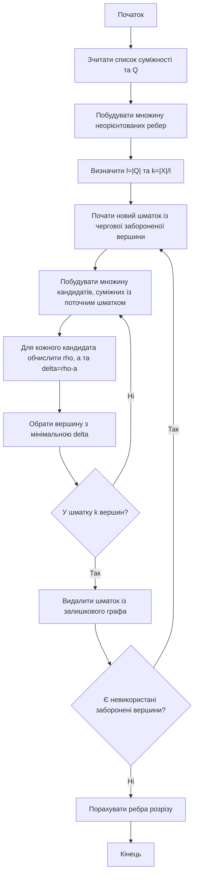
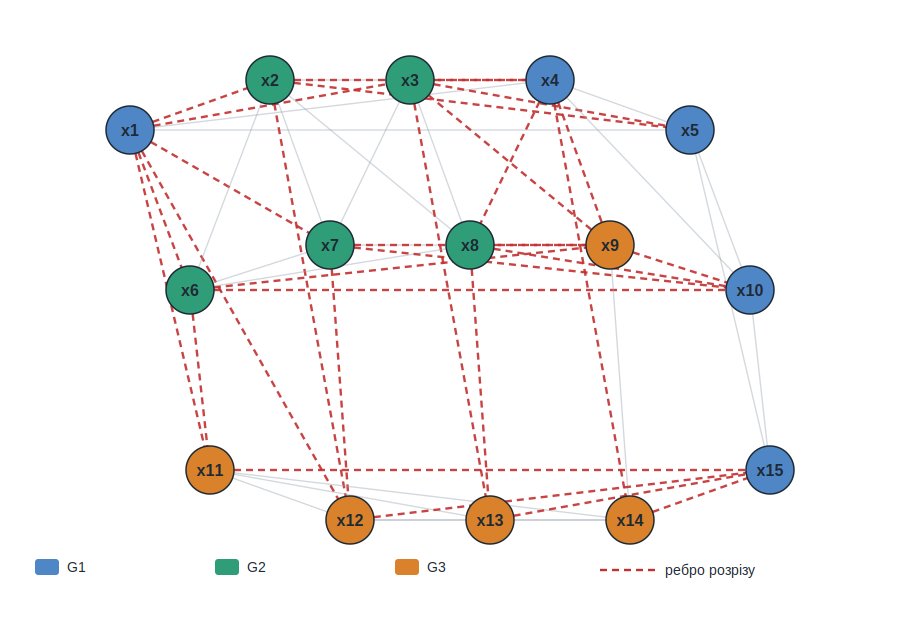

<div align="center">

# Вінницький національний технічний університет

Факультет інтелектуальних інформаційних технологій та автоматизації

<br><br><br><br><br><br><br><br>

## Звіт до лабораторної роботи №7

**«Дослідження задачі розтину графа на шматки»**

<br><br>

**Курс:** 1  
**Група:** 4КН-25б  
**Варіант:** №6  

</div>

<br><br><br><br><br>

<div align="right">

**Виконав:** Саволюк Микола Миколайович  

**Викладач:** Шевчук Олександр Федорович

</div>

<br><br>

<div align="center">

**Рік:** 2026

</div>

<div style="page-break-after: always;"></div>

## Мета роботи

Набути навичок розв'язання задачі розтину графа на шматки та реалізувати послідовний алгоритм розбиття графа програмно.

## Короткі теоретичні відомості

Розтин графа `G=(X,U)` на шматки полягає у розбитті множини вершин `X` на непорожні попарно неперетинні підмножини `X1, X2, ..., Xl`. Кожна підмножина задає відповідний шматок графа.

Критерієм якості розтину є кількість ребер, які проходять між різними шматками. Оптимальним вважається такий розтин, для якого ця кількість є мінімальною:

```math
$$k=\frac{1}{2}\sum_{i}\sum_{j} k_{ij}, \quad i \ne j$$
```

де `kij` — кількість ребер між шматками `Gi` та `Gj`.

У лабораторній роботі використано послідовний алгоритм. Він формує шматки один за одним, починаючи кожен шматок із забороненої вершини. Заборонені вершини повинні потрапити у різні шматки.

Для вибору чергової вершини використовується відносна вага:

```math
$$\delta(x_i)=\rho(x_i)-a_{ik}$$
```

де:

- `ρ(xi)` — локальний ступінь вершини `xi` у поточному залишковому графі;
- `aik` — кількість ребер, що з'єднують вершину `xi` з уже вибраними вершинами поточного шматка.

До шматка додається вершина з мінімальним значенням `δ(xi)`. Якщо таких вершин кілька, обирається вершина з більшим локальним ступенем `ρ(xi)`.

Повний код програми збережено у файлі `lab7_graph_partition.py`, а протокол виконання — у файлі `lab7_results.txt`.

---

## Вхідні дані варіанта №6

З таблиці 1 методичних вказівок для варіанта №6 задано граф із 15 вершинами.

Список суміжності з таблиці:

| Вершина | Суміжні вершини |
| --- | --- |
| x1 | x2, x3, x4, x5, x6, x7, x11, x12 |
| x2 | x1, x3, x4, x5, x6, x7, x8 |
| x3 | x1, x2, x4, x5, x7, x8, x9, x13 |
| x4 | x1, x2, x3, x5, x8, x9, x10, x14 |
| x5 | x1, x2, x3, x4, x10, x15 |
| x6 | x1, x2, x7, x8, x9, x10, x11 |
| x7 | x1, x2, x3, x6, x8, x9, x10, x12 |
| x8 | x2, x3, x4, x6, x7, x9, x10, x13 |
| x9 | x3, x4, x6, x7, x8, x10, x14 |
| x10 | x4, x5, x6, x7, x8, x9, x15 |
| x11 | x1, x6, x12, x13, x14, x15 |
| x12 | x2, x7, x11, x13, x14, x15 |
| x13 | x3, x8, x11, x12, x14, x15 |
| x14 | x4, x9, x11, x12, x13, x15 |
| x15 | x5, x10, x11, x12, x13, x14 |

Оскільки методичка формулює задачу для неорієнтованого графа та ребер, кожну пару зі списку суміжності я розглядаю як неорієнтоване ребро. Після усунення повторів отримано:

```math
$$|X|=15,\quad |U|=53$$
```

З таблиці 2 для варіанта №6 задано множину заборонених вершин:

```math
$$Q=\{x_1,x_6,x_{11}\}$$
```

Кількість заборонених вершин дорівнює кількості шматків:

```math
$$l=|Q|=3$$
```

Тому розмір кожного шматка:

```math
$$k=\frac{|X|}{l}=\frac{15}{3}=5$$
```

Отже, потрібно побудувати три шматки по 5 вершин так, щоб `x1`, `x6` і `x11` належали різним шматкам.

---

## Схема алгоритму



---

## Реалізація програми

Програма `lab7_graph_partition.py` виконує такі дії:

1. Задає список суміжності варіанта №6.
2. Перетворює список суміжності на множину неорієнтованих ребер.
3. Починає формування шматків із вершин `x1`, `x6`, `x11`.
4. На кожному кроці будує множину кандидатів.
5. Для кожного кандидата обчислює `ρ`, `a` та `δ=ρ-a`.
6. Додає до шматка вершину з найменшим `δ`.
7. Після побудови всіх шматків рахує кількість ребер між шматками.
8. Зберігає текстовий протокол і SVG-схему розбиття.

Команда запуску:

```powershell
cd discrete-math/lab-07
python lab7_graph_partition.py
```

---

## Покрокове виконання алгоритму

### Формування шматка `G1`

Починаю з першої забороненої вершини:

```math
$$G_1=\{x_1\}$$
```

| Крок | Поточний склад перед вибором | Кандидати у форматі `x: δ(ρ,a)` | Обрано |
| ---: | --- | --- | --- |
| 1 | x1 | x2: 7(8,1); x3: 7(8,1); x4: 7(8,1); x5: 5(6,1); x7: 7(8,1); x12: 6(7,1) | x5 |
| 2 | x1, x5 | x2: 6(8,2); x3: 6(8,2); x4: 6(8,2); x7: 7(8,1); x10: 6(7,1); x12: 6(7,1); x15: 5(6,1) | x15 |
| 3 | x1, x5, x15 | x2: 6(8,2); x3: 6(8,2); x4: 6(8,2); x7: 7(8,1); x10: 5(7,2); x12: 5(7,2); x13: 5(6,1); x14: 5(6,1) | x10 |
| 4 | x1, x5, x15, x10 | x2: 6(8,2); x3: 6(8,2); x4: 5(8,3); x7: 6(8,2); x8: 7(8,1); x9: 6(7,1); x12: 5(7,2); x13: 5(6,1); x14: 5(6,1) | x4 |

Після четвертого вибору:

```math
$$G_1=\{x_1,x_5,x_{15},x_{10},x_4\}$$
```

### Формування шматка `G2`

Починаю з другої забороненої вершини:

```math
$$G_2=\{x_6\}$$
```

Вершини шматка `G1` уже вилучені із залишкового графа.

| Крок | Поточний склад перед вибором | Кандидати у форматі `x: δ(ρ,a)` | Обрано |
| ---: | --- | --- | --- |
| 1 | x6 | x2: 4(5,1); x7: 5(6,1); x8: 5(6,1); x9: 4(5,1) | x2 |
| 2 | x6, x2 | x3: 4(5,1); x7: 4(6,2); x8: 4(6,2); x9: 4(5,1); x12: 4(5,1) | x7 |
| 3 | x6, x2, x7 | x3: 3(5,2); x8: 3(6,3); x9: 3(5,2); x12: 3(5,2) | x8 |
| 4 | x6, x2, x7, x8 | x3: 2(5,3); x9: 2(5,3); x12: 3(5,2); x13: 4(5,1) | x3 |

Після четвертого вибору:

```math
$$G_2=\{x_6,x_2,x_7,x_8,x_3\}$$
```

### Формування шматка `G3`

Починаю з третьої забороненої вершини:

```math
$$G_3=\{x_{11}\}$$
```

Після вилучення `G1` та `G2` у залишковому графі лишаються вершини `x9`, `x11`, `x12`, `x13`, `x14`.

| Крок | Поточний склад перед вибором | Кандидати у форматі `x: δ(ρ,a)` | Обрано |
| ---: | --- | --- | --- |
| 1 | x11 | x12: 2(3,1); x13: 2(3,1); x14: 3(4,1) | x12 |
| 2 | x11, x12 | x13: 1(3,2); x14: 2(4,2) | x13 |
| 3 | x11, x12, x13 | x14: 1(4,3) | x14 |
| 4 | x11, x12, x13, x14 | x9: 0(1,1) | x9 |

Після четвертого вибору:

```math
$$G_3=\{x_{11},x_{12},x_{13},x_{14},x_9\}$$
```

---

## Результати розтину

Отримано три шматки однакового розміру:

| Шматок | Вершини | Кількість вершин | Заборонена вершина |
| --- | --- | ---: | --- |
| `G1` | x1, x5, x15, x10, x4 | 5 | x1 |
| `G2` | x6, x2, x7, x8, x3 | 5 | x6 |
| `G3` | x11, x12, x13, x14, x9 | 5 | x11 |

Умова щодо заборонених вершин виконується: `x1`, `x6` і `x11` розміщені у різних шматках.

Кількість ребер, які проходять між різними шматками:

```math
$$k=30$$
```

Ребра розрізу:

```text
(x1, x2), (x1, x3), (x1, x6), (x1, x7), (x1, x11), (x1, x12),
(x2, x4), (x2, x5), (x2, x12), (x3, x4), (x3, x5), (x3, x9),
(x3, x13), (x4, x8), (x4, x9), (x4, x14), (x6, x9), (x6, x10),
(x6, x11), (x7, x9), (x7, x10), (x7, x12), (x8, x9), (x8, x10),
(x8, x13), (x9, x10), (x11, x15), (x12, x15), (x13, x15), (x14, x15)
```

Схема отриманого розбиття:



---

## Інструкція користувача

Для повторного виконання лабораторної роботи потрібно:

1. Перейти в директорію з артефактами лабораторної роботи.
2. Запустити Python-скрипт `lab7_graph_partition.py`.
3. Переглянути файл `lab7_results.txt` із протоколом обчислень.
4. Переглянути файл `variant6_partition.svg` із графічною схемою розтину.

Команди:

```powershell
cd discrete-math/lab-07
python lab7_graph_partition.py
```

Після запуску створюються або оновлюються файли:

- `lab7_results.txt` — текстовий протокол роботи алгоритму;
- `variant6_partition.svg` — схема графа з позначенням шматків і ребер розрізу.

---

## Висновки

У ході лабораторної роботи я дослідив задачу розтину графа на шматки та реалізував послідовний алгоритм розбиття графа з урахуванням заборонених вершин.

Для варіанта №6 граф із 15 вершинами було розбито на три рівні шматки по 5 вершин. Заборонені вершини `x1`, `x6` і `x11` розміщено у різних шматках. За результатами роботи алгоритму отримано розтин із 30 ребрами між шматками.

Послідовний алгоритм не виконує повного перебору всіх можливих розбиттів, тому дає практичний локальний результат. Його перевага полягає в простоті реалізації та можливості покроково контролювати вибір кожної вершини.
