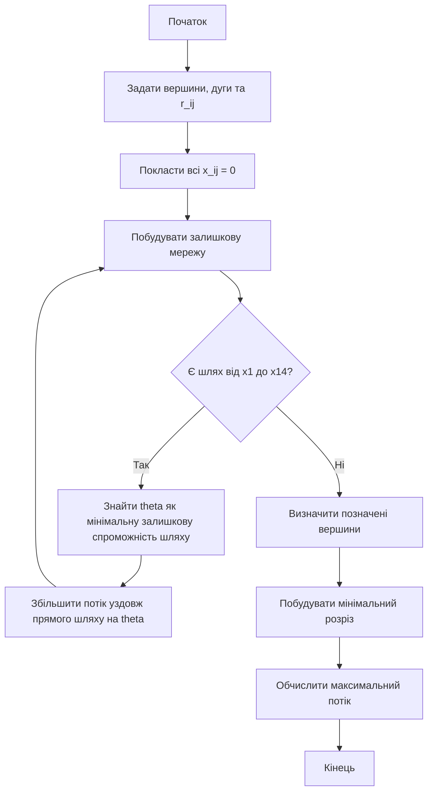
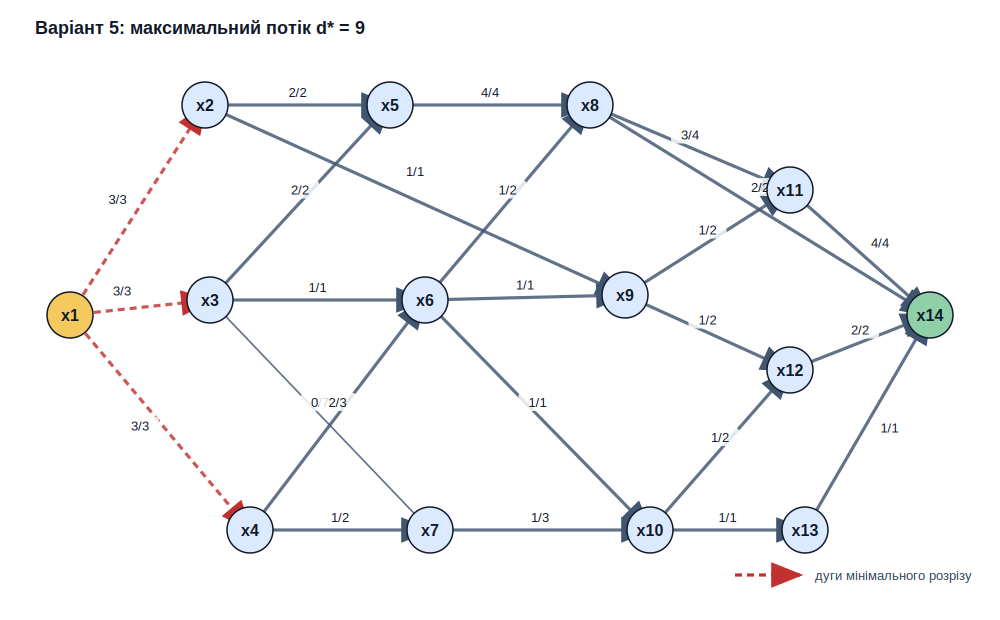

<div align="center">

# Вінницький національний технічний університет

Факультет інтелектуальних інформаційних технологій та автоматизації

<br><br><br><br><br><br><br><br>

## Звіт до лабораторної роботи №8

**«Дослідження потоків у мережах»**

<br><br>

**Курс:** 1  
**Група:** 4КН-25б  
**Варіант:** №5  

</div>

<br><br><br><br><br>

<div align="right">

**Виконав:** Саволюк Микола Миколайович  

**Викладач:** Шевчук Олександр Федорович

</div>

<br><br>

<div align="center">

**Рік:** 2026

</div>

<div style="page-break-after: always;"></div>

## Мета роботи

Набути навичок побудови максимального потоку на мережі за допомогою алгоритму Форда-Фалкерсона та реалізувати його програмно.

## Короткі теоретичні відомості

Мережею називають орієнтований граф `G=(I,U)`, у якому кожній дузі `(i,j)` поставлено у відповідність пропускну спроможність `rij`.

Потік `xij` через дугу повинен задовольняти обмеження:

```math
$$0 \le x_{ij} \le r_{ij}$$
```

Для всіх проміжних вершин виконується умова збереження потоку: сума потоку, що входить у вершину, дорівнює сумі потоку, що виходить із неї.

У задачі максимального потоку потрібно знайти найбільшу інтенсивність джерела `d*`, за якої мережа допускає потік із джерела до стоку.

Алгоритм Форда-Фалкерсона працює ітераційно:

1. Починаємо з нульового потоку.
2. У залишковій мережі шукаємо шлях від джерела до стоку.
3. Для знайденого шляху визначаємо мінімальну залишкову пропускну спроможність `θ`.
4. Збільшуємо потік уздовж цього шляху на `θ`.
5. Повторюємо, доки в залишковій мережі більше немає шляху від джерела до стоку.

Після завершення алгоритму позначені вершини залишкової мережі визначають мінімальний розріз, а величина максимального потоку дорівнює пропускній спроможності цього розрізу.

Повний код програми збережено у файлі `lab8_max_flow.py`, а протокол виконання — у файлі `lab8_results.txt`.

---

## Вхідні дані варіанта №5

У методичних вказівках до ЛР8 зазначено: варіанти завдань потрібно брати з ЛР5. Для варіанта №5 використано відповідний граф з ЛР5.

Граф розглядається як мережа з напрямом дуг зліва направо:

```math
$$x_1 \rightarrow x_{14}$$
```

Джерело:

```math
$$s=x_1$$
```

Стік:

```math
$$t=x_{14}$$
```

Підписи ребер у ЛР5 мають вигляд `a(b)`. Для ЛР8 як пропускну спроможність використано число в дужках `b`. Якщо дужок немає, використано єдине число біля дуги.

Список дуг мережі:

| Дуга | Підпис на графі | Пропускна спроможність |
| --- | ---: | ---: |
| x1 -> x2 | 5(3) | 3 |
| x1 -> x3 | 5(3) | 3 |
| x1 -> x4 | 3(3) | 3 |
| x2 -> x5 | 2(2) | 2 |
| x2 -> x9 | 3(1) | 1 |
| x3 -> x5 | 2(2) | 2 |
| x3 -> x6 | 2(1) | 1 |
| x3 -> x7 | 7 | 7 |
| x4 -> x6 | 3(3) | 3 |
| x4 -> x7 | 2 | 2 |
| x5 -> x8 | 4(4) | 4 |
| x6 -> x8 | 2(2) | 2 |
| x6 -> x9 | 1(1) | 1 |
| x6 -> x10 | 1(1) | 1 |
| x7 -> x10 | 3 | 3 |
| x8 -> x11 | 4(4) | 4 |
| x8 -> x14 | 5(2) | 2 |
| x9 -> x11 | 2 | 2 |
| x9 -> x12 | 2(2) | 2 |
| x10 -> x12 | 2 | 2 |
| x10 -> x13 | 1(1) | 1 |
| x11 -> x14 | 4(4) | 4 |
| x12 -> x14 | 5(2) | 2 |
| x13 -> x14 | 2(1) | 1 |

Початковий потік для всіх дуг:

```math
$$x_{ij}=0$$
```

---

## Схема алгоритму



---

## Реалізація програми

Програма `lab8_max_flow.py` виконує такі дії:

1. Задає список дуг варіанта №5 і їх пропускні спроможності.
2. Будує залишкову мережу.
3. Шукає збільшувальні шляхи від `x1` до `x14`.
4. Для кожного шляху обчислює величину збільшення `θ`.
5. Оновлює потік і залишкові спроможності.
6. Після завершення визначає мінімальний розріз.
7. Зберігає текстовий протокол і SVG-схему фінального потоку.

Команда запуску:

```powershell
cd discrete-math/lab-08
python lab8_max_flow.py
```

---

## Покрокове виконання алгоритму

У таблиці наведено знайдені збільшувальні шляхи. Для кожного шляху `θ` дорівнює мінімальній залишковій пропускній спроможності на цьому шляху.

| № | Збільшувальний шлях | Залишкові спроможності на шляху | `θ` |
| ---: | --- | --- | ---: |
| 1 | x1 -> x2 -> x5 -> x8 -> x14 | 3, 2, 4, 2 | 2 |
| 2 | x1 -> x2 -> x9 -> x11 -> x14 | 1, 1, 2, 4 | 1 |
| 3 | x1 -> x3 -> x5 -> x8 -> x11 -> x14 | 3, 2, 2, 4, 3 | 2 |
| 4 | x1 -> x3 -> x6 -> x8 -> x11 -> x14 | 1, 1, 2, 2, 1 | 1 |
| 5 | x1 -> x4 -> x6 -> x9 -> x12 -> x14 | 3, 3, 1, 2, 2 | 1 |
| 6 | x1 -> x4 -> x6 -> x10 -> x12 -> x14 | 2, 2, 1, 2, 1 | 1 |
| 7 | x1 -> x4 -> x7 -> x10 -> x13 -> x14 | 1, 2, 3, 1, 1 | 1 |

Сумарна величина збільшень:

```math
$$2+1+2+1+1+1+1=9$$
```

Отже, після семи ітерацій отримано потік величини:

```math
$$d=9$$
```

---

## Фінальний потік

Фінальні значення потоку на дугах:

| Дуга | Потік / спроможність |
| --- | ---: |
| x1 -> x2 | 3 / 3 |
| x1 -> x3 | 3 / 3 |
| x1 -> x4 | 3 / 3 |
| x2 -> x5 | 2 / 2 |
| x2 -> x9 | 1 / 1 |
| x3 -> x5 | 2 / 2 |
| x3 -> x6 | 1 / 1 |
| x3 -> x7 | 0 / 7 |
| x4 -> x6 | 2 / 3 |
| x4 -> x7 | 1 / 2 |
| x5 -> x8 | 4 / 4 |
| x6 -> x8 | 1 / 2 |
| x6 -> x9 | 1 / 1 |
| x6 -> x10 | 1 / 1 |
| x7 -> x10 | 1 / 3 |
| x8 -> x11 | 3 / 4 |
| x8 -> x14 | 2 / 2 |
| x9 -> x11 | 1 / 2 |
| x9 -> x12 | 1 / 2 |
| x10 -> x12 | 1 / 2 |
| x10 -> x13 | 1 / 1 |
| x11 -> x14 | 4 / 4 |
| x12 -> x14 | 2 / 2 |
| x13 -> x14 | 1 / 1 |

Схема фінального потоку:



---

## Мінімальний розріз

Після останньої ітерації у залишковій мережі з джерела `x1` не можна перейти в жодну іншу вершину, тому множина позначених вершин:

```math
$$S=\{x_1\}$$
```

Непозначені вершини:

```math
$$T=X\setminus S$$
```

Мінімальний розріз складається з дуг, які виходять із `S` у `T`:

```math
$$R=\{(x_1,x_2),(x_1,x_3),(x_1,x_4)\}$$
```

Його пропускна спроможність:

```math
$$c(R)=3+3+3=9$$
```

Оскільки величина знайденого потоку дорівнює пропускній спроможності мінімального розрізу, за теоремою Форда-Фалкерсона потік є максимальним:

```math
$$d^*=9$$
```

---

## Інструкція користувача

Для повторного запуску програми потрібно:

1. Відкрити директорію з артефактами лабораторної роботи.
2. Запустити Python-скрипт.
3. Переглянути файл із результатами.
4. Переглянути SVG-схему мережі з фінальними потоками.

Команди:

```powershell
cd discrete-math/lab-08
python lab8_max_flow.py
```

Після запуску створюються або оновлюються файли:

- `lab8_results.txt` — текстовий протокол роботи алгоритму;
- `variant5_max_flow.svg` — схема мережі з фінальними потоками.

---

## Висновки

У ході лабораторної роботи я дослідив задачу максимального потоку в мережі та реалізував алгоритм Форда-Фалкерсона.

Для варіанта №5 було побудовано мережу з джерелом `x1` і стоком `x14`. За пропускні спроможності взято числа в дужках із графа ЛР5, а для дуг без дужок — єдині підписані числа.

У результаті виконання алгоритму отримано максимальний потік:

```math
$$d^*=9$$
```

Мінімальний розріз має пропускну спроможність `9`, що збігається з величиною знайденого потоку. Це підтверджує правильність отриманого результату.
