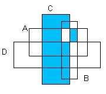
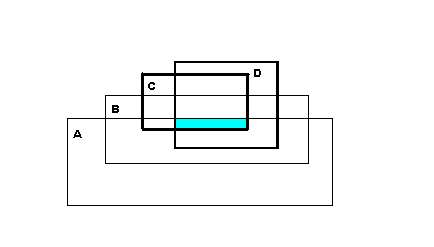

# Вінницький національний технічний університет

Факультет інтелектуальних інформаційних технологій та автоматизації

        

## Звіт до практичної роботи №1

**«Множини та діаграми Венна»**

  

**Курс:** 1  
**Група:** 4КН-25б  
**Варіанти задач:** Задача 1: №29; Задача 2: №19; Задача 3: №43, №6  

     

**Виконав:** Саволюк Микола Миколайович  

**Викладач:** Шевчук Олександр Федорович

  

**Рік:** 2026

## Мета роботи

Набути навичок виконання операцій над множинами, подання заданих множин через базові множини, а також запису зафарбованих областей діаграм Венна мовою операцій над множинами.

## Короткі теоретичні відомості

У роботі використовуються такі операції над множинами:

| Операція | Зміст |
| --- | --- |
| A ∪ B | об'єднання множин |
| A ∩ B | перетин множин |
| A \ B | різниця множин |
| Ā | доповнення множини A до універсальної множини U |

---

## Задача 1. Варіант №29

За умовою задано:

U = {1, 2, 3, 4, 5, 6, 7, 8, 9, 10, 11, 12, 13, 14}  
A = {1, 2, 3, 4, 7, 9}  
B = {3, 4, 5, 6, 11, 12, 13}  
C = {2, 3, 4, 7, 8, 12, 13, 14}  
D = {1, 7, 14}

Потрібно обчислити множину:

X = (A ∪ B) ∪ (C̄ ∩ D̄)

### Покрокове виконання

1. Знаходжу об'єднання множин A і B:

A ∪ B = {1, 2, 3, 4, 5, 6, 7, 9, 11, 12, 13}

2. Знаходжу доповнення множини C:

C̄ = U \ C = {1, 5, 6, 9, 10, 11}

3. Знаходжу доповнення множини D:

D̄ = U \ D = {2, 3, 4, 5, 6, 8, 9, 10, 11, 12, 13}

4. Знаходжу перетин доповнень:

C̄ ∩ D̄ = {5, 6, 9, 10, 11}

5. Остаточно:

X = {1, 2, 3, 4, 5, 6, 7, 9, 11, 12, 13} ∪ {5, 6, 9, 10, 11}

X = {1, 2, 3, 4, 5, 6, 7, 9, 10, 11, 12, 13}

Відповідь:

**X = {1, 2, 3, 4, 5, 6, 7, 9, 10, 11, 12, 13}**

---

## Задача 2. Варіант №19

Задано універсальну множину та множини:

U = {1, 2, 3, 4, 5, 6, 7, 8, 9}  
A = {1, 2, 3, 4, 5, 9}  
B = {2, 4, 6, 8}  
C = {1, 3, 5, 7}  
D = {1, 4, 5, 7, 8, 9}

Для варіанта №19 потрібно подати через A, B, C, D множину:

M = {1, 2, 4, 5, 6, 7, 8, 9}

Обираю подання:

M = (B ∪ D) ∪ (A \ C)

### Перевірка подання

1. Знаходжу об'єднання B і D:

B ∪ D = {1, 2, 4, 5, 6, 7, 8, 9}

2. Знаходжу різницю A \ C:

A \ C = {2, 4, 9}

3. Об'єдную отримані множини:

(B ∪ D) ∪ (A \ C) = {1, 2, 4, 5, 6, 7, 8, 9} ∪ {2, 4, 9}

(B ∪ D) ∪ (A \ C) = {1, 2, 4, 5, 6, 7, 8, 9}

Отримана множина збігається із заданою множиною M, отже:

**M = (B ∪ D) ∪ (A \ C)**

---

## Задача 3. Варіанти №43, №6

Потрібно за діаграмами Венна записати зафарбовані області через множини A, B, C, D.

### Варіант №43

На діаграмі зафарбовано всю область множини C, а також частину, що належить одночасно A і B. Тому:

**E₄₃ = C ∪ (A ∩ B)**

### Варіант №6

Зафарбована горизонтальна смуга лежить у спільній частині всіх чотирьох множин A, B, C і D. Тому:

**E₆ = A ∩ B ∩ C ∩ D**

---

## Перевірка результатів

Контрольні обчислення виконано скриптом:

`artifacts/solve_pr1_tasks1_3.js`

Файл результатів:

`artifacts/pr1_tasks1_3_results.json`

Скрипт підтвердив:

| Задача | Контрольний результат |
| --- | --- |
| 1 | X = {1, 2, 3, 4, 5, 6, 7, 9, 10, 11, 12, 13} |
| 2 | M = {1, 2, 4, 5, 6, 7, 8, 9} |
| 3, №43 | E₄₃ = C ∪ (A ∩ B) |
| 3, №6 | E₆ = A ∩ B ∩ C ∩ D |

## Висновок

У практичній роботі №1 виконано три задачі з різними варіантами. Для задачі 1 обчислено результат операцій над множинами, для задачі 2 задану множину подано через A, B, C, D, а для задачі 3 за двома діаграмами Венна записано відповідні області через операції над множинами.
