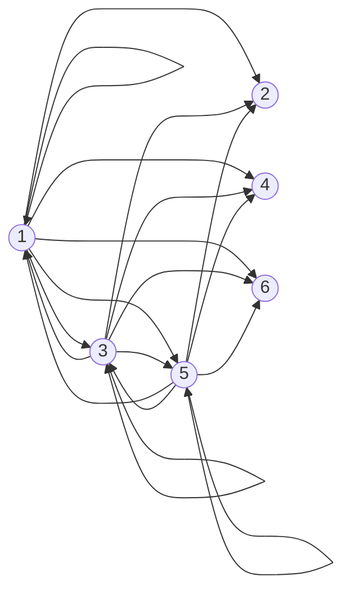
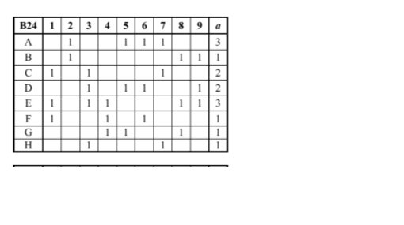

# Вінницький національний технічний університет

Факультет інтелектуальних інформаційних технологій та автоматизації

        

## Звіт до практичної роботи №2

**«Бінарні відношення, покриття та комбінаторика»**

  

**Курс:** 1  
**Група:** 4КН-25б  
**Варіанти задач:** Задача 4: №9; Задача 5: №24; Задача 6: №59, №33  

     

**Виконав:** Саволюк Микола Миколайович  

**Викладач:** Шевчук Олександр Федорович

  

**Рік:** 2026

## Мета роботи

Навчитися будувати бінарні відношення за предикатом, подавати їх списком пар, матрицею та графом, знаходити мінімальні й найкоротші покриття, а також застосовувати базові правила комбінаторики.

---

## Задача 4. Варіант №9

Задано множину:

D = {1, 2, 3, 4, 5, 6}

Відношення R ⊆ D × D задано предикатом:

(m, n) ∈ R ⇔ (3m + 1 - 2n) є парним числом.

### Спрощення предиката

Розглядаю парність виразу:

3m + 1 - 2n ≡ m + 1 (mod 2),

оскільки 3m має ту саму парність, що й m, а 2n завжди парне. Отже, вираз є парним тоді й лише тоді, коли m + 1 парне, тобто m непарне.

Тому до R входять усі пари, у яких перша координата m ∈ {1, 3, 5}, а друга координата n може бути будь-яким елементом D.

R = {(1, 1), (1, 2), (1, 3), (1, 4), (1, 5), (1, 6), (3, 1), (3, 2), (3, 3), (3, 4), (3, 5), (3, 6), (5, 1), (5, 2), (5, 3), (5, 4), (5, 5), (5, 6)}

### Матричне подання

| R | 1 | 2 | 3 | 4 | 5 | 6 |
| --- | --- | --- | --- | --- | --- | --- |
| 1 | 1 | 1 | 1 | 1 | 1 | 1 |
| 2 | 0 | 0 | 0 | 0 | 0 | 0 |
| 3 | 1 | 1 | 1 | 1 | 1 | 1 |
| 4 | 0 | 0 | 0 | 0 | 0 | 0 |
| 5 | 1 | 1 | 1 | 1 | 1 | 1 |
| 6 | 0 | 0 | 0 | 0 | 0 | 0 |

### Графічне подання

### Класифікація відношення

| Властивість | Висновок | Пояснення |
| --- | --- | --- |
| Рефлексивність | ні | відсутні пари (2, 2), (4, 4), (6, 6) |
| Антирефлексивність | ні | наявні пари (1, 1), (3, 3), (5, 5) |
| Симетричність | ні | (1, 2) ∈ R, але (2, 1) ∉ R |
| Антисиметричність | ні | (1, 3) ∈ R і (3, 1) ∈ R, хоча 1 ≠ 3 |
| Асиметричність | ні | є петлі та взаємні пари |
| Транзитивність | так | якщо друга координата проміжної пари парна, наступної пари з неї немає; якщо непарна, то початковий непарний m вже пов'язаний з усіма елементами D |

---

## Задача 5. Варіант №24

Для таблиці покриттів B24 потрібно побудувати мінімальне та найкоротше покриття.

| Рядок | 1 | 2 | 3 | 4 | 5 | 6 | 7 | 8 | 9 | a |
| --- | --- | --- | --- | --- | --- | --- | --- | --- | --- | --- |
| A |  | 1 |  |  | 1 | 1 | 1 |  |  | 3 |
| B |  | 1 |  |  |  |  |  | 1 | 1 | 1 |
| C | 1 |  | 1 |  |  |  | 1 |  |  | 2 |
| D |  |  | 1 |  | 1 | 1 |  |  | 1 | 2 |
| E | 1 |  | 1 | 1 |  |  |  | 1 | 1 | 3 |
| F | 1 |  |  | 1 |  | 1 |  |  |  | 1 |
| G |  |  |  | 1 | 1 |  |  | 1 |  | 1 |
| H |  |  | 1 |  |  |  | 1 |  |  | 1 |

У вигляді множин рядки мають вигляд:

| Рядок | Множина | Ціна |
| --- | --- | --- |
| A | {2, 5, 6, 7} | 3 |
| B | {2, 8, 9} | 1 |
| C | {1, 3, 7} | 2 |
| D | {3, 5, 6, 9} | 2 |
| E | {1, 3, 4, 8, 9} | 3 |
| F | {1, 4, 6} | 1 |
| G | {4, 5, 8} | 1 |
| H | {3, 7} | 1 |

### Мінімальне покриття

Перевіряю покриття з найменшою сумарною ціною. Рядки B, F, G, H мають ціну 1 кожен:

B = {2, 8, 9}  
F = {1, 4, 6}  
G = {4, 5, 8}  
H = {3, 7}

Їх об'єднання:

B ∪ F ∪ G ∪ H = {1, 2, 3, 4, 5, 6, 7, 8, 9}

Сумарна ціна:

a(B) + a(F) + a(G) + a(H) = 1 + 1 + 1 + 1 = 4.

Покриття з ціною 3 неможливе: якщо взяти B для покриття стовпця 2 і H для стовпця 7, то ще залишаються елементи 1, 4, 5, 6, які одним рядком ціни 1 не покриваються; якщо замість B брати A, то вже витрачається ціна 3 і все одно лишаються непокриті елементи.

Отже, мінімальне покриття:

**B ∪ F ∪ G ∪ H**, сумарна ціна **4**.

### Найкоротше покриття

Найкоротше покриття має мінімальну кількість рядків. Один рядок не покриває всі 9 елементів, тому перевіряю пари рядків.

A = {2, 5, 6, 7}  
E = {1, 3, 4, 8, 9}

A ∪ E = {2, 5, 6, 7} ∪ {1, 3, 4, 8, 9} = {1, 2, 3, 4, 5, 6, 7, 8, 9}

Отже, найкоротше покриття:

**A ∪ E**, кількість рядків **2**, сумарна ціна **6**.

---

## Задача 6. Варіанти №59, №33

### Варіант №59

Потрібно порахувати кількість способів розмістити 9 різних пасажирів у трьох різних вагонах.

1. Без додаткових обмежень кожен пасажир має 3 варіанти вибору вагона:

3⁹ = 19683

2. Якщо у перший вагон сідають рівно 3 пасажири, спочатку вибираю цих пасажирів, а решта 6 розподіляються між двома вагонами:

C(9, 3) · 2⁶ = 84 · 64 = 5376

3. Якщо у кожний вагон сідають рівно 3 пасажири:

9! / (3! · 3! · 3!) = 1680

4. Якщо в один вагон сідає 4 пасажири, у другий 3, у третій 2, то спочатку розподіляю пасажирів за групами, а потім враховую перестановку ролей трьох вагонів:

3! · 9! / (4! · 3! · 2!) = 7560

### Варіант №33

Потрібно опустити 5 різних листів у 11 різних поштових скриньок так, щоб у кожній скриньці було не більше одного листа.

Для першого листа є 11 скриньок, для другого 10, далі 9, 8 і 7:

A(11, 5) = 11 · 10 · 9 · 8 · 7 = 55440

---

## Перевірка результатів

Контрольні обчислення виконано скриптом:

`artifacts/solve_pr2_tasks4_6.js`

Файл результатів:

`artifacts/pr2_tasks4_6_results.json`

Скрипт підтвердив матрицю відношення, мінімальне покриття **BFGH**, найкоротше покриття **AE**, а також усі числові відповіді комбінаторних задач.

## Висновок

У практичній роботі №2 побудовано та класифіковано бінарне відношення, знайдено мінімальне й найкоротше покриття для таблиці B24, а також розв'язано дві комбінаторні задачі. Мінімальне покриття за ціною не збігається з найкоротшим: **BFGH** має меншу ціну, а **AE** має меншу кількість рядків.
