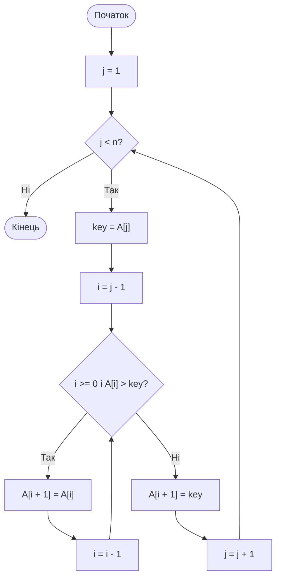
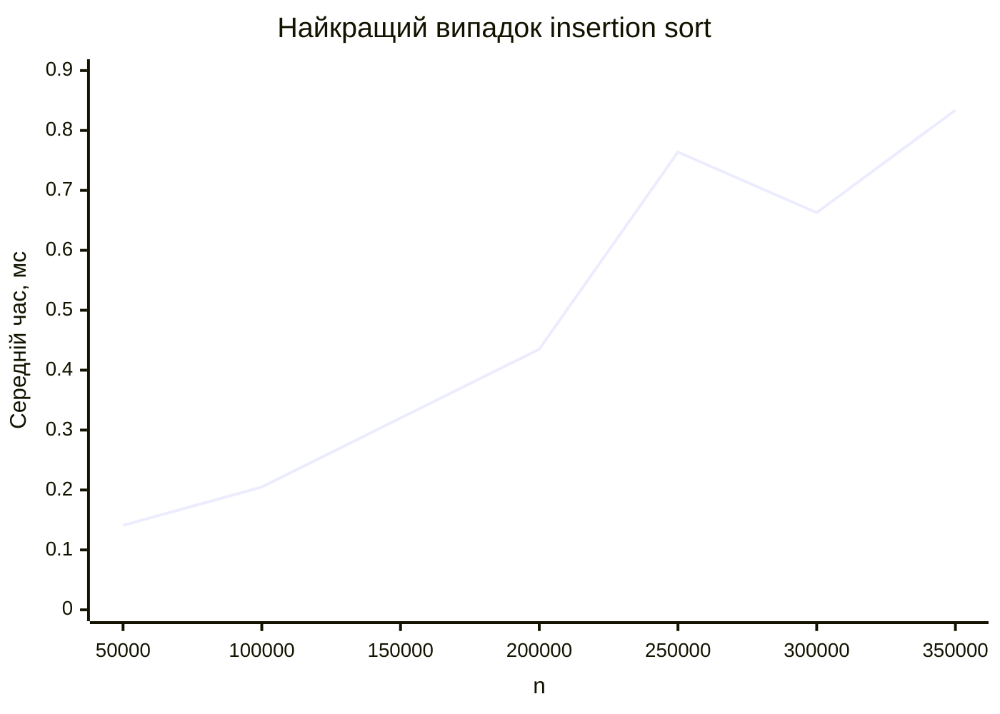
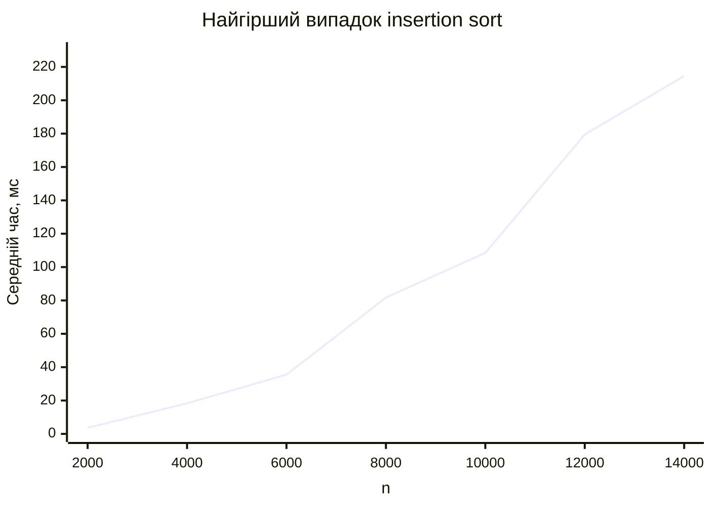
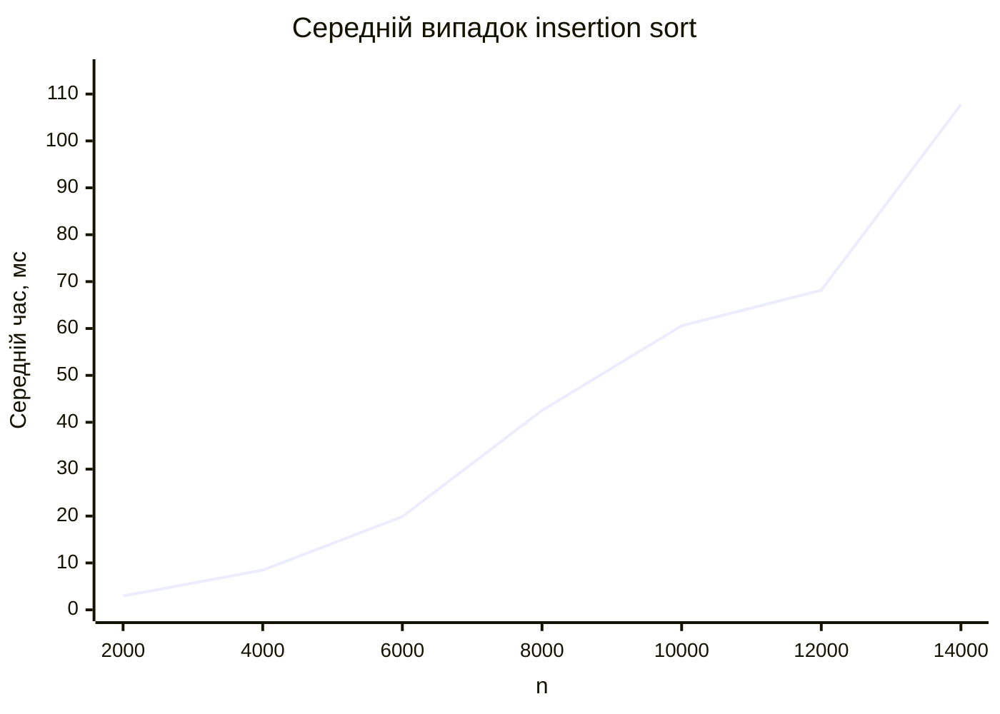

<div align="center">

# Вінницький національний технічний університет

Факультет інтелектуальних інформаційних технологій та автоматизації

<br><br><br><br><br><br><br><br>

## Звіт до лабораторної роботи №2

**«Програмування, дослідження алгоритму внутрішнього сортування шляхом вставок»**

<br><br>

**Дисципліна:** Теорія алгоритмів  
**Курс:** 1  
**Група:** 4КН-25б  

</div>

<br><br><br><br><br>

<div align="right">

**Виконав:** Саволюк Микола Миколайович  

**Викладач:** Перепелиця В&#96;ячеслав Ігорович

</div>

<br><br>

<div align="center">

**Рік:** 2026

</div>

<div style="page-break-after: always;"></div>

## Тема роботи

Програмування та дослідження алгоритму внутрішнього сортування шляхом вставок.

## Мета роботи

Детально проаналізувати та дослідити алгоритм сортування методом вставок, розглянути його ідею, реалізацію, теоретичну складність і практичний час виконання для різних типів вхідних даних.

## Порядок виконання роботи

1. Ознайомитися з поняттям внутрішнього сортування та особливостями сортування методом вставок.
2. Розглянути ідею алгоритму insertion sort.
3. Навести власний приклад роботи алгоритму на масиві з 10 чисел.
4. Подати алгоритм у графічному вигляді.
5. Оцінити теоретичну складність алгоритму для найкращого, найгіршого та середнього випадків.
6. Реалізувати алгоритм мовою C#/.NET.
7. Провести практичні вимірювання часу виконання для відсортованого, спадного та випадкового масивів.
8. Побудувати таблиці й графіки часу виконання.
9. Порівняти теоретичні та практичні залежності.
10. Сформулювати переваги, недоліки та висновки.

---

## Короткі теоретичні відомості

Сортуванням називають процес перегрупування елементів деякої множини або послідовності у визначеному порядку. Найчастіше елементи впорядковують за зростанням або спаданням ключа. Ключем називають значення або поле елемента, за яким виконується порівняння.

Задача сортування є однією з базових у теорії алгоритмів, тому що для неї існує багато різних підходів: прості квадратичні алгоритми, ефективні алгоритми зі складністю `O(n log n)`, лінійні алгоритми для спеціальних типів ключів тощо. На прикладі сортувань добре видно, як вибір алгоритму впливає на час роботи програми.

### Внутрішнє та зовнішнє сортування

Внутрішнім називають сортування, коли всі елементи розміщені в оперативній пам'яті, наприклад у масиві. У цьому випадку доступ до елементів є швидким, а алгоритм може часто звертатися до довільних позицій масиву.

Зовнішнє сортування застосовується тоді, коли даних настільки багато, що вони не поміщаються повністю в оперативну пам'ять. Такі дані зберігаються у файлах або на зовнішніх носіях, тому алгоритм має враховувати повільні операції читання та запису.

### Стійкість сортування

Алгоритм сортування називається стійким, якщо він не змінює відносний порядок елементів з однаковими ключами. Наприклад, якщо два студенти мають однакову оцінку, то після стійкого сортування за оцінкою вони залишаться в тому самому порядку, у якому були до сортування.

Сортування вставками є стійким, якщо під час пошуку місця вставки зсувати тільки елементи, які строго більші за поточний ключ. Саме така умова використовується в реалізації:

```text
while i >= 0 and A[i] > key
```

Якщо замінити `>` на `>=`, елементи з однаковими ключами можуть помінятися місцями, і стійкість буде втрачена.

---

## Ідея алгоритму сортування вставками

Метод вставок працює так, як людина часто впорядковує карти в руці. Ліва частина масиву вважається вже відсортованою, а з правої частини по черзі береться наступний елемент і вставляється у правильне місце серед уже впорядкованих елементів.

На початку відсортованою вважається частина з одного першого елемента. Далі алгоритм бере другий елемент, потім третій, четвертий і так до кінця масиву. Для кожного поточного елемента всі більші елементи зліва зсуваються на одну позицію праворуч, після чого поточний елемент записується на звільнене місце.

Алгоритм працює “на місці”, тобто не потребує додаткового масиву. Додаткова пам'ять використовується лише для кількох змінних: `key`, `i`, `j`.

---

## Власний приклад роботи алгоритму

Початковий масив:

```text
[37, 12, 45, 8, 29, 3, 18, 50, 21, 11]
```

Покрокова робота алгоритму сортування вставками:

| Крок | Поточний елемент `key` | Стан масиву після вставки |
| ---: | ---------------------: | ------------------------- |
| 0 | - | `[37, 12, 45, 8, 29, 3, 18, 50, 21, 11]` |
| 1 | 12 | `[12, 37, 45, 8, 29, 3, 18, 50, 21, 11]` |
| 2 | 45 | `[12, 37, 45, 8, 29, 3, 18, 50, 21, 11]` |
| 3 | 8 | `[8, 12, 37, 45, 29, 3, 18, 50, 21, 11]` |
| 4 | 29 | `[8, 12, 29, 37, 45, 3, 18, 50, 21, 11]` |
| 5 | 3 | `[3, 8, 12, 29, 37, 45, 18, 50, 21, 11]` |
| 6 | 18 | `[3, 8, 12, 18, 29, 37, 45, 50, 21, 11]` |
| 7 | 50 | `[3, 8, 12, 18, 29, 37, 45, 50, 21, 11]` |
| 8 | 21 | `[3, 8, 12, 18, 21, 29, 37, 45, 50, 11]` |
| 9 | 11 | `[3, 8, 11, 12, 18, 21, 29, 37, 45, 50]` |

У результаті отримано впорядкований за зростанням масив:

```text
[3, 8, 11, 12, 18, 21, 29, 37, 45, 50]
```

---

## Графічний алгоритм



---

## Псевдокод алгоритму

```text
INSERTION-SORT(A)
    for j = 2 to length[A]
        key = A[j]
        i = j - 1

        while i > 0 and A[i] > key
            A[i + 1] = A[i]
            i = i - 1

        A[i + 1] = key
```

У програмній реалізації C# індексація починається з нуля, тому зовнішній цикл починається з `j = 1`, а внутрішня умова має вигляд `i >= 0`.

---

## Теоретична оцінка складності

### Найкращий випадок

Найкращий випадок виникає тоді, коли масив уже відсортований за зростанням. Для кожного `j` умова внутрішнього циклу перевіряється, але зсувів не відбувається, бо `A[i] <= key`.

Кількість основних перевірок пропорційна `n - 1`, тому:

```text
T_best(n) = a*n + b
```

Асимптотична складність:

```text
T_best(n) = O(n)
```

### Найгірший випадок

Найгірший випадок виникає тоді, коли масив відсортований у спадному порядку. Кожен новий елемент потрібно перемістити на початок уже відсортованої частини, тому для елемента з індексом `j` виконується приблизно `j` порівнянь і зсувів.

Сума кількості зсувів:

```text
1 + 2 + ... + (n - 1) = n(n - 1) / 2
```

Отже:

```text
T_worst(n) = a*n^2 + b*n + c
```

Асимптотична складність:

```text
T_worst(n) = O(n^2)
```

### Середній випадок

У середньому для випадкового масиву поточний елемент проходить приблизно половину вже відсортованої частини. Тому кількість порівнянь і зсувів приблизно вдвічі менша, ніж у найгіршому випадку, але порядок зростання залишається квадратичним.

```text
T_average(n) ≈ n^2 / 4
```

Асимптотична складність:

```text
T_average(n) = O(n^2)
```

Додаткова пам'ять для всіх трьох випадків:

```text
M(n) = O(1)
```

---

## Вихідний код програми

Нижче наведено C#/.NET-програму, яка реалізує сортування вставками та виконує практичні вимірювання для трьох типів вхідних масивів: уже відсортованого, спадного та випадкового.

```csharp
using System.Diagnostics;
using System.Globalization;

const int targetMilliseconds = 2_000;

var sortedSizes = new[] { 50_000, 100_000, 150_000, 200_000, 250_000, 300_000, 350_000 };
var quadraticSizes = new[] { 2_000, 4_000, 6_000, 8_000, 10_000, 12_000, 14_000 };

Console.WriteLine("case,n,repeats,total_ms,avg_us,sorted_ok");

foreach (var n in sortedSizes)
{
    RunCase("best_sorted", n, MakeSorted(n), targetMilliseconds,
        fixedRepeats: Math.Max(1, 1_500_000_000 / n));
}

foreach (var n in quadraticSizes)
{
    RunCase("worst_reversed", n, MakeReversed(n), targetMilliseconds);
}

foreach (var n in quadraticSizes)
{
    RunCase("average_random", n, MakeRandom(n), targetMilliseconds);
}

static void InsertionSort(int[] a)
{
    for (var j = 1; j < a.Length; j++)
    {
        var key = a[j];
        var i = j - 1;

        while (i >= 0 && a[i] > key)
        {
            a[i + 1] = a[i];
            i--;
        }

        a[i + 1] = key;
    }
}

static void RunCase(string name, int n, int[] input, int targetMilliseconds, int? fixedRepeats = null)
{
    var repeats = fixedRepeats ?? EstimateRepeats(name, input, targetMilliseconds);
    var elapsed = Measure(name, input, repeats, out var sortedOk);
    var averageUs = elapsed.TotalMilliseconds * 1000.0 / repeats;

    Console.WriteLine(string.Join(",",
        name,
        n.ToString(CultureInfo.InvariantCulture),
        repeats.ToString(CultureInfo.InvariantCulture),
        elapsed.TotalMilliseconds.ToString("F3", CultureInfo.InvariantCulture),
        averageUs.ToString("F3", CultureInfo.InvariantCulture),
        sortedOk ? "true" : "false"));
}

static int EstimateRepeats(string name, int[] input, int targetMilliseconds)
{
    var repeats = 1;
    TimeSpan elapsed;

    do
    {
        elapsed = Measure(name, input, repeats, out _);
        if (elapsed.TotalMilliseconds >= 150)
        {
            break;
        }

        repeats *= 2;
    }
    while (repeats < 1_000_000);

    if (elapsed.TotalMilliseconds <= 0)
    {
        return repeats;
    }

    var estimated = (int)Math.Ceiling(repeats * targetMilliseconds / elapsed.TotalMilliseconds);
    return Math.Clamp(estimated, 1, 2_000_000);
}

static TimeSpan Measure(string name, int[] input, int repeats, out bool sortedOk)
{
    int[] work = name == "best_sorted" ? (int[])input.Clone() : new int[input.Length];
    sortedOk = true;

    GC.Collect();
    GC.WaitForPendingFinalizers();
    GC.Collect();

    var sw = new Stopwatch();
    for (var r = 0; r < repeats; r++)
    {
        if (name != "best_sorted")
        {
            Array.Copy(input, work, input.Length);
        }

        sw.Start();
        InsertionSort(work);
        sw.Stop();
    }

    sortedOk = IsSorted(work);
    return sw.Elapsed;
}

static int[] MakeSorted(int n)
{
    var a = new int[n];
    for (var i = 0; i < n; i++)
    {
        a[i] = i;
    }

    return a;
}

static int[] MakeReversed(int n)
{
    var a = new int[n];
    for (var i = 0; i < n; i++)
    {
        a[i] = n - i;
    }

    return a;
}

static int[] MakeRandom(int n)
{
    var random = new Random(20260505 + n);
    var a = new int[n];
    for (var i = 0; i < n; i++)
    {
        a[i] = random.Next();
    }

    return a;
}

static bool IsSorted(int[] a)
{
    for (var i = 1; i < a.Length; i++)
    {
        if (a[i - 1] > a[i])
        {
            return false;
        }
    }

    return true;
}
```

---

## Практична оцінка складності

Вимірювання виконано локально за допомогою `.NET 10` у конфігурації `Release`. Для кожного значення `n` алгоритм запускався кілька разів, щоб отримати сумарний час порядку кількох секунд. У таблицях наведено сумарний час усіх повторень і середній час одного сортування.

Підготовка масиву не входила у вимірюваний час сортування. Для випадкового масиву використано фіксований seed, щоб результати можна було повторити.

### Найкращий випадок: масив уже відсортований

| `n` | Кількість повторень | Сумарний час, мс | Середній час одного сортування, мс |
| --: | ------------------: | ---------------: | ---------------------------------: |
| 50 000 | 30 000 | 4 226,320 | 0,141 |
| 100 000 | 15 000 | 3 080,835 | 0,205 |
| 150 000 | 10 000 | 3 202,532 | 0,320 |
| 200 000 | 7 500 | 3 265,478 | 0,435 |
| 250 000 | 6 000 | 4 586,362 | 0,764 |
| 300 000 | 5 000 | 3 314,349 | 0,663 |
| 350 000 | 4 285 | 3 573,403 | 0,834 |



### Найгірший випадок: масив відсортований у спадному порядку

| `n` | Кількість повторень | Сумарний час, мс | Середній час одного сортування, мс |
| --: | ------------------: | ---------------: | ---------------------------------: |
| 2 000 | 525 | 1 914,548 | 3,647 |
| 4 000 | 106 | 1 945,458 | 18,353 |
| 6 000 | 52 | 1 846,540 | 35,510 |
| 8 000 | 33 | 2 696,516 | 81,713 |
| 10 000 | 16 | 1 735,896 | 108,494 |
| 12 000 | 13 | 2 333,335 | 179,487 |
| 14 000 | 9 | 1 930,694 | 214,522 |



### Середній випадок: випадковий масив

| `n` | Кількість повторень | Сумарний час, мс | Середній час одного сортування, мс |
| --: | ------------------: | ---------------: | ---------------------------------: |
| 2 000 | 747 | 2 212,273 | 2,962 |
| 4 000 | 190 | 1 607,219 | 8,459 |
| 6 000 | 107 | 2 128,305 | 19,891 |
| 8 000 | 49 | 2 083,327 | 42,517 |
| 10 000 | 22 | 1 332,731 | 60,579 |
| 12 000 | 30 | 2 045,030 | 68,168 |
| 14 000 | 17 | 1 832,012 | 107,765 |



---

## Порівняльний аналіз теоретичних і практичних результатів

Теоретично найкращий випадок має лінійну складність `O(n)`, оскільки внутрішній цикл майже не виконує зсувів. Практичний графік для відсортованого масиву загалом підтверджує лінійний характер залежності: зі збільшенням `n` середній час одного сортування зростає значно повільніше, ніж у двох інших випадках. Невеликі відхилення пояснюються роботою операційної системи, кеш-пам'яттю, JIT-компіляцією та шумом таймера.

Для найгіршого випадку теоретична складність дорівнює `O(n^2)`, бо кожен новий елемент проходить майже всю уже відсортовану частину масиву. Практичні виміри це підтверджують: при збільшенні розміру масиву час зростає значно швидше, ніж лінійно.

Середній випадок також має квадратичну складність `O(n^2)`, але з меншим коефіцієнтом, ніж найгірший випадок. Це видно з таблиць: для однакових значень `n` випадковий масив у середньому сортується швидше, ніж спадний, бо елемент зазвичай зсувається приблизно через половину відсортованої частини, а не через усю.

---

## Переваги та недоліки алгоритму сортування вставками

Переваги:

- алгоритм простий для розуміння та реалізації;
- працює “на місці” і потребує лише `O(1)` додаткової пам'яті;
- є стійким за умови використання порівняння `A[i] > key`;
- дуже ефективний для малих або майже відсортованих масивів;
- може використовуватися як допоміжний алгоритм у складніших гібридних сортуваннях.

Недоліки:

- має квадратичну складність `O(n^2)` у середньому та найгіршому випадках;
- погано підходить для великих випадково перемішаних або спадних масивів;
- виконує багато зсувів елементів, якщо дані розташовані невдало;
- поступається ефективнішим алгоритмам на великих входах, наприклад merge sort, heap sort або quicksort.

На мою думку, сортування вставками варто використовувати тоді, коли масив невеликий або вже майже впорядкований. Для великих масивів загального вигляду краще застосовувати алгоритми зі складністю `O(n log n)`.

---

## Розширений висновок

У цій лабораторній роботі я дослідив алгоритм внутрішнього сортування методом вставок. Було розглянуто його основну ідею: поступове розширення відсортованої частини масиву за рахунок вставлення чергового елемента у правильну позицію.

На власному прикладі з 10 чисел було показано покрокову роботу алгоритму. Також алгоритм було подано у вигляді блок-схеми, псевдокоду та програми мовою C#/.NET.

Теоретичний аналіз показав, що в найкращому випадку, коли масив уже відсортований, складність алгоритму становить `O(n)`. У найгіршому та середньому випадках складність є квадратичною — `O(n^2)`. Додаткова пам'ять у всіх випадках дорівнює `O(1)`.

Практичні вимірювання підтвердили теоретичні очікування. Для відсортованого масиву час виконання зростав повільно, тоді як для спадного та випадкового масивів спостерігалося значно швидше зростання часу. Найгіршим для алгоритму є спадний порядок елементів, бо кожен новий елемент доводиться переносити на початок відсортованої частини.

Отже, сортування вставками є простим, стійким і зручним алгоритмом для малих або майже впорядкованих масивів, але для великих невпорядкованих наборів даних воно не є достатньо ефективним через квадратичну складність.

---

## Відповіді на контрольні запитання

### 1. Поясніть, чому задача сортування елементів є однією з найцікавіших та показових задач для курсу теорії алгоритмів

Задача сортування є показовою, тому що для неї існує багато різних алгоритмів з різними властивостями та складністю. На її прикладі можна порівнювати прості й ефективні алгоритми, аналізувати найкращий, середній і найгірший випадки, досліджувати використання пам'яті та вплив структури вхідних даних на час роботи.

Сортування також часто використовується на практиці: у базах даних, пошуку, обробці таблиць, файлових системах, довідниках і багатьох інших задачах. Тому воно є не лише теоретично цікавим, а й практично важливим.

### 2. Поясніть, що таке стійкість алгоритму сортування

Стійкість алгоритму сортування означає, що елементи з однаковими ключами після сортування залишаються у тому самому відносному порядку, у якому вони були до сортування.

Наприклад, якщо записи студентів уже відсортовані за прізвищем, а потім їх стійко відсортувати за оцінкою, то студенти з однаковою оцінкою залишаться впорядкованими за прізвищем. Це корисно під час багатокритеріального сортування.

### 3. За якими критеріями, на Ваш погляд, можна класифікувати алгоритми сортування?

Алгоритми сортування можна класифікувати за кількома критеріями:

- за місцем зберігання даних: внутрішні та зовнішні;
- за використанням додаткової пам'яті: на місці або з додатковими структурами;
- за стійкістю: стійкі та нестійкі;
- за складністю: квадратичні, `O(n log n)`, лінійні для спеціальних випадків;
- за принципом роботи: обмін, вибір, вставки, злиття, розділення, підрахунок;
- за типом порівнянь: порівняльні та непорівняльні.

### 4. Наведіть класифікацію алгоритмів сортування

Класифікація алгоритмів сортування може бути такою:

| Клас | Приклади | Характеристика |
| ---- | -------- | -------------- |
| Прості квадратичні | insertion sort, selection sort, bubble sort | Мають складність `O(n^2)`, прості в реалізації |
| Ефективні порівняльні | merge sort, heap sort, quicksort | Зазвичай мають складність близько `O(n log n)` |
| Непорівняльні | counting sort, radix sort, bucket sort | Можуть працювати за лінійний час за певних обмежень на ключі |
| Внутрішні | insertion sort, quicksort, heap sort | Працюють з даними в оперативній пам'яті |
| Зовнішні | зовнішнє сортування злиттям | Призначені для даних, що зберігаються у файлах |

### 5. Перерахуйте та порівняйте відомі Вам алгоритми сортування за квадратичний час

До алгоритмів сортування з квадратичною складністю належать сортування вставками, сортування вибором і бульбашкове сортування.

| Алгоритм | Найкращий випадок | Середній випадок | Найгірший випадок | Особливості |
| -------- | ----------------- | ---------------- | ----------------- | ----------- |
| Сортування вставками | `O(n)` | `O(n^2)` | `O(n^2)` | Добре працює для майже відсортованих масивів, стійке |
| Сортування вибором | `O(n^2)` | `O(n^2)` | `O(n^2)` | Робить мало обмінів, але завжди багато порівнянь |
| Бульбашкове сортування | `O(n)` з оптимізацією | `O(n^2)` | `O(n^2)` | Просте, але зазвичай неефективне на практиці |

Серед цих алгоритмів сортування вставками часто є найкориснішим на практиці для малих або частково впорядкованих даних. Сортування вибором корисне тоді, коли потрібно мінімізувати кількість обмінів. Бульбашкове сортування переважно має навчальне значення.

### 6. Поясніть, чому при оцінці складності алгоритму нас частіше за все цікавить робота у найгіршому випадку

Найгірший випадок важливий тому, що він дає верхню межу часу роботи алгоритму. Якщо ми знаємо складність у найгіршому випадку, то можемо гарантувати, що алгоритм не працюватиме довше за певну оцінку для будь-якого входу заданого розміру.

Крім того, несприятливі входи можуть часто траплятися на практиці. Для сортування вставками таким входом є масив, відсортований у спадному порядку. Якщо орієнтуватися тільки на найкращий випадок, можна сильно переоцінити ефективність алгоритму.

Саме тому аналіз найгіршого випадку є важливим для надійної оцінки алгоритмів, особливо коли програма має працювати передбачувано.
