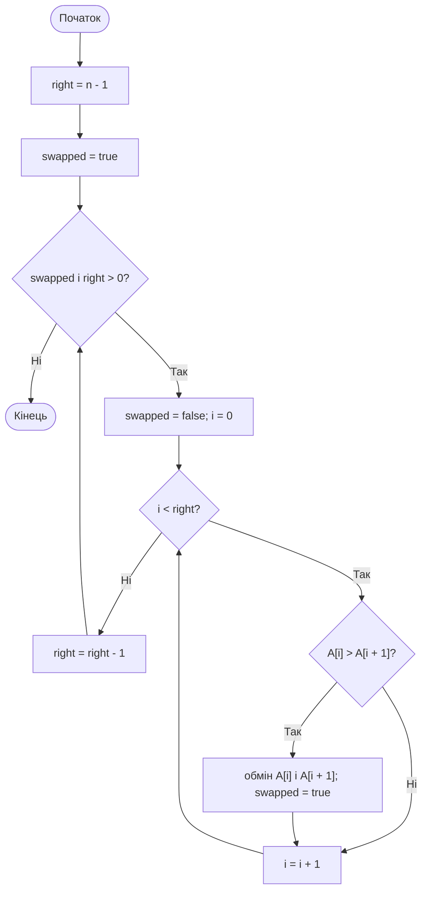
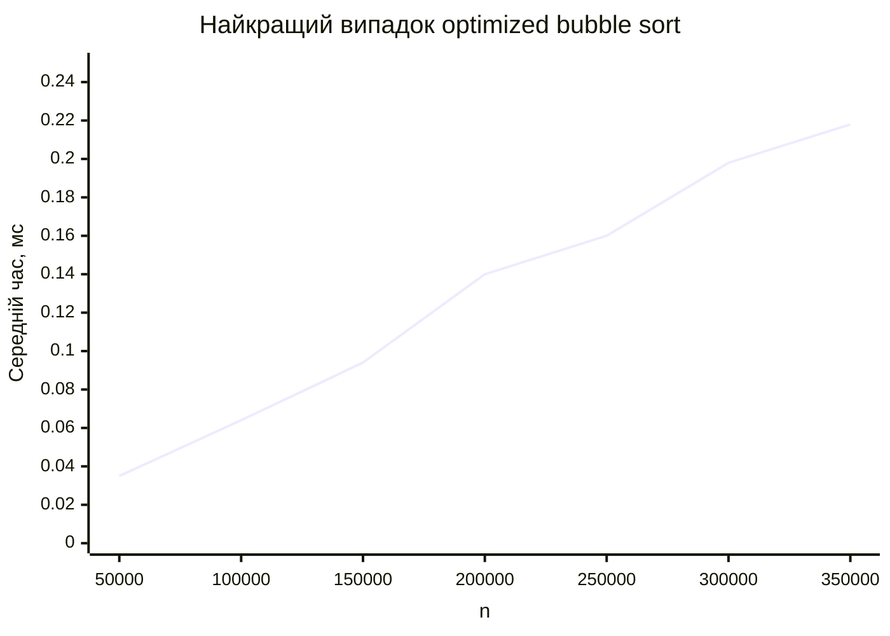
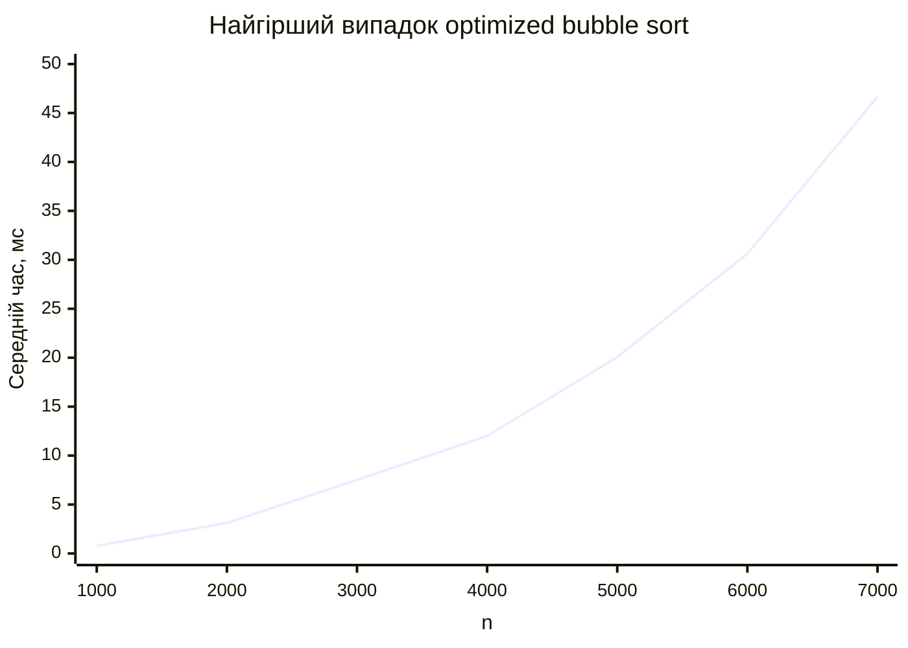
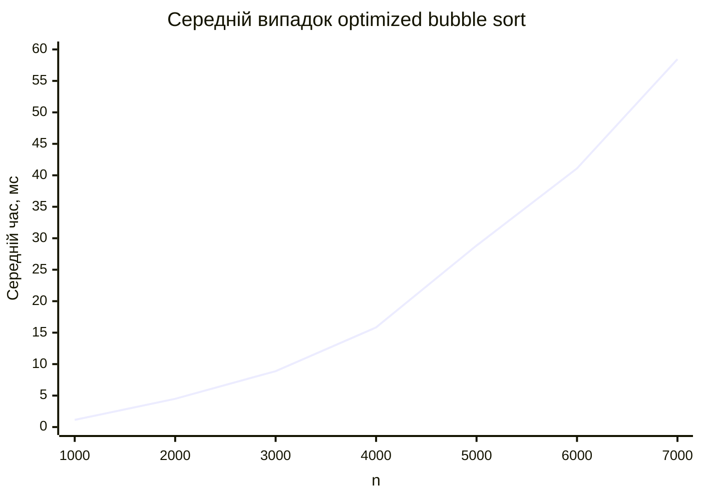

<div align="center">

# Вінницький національний технічний університет

Факультет інтелектуальних інформаційних технологій та автоматизації

<br><br><br><br><br><br><br><br>

## Звіт до лабораторної роботи №4

**«Розробка та дослідження алгоритму внутрішнього обмінного сортування»**

<br><br>

**Дисципліна:** Теорія алгоритмів  
**Курс:** 1  
**Група:** 4КН-25б  
**Варіант:** №14  

</div>

<br><br><br><br><br>

<div align="right">

**Виконав:** Саволюк Микола Миколайович  

**Викладач:** Перепелиця В&#96;ячеслав Ігорович

</div>

<br><br>

<div align="center">

**Рік:** 2026

</div>

<div style="page-break-after: always;"></div>

## Тема роботи

Розробка та дослідження алгоритму внутрішнього обмінного сортування. Для парного варіанта №14 досліджується оптимізоване бульбашкове сортування.

## Мета роботи

Детально проаналізувати та дослідити алгоритм внутрішнього обмінного сортування, розглянути його ідею, реалізацію, теоретичну складність і практичний час виконання для різних типів вхідних даних.

## Порядок виконання роботи

1. Ознайомитися з алгоритмами сортування шляхом вибору та внутрішнього обмінного сортування.
2. Визначити алгоритм для свого варіанта: для варіанта №14 обрати бульбашкове сортування.
3. Розглянути ідею оптимізованого бульбашкового сортування з прапорцем обмінів.
4. Навести власний приклад роботи алгоритму на масиві з 10 чисел.
5. Подати алгоритм у графічному вигляді.
6. Оцінити теоретичну складність алгоритму в найкращому, найгіршому та середньому випадках.
7. Реалізувати алгоритм мовою C#/.NET.
8. Провести практичні вимірювання часу виконання для відсортованого, спадного та випадкового масивів.
9. Побудувати таблиці й графіки часу виконання.
10. Сформулювати переваги, недоліки, висновки та відповісти на контрольні питання.

---

## Короткі теоретичні відомості

Сортуванням називають процес упорядкування елементів за певним ключем. У внутрішньому сортуванні всі елементи розміщуються в оперативній пам'яті, наприклад у масиві. Це дає змогу швидко звертатися до довільних елементів і багаторазово порівнювати або міняти їх місцями.

У цій лабораторній роботі для парного варіанта розглядається внутрішнє обмінне сортування. Його базова ідея полягає у порівнянні сусідніх елементів і перестановці їх місцями, якщо вони розташовані у неправильному порядку.

Найвідомішим внутрішнім обмінним алгоритмом є бульбашкове сортування. Після кожного повного проходу найбільший елемент з невідсортованої частини масиву “спливає” вправо, тобто займає своє остаточне місце.

---

## Ідея алгоритму бульбашкового сортування

У простому бульбашковому сортуванні масив багато разів переглядається зліва направо. Якщо сусідні елементи `A[i]` і `A[i + 1]` стоять у неправильному порядку, вони міняються місцями.

У цій роботі використано оптимізовану версію алгоритму. Вона має дві прості ідеї:

- після кожного проходу права межа зменшується, бо найбільший елемент уже стоїть на своєму місці;
- якщо під час проходу не було жодного обміну, масив уже відсортовано, і алгоритм можна завершити достроково.

Саме оптимізація з прапорцем обмінів дає найкращий випадок `O(n)`, коли масив уже відсортований.

---

## Власний приклад роботи алгоритму

Початковий масив:

```text
[37, 12, 45, 8, 29, 3, 18, 50, 21, 11]
```

Покажемо стан масиву після кожного проходу оптимізованого бульбашкового сортування.

| Прохід | Кількість обмінів | Стан масиву після проходу |
| -----: | ----------------: | ------------------------- |
| 0 | - | `[37, 12, 45, 8, 29, 3, 18, 50, 21, 11]` |
| 1 | 7 | `[12, 37, 8, 29, 3, 18, 45, 21, 11, 50]` |
| 2 | 6 | `[12, 8, 29, 3, 18, 37, 21, 11, 45, 50]` |
| 3 | 5 | `[8, 12, 3, 18, 29, 21, 11, 37, 45, 50]` |
| 4 | 3 | `[8, 3, 12, 18, 21, 11, 29, 37, 45, 50]` |
| 5 | 2 | `[3, 8, 12, 18, 11, 21, 29, 37, 45, 50]` |
| 6 | 1 | `[3, 8, 12, 11, 18, 21, 29, 37, 45, 50]` |
| 7 | 1 | `[3, 8, 11, 12, 18, 21, 29, 37, 45, 50]` |
| 8 | 0 | `[3, 8, 11, 12, 18, 21, 29, 37, 45, 50]` |

На восьмому проході обмінів уже не було, тому алгоритм завершується. Результат:

```text
[3, 8, 11, 12, 18, 21, 29, 37, 45, 50]
```

---

## Графічний алгоритм



---

## Псевдокод алгоритму

```text
OPTIMIZED-BUBBLE-SORT(A)
    right = length[A] - 1
    swapped = true

    while swapped and right > 0
        swapped = false

        for i = 0 to right - 1
            if A[i] > A[i + 1]
                swap A[i], A[i + 1]
                swapped = true

        right = right - 1
```

---

## Теоретична оцінка складності

### Найкращий випадок

Найкращий випадок виникає тоді, коли масив уже відсортований за зростанням. Алгоритм виконує один прохід, не знаходить жодної пари для обміну і завершується.

Кількість порівнянь у цьому випадку приблизно дорівнює `n - 1`, тому:

```text
T_best(n) = O(n)
```

### Найгірший випадок

Найгірший випадок виникає тоді, коли масив відсортований у спадному порядку. Кожен елемент потрібно багаторазово пересувати через сусідні обміни. Кількість порівнянь і обмінів має квадратичний порядок.

Кількість порівнянь:

```text
(n - 1) + (n - 2) + ... + 1 = n(n - 1) / 2
```

Отже:

```text
T_worst(n) = O(n^2)
```

### Середній випадок

Для випадкового масиву алгоритм зазвичай виконує багато проходів і значну кількість обмінів. Оптимізація з прапорцем може прибрати зайві останні проходи, але не змінює асимптотичний порядок.

```text
T_average(n) = O(n^2)
```

Додаткова пам'ять:

```text
M(n) = O(1)
```

---

## Вихідний код програми

Нижче наведено C#/.NET-програму, яка реалізує оптимізоване бульбашкове сортування та виконує практичні вимірювання для трьох типів входів.

```csharp
using System.Diagnostics;
using System.Globalization;

const int targetMilliseconds = 2_000;

var sortedSizes = new[] { 50_000, 100_000, 150_000, 200_000, 250_000, 300_000, 350_000 };
var quadraticSizes = new[] { 1_000, 2_000, 3_000, 4_000, 5_000, 6_000, 7_000 };

Console.WriteLine("case,n,repeats,total_ms,avg_us,sorted_ok");

foreach (var n in sortedSizes)
{
    RunCase("best_sorted", n, MakeSorted(n), targetMilliseconds,
        fixedRepeats: Math.Max(1, (int)(3_000_000_000L / n)));
}

foreach (var n in quadraticSizes)
{
    RunCase("worst_reversed", n, MakeReversed(n), targetMilliseconds,
        fixedRepeats: Math.Max(10, (int)(3_000_000_000L / ((long)n * n))));
}

foreach (var n in quadraticSizes)
{
    RunCase("average_random", n, MakeRandom(n), targetMilliseconds,
        fixedRepeats: Math.Max(10, (int)(3_000_000_000L / ((long)n * n))));
}

static void OptimizedBubbleSort(int[] a)
{
    var right = a.Length - 1;
    var swapped = true;

    while (swapped && right > 0)
    {
        swapped = false;
        for (var i = 0; i < right; i++)
        {
            if (a[i] > a[i + 1])
            {
                (a[i], a[i + 1]) = (a[i + 1], a[i]);
                swapped = true;
            }
        }

        right--;
    }
}

static void RunCase(string name, int n, int[] input, int targetMilliseconds, int? fixedRepeats = null)
{
    var repeats = fixedRepeats ?? EstimateRepeats(name, input, targetMilliseconds);
    var elapsed = Measure(name, input, repeats, out var sortedOk);
    var averageUs = elapsed.TotalMilliseconds * 1000.0 / repeats;

    Console.WriteLine(string.Join(",",
        name,
        n.ToString(CultureInfo.InvariantCulture),
        repeats.ToString(CultureInfo.InvariantCulture),
        elapsed.TotalMilliseconds.ToString("F3", CultureInfo.InvariantCulture),
        averageUs.ToString("F3", CultureInfo.InvariantCulture),
        sortedOk ? "true" : "false"));
}

static int EstimateRepeats(string name, int[] input, int targetMilliseconds)
{
    var repeats = 1;
    TimeSpan elapsed;

    do
    {
        elapsed = Measure(name, input, repeats, out _);
        if (elapsed.TotalMilliseconds >= 150)
        {
            break;
        }

        repeats *= 2;
    }
    while (repeats < 1_000_000);

    if (elapsed.TotalMilliseconds <= 0)
    {
        return repeats;
    }

    var estimated = (int)Math.Ceiling(repeats * targetMilliseconds / elapsed.TotalMilliseconds);
    return Math.Clamp(estimated, 1, 2_000_000);
}

static TimeSpan Measure(string name, int[] input, int repeats, out bool sortedOk)
{
    int[] work = name == "best_sorted" ? (int[])input.Clone() : new int[input.Length];
    sortedOk = true;

    GC.Collect();
    GC.WaitForPendingFinalizers();
    GC.Collect();

    var sw = new Stopwatch();
    for (var r = 0; r < repeats; r++)
    {
        if (name != "best_sorted")
        {
            Array.Copy(input, work, input.Length);
        }

        sw.Start();
        OptimizedBubbleSort(work);
        sw.Stop();
    }

    sortedOk = IsSorted(work);
    return sw.Elapsed;
}

static int[] MakeSorted(int n)
{
    var a = new int[n];
    for (var i = 0; i < n; i++)
    {
        a[i] = i;
    }

    return a;
}

static int[] MakeReversed(int n)
{
    var a = new int[n];
    for (var i = 0; i < n; i++)
    {
        a[i] = n - i;
    }

    return a;
}

static int[] MakeRandom(int n)
{
    var random = new Random(20260505 + n);
    var a = new int[n];
    for (var i = 0; i < n; i++)
    {
        a[i] = random.Next();
    }

    return a;
}

static bool IsSorted(int[] a)
{
    for (var i = 1; i < a.Length; i++)
    {
        if (a[i - 1] > a[i])
        {
            return false;
        }
    }

    return true;
}
```

---

## Практична оцінка складності

Вимірювання виконано локально за допомогою `.NET 10` у конфігурації `Release`. Генерація та копіювання масивів не входили до вимірюваного часу сортування. Для випадкового масиву використано фіксований seed.

### Найкращий випадок: масив уже відсортований

| `n` | Кількість повторень | Сумарний час, мс | Середній час одного сортування, мс |
| --: | ------------------: | ---------------: | ---------------------------------: |
| 50 000 | 60 000 | 2 074,098 | 0,035 |
| 100 000 | 30 000 | 1 922,438 | 0,064 |
| 150 000 | 20 000 | 1 874,154 | 0,094 |
| 200 000 | 15 000 | 2 097,624 | 0,140 |
| 250 000 | 12 000 | 1 923,925 | 0,160 |
| 300 000 | 10 000 | 1 979,613 | 0,198 |
| 350 000 | 8 571 | 1 867,797 | 0,218 |



### Найгірший випадок: масив відсортований у спадному порядку

| `n` | Кількість повторень | Сумарний час, мс | Середній час одного сортування, мс |
| --: | ------------------: | ---------------: | ---------------------------------: |
| 1 000 | 3 000 | 2 326,096 | 0,775 |
| 2 000 | 750 | 2 339,813 | 3,120 |
| 3 000 | 333 | 2 499,331 | 7,506 |
| 4 000 | 187 | 2 245,026 | 12,005 |
| 5 000 | 120 | 2 406,898 | 20,057 |
| 6 000 | 83 | 2 542,767 | 30,636 |
| 7 000 | 61 | 2 846,951 | 46,671 |



### Середній випадок: випадковий масив

| `n` | Кількість повторень | Сумарний час, мс | Середній час одного сортування, мс |
| --: | ------------------: | ---------------: | ---------------------------------: |
| 1 000 | 3 000 | 3 411,984 | 1,137 |
| 2 000 | 750 | 3 369,419 | 4,493 |
| 3 000 | 333 | 2 958,439 | 8,884 |
| 4 000 | 187 | 2 959,387 | 15,826 |
| 5 000 | 120 | 3 460,794 | 28,840 |
| 6 000 | 83 | 3 410,986 | 41,096 |
| 7 000 | 61 | 3 565,746 | 58,455 |



---

## Порівняльний аналіз теоретичних і практичних результатів

Практичні дані для найкращого випадку підтверджують лінійну залежність. Якщо масив уже відсортований, оптимізований алгоритм виконує один прохід, не робить обмінів і завершується. Тому навіть для сотень тисяч елементів середній час одного сортування залишається дуже малим.

У найгіршому випадку час зростає значно швидше. Це відповідає теоретичній оцінці `O(n^2)`: при збільшенні `n` кількість порівнянь і обмінів приблизно пропорційна `n(n - 1) / 2`.

Для випадкового масиву залежність також має квадратичний характер. У середньому випадку кількість обмінів менша, ніж для повністю спадного масиву, але порядок складності залишається `O(n^2)`. Практичний графік має таку саму загальну форму, як і теоретична оцінка.

---

## Переваги та недоліки бульбашкового сортування

Переваги:

- алгоритм дуже простий для розуміння та реалізації;
- працює “на місці” і потребує лише `O(1)` додаткової пам'яті;
- є стійким, якщо міняти місцями тільки строго неправильно впорядковані елементи;
- оптимізована версія швидко завершується на вже відсортованому масиві;
- зручний для навчального пояснення обмінних сортувань.

Недоліки:

- у середньому та найгіршому випадках має складність `O(n^2)`;
- виконує багато обмінів, а обмін зазвичай дорожчий за просте порівняння;
- погано підходить для великих випадково впорядкованих масивів;
- зазвичай поступається сортуванню вставками, вибором і тим більше алгоритмам `O(n log n)`.

На мою думку, бульбашкове сортування корисне передусім як навчальний алгоритм. У реальних задачах його варто використовувати тільки для дуже малих або майже відсортованих наборів даних.

---

## Розширений висновок

У цій лабораторній роботі я дослідив алгоритм внутрішнього обмінного сортування для парного варіанта №14. За основу було взято оптимізоване бульбашкове сортування з прапорцем обмінів.

Було розглянуто ідею алгоритму: сусідні елементи порівнюються і міняються місцями, якщо вони стоять у неправильному порядку. Після кожного проходу найбільший елемент невідсортованої частини переходить у правий кінець, а якщо за прохід не було жодного обміну, алгоритм завершується достроково.

На власному прикладі з 10 чисел було показано покрокову роботу алгоритму. Також алгоритм подано у вигляді блок-схеми, псевдокоду та C#-програми.

Теоретичний аналіз показав, що для відсортованого масиву складність оптимізованої версії становить `O(n)`, а для спадного та випадкового масивів — `O(n^2)`. Практичні вимірювання підтвердили ці оцінки: найкращий випадок зростав майже лінійно, тоді як найгірший і середній випадки мали квадратичну форму зростання часу.

Отже, оптимізоване бульбашкове сортування просте, стійке й економне за пам'яттю, але недостатньо ефективне для великих невпорядкованих масивів.

---

## Відповіді на контрольні питання

### 1. Поясніть, чому задача сортування елементів є однією з найцікавіших та показових задач для курсу теорії алгоритмів

Сортування є показовою задачею, тому що для неї існує багато алгоритмів з різною складністю, різними перевагами та різною поведінкою на різних типах вхідних даних. На прикладі сортування добре видно, як одна й та сама задача може розв'язуватися простими квадратичними алгоритмами або значно ефективнішими алгоритмами зі складністю `O(n log n)`.

Крім того, сортування часто використовується на практиці: у базах даних, пошуку, обробці таблиць, файлових системах, довідниках і багатьох інших задачах.

### 2. Поясніть, що таке стійкість алгоритму сортування

Стійкість сортування означає, що елементи з однаковими ключами після сортування залишаються в тому самому відносному порядку, у якому вони були до сортування.

Бульбашкове сортування є стійким, якщо обмінювати сусідні елементи тільки тоді, коли лівий елемент строго більший за правий:

```text
A[i] > A[i + 1]
```

Якщо ж міняти місцями елементи з однаковими ключами, стійкість може бути втрачена.

### 3. За якими критеріями, на Ваш погляд, можна класифікувати алгоритми сортування?

Алгоритми сортування можна класифікувати за місцем зберігання даних, використанням додаткової пам'яті, стійкістю, складністю, принципом роботи та способом порівняння елементів.

Наприклад, за місцем зберігання розрізняють внутрішні та зовнішні сортування. За принципом роботи розрізняють сортування вставками, вибором, обміном, злиттям, розділенням, підрахунком тощо.

### 4. Наведіть класифікацію алгоритмів сортування

| Клас | Приклади | Характеристика |
| ---- | -------- | -------------- |
| Прості квадратичні | bubble sort, selection sort, insertion sort | Прості, але мають `O(n^2)` у середньому або найгіршому випадку |
| Ефективні порівняльні | merge sort, heap sort, quicksort | Зазвичай мають складність `O(n log n)` |
| Непорівняльні | counting sort, radix sort, bucket sort | Можуть працювати за лінійний час за обмежень на ключі |
| Внутрішні | bubble sort, insertion sort, quicksort | Дані розміщені в оперативній пам'яті |
| Зовнішні | зовнішнє сортування злиттям | Дані зберігаються у файлах або на зовнішніх носіях |

### 5. Перерахуйте та порівняйте відомі Вам алгоритми сортування за квадратичний час

| Алгоритм | Найкращий випадок | Середній випадок | Найгірший випадок | Особливості |
| -------- | ----------------- | ---------------- | ----------------- | ----------- |
| Бульбашкове сортування | `O(n)` з оптимізацією | `O(n^2)` | `O(n^2)` | Просте, стійке, але виконує багато обмінів |
| Сортування вибором | `O(n^2)` | `O(n^2)` | `O(n^2)` | Має мало обмінів, але завжди багато порівнянь |
| Сортування вставками | `O(n)` | `O(n^2)` | `O(n^2)` | Добре працює для майже відсортованих масивів |

Серед цих алгоритмів сортування вставками часто найкраще для малих або майже впорядкованих даних. Сортування вибором корисне, коли обміни дорогі. Бульбашкове сортування переважно має навчальне значення.

### 6. Поясніть, чому при оцінці складності алгоритму нас частіше за все цікавить робота у найгіршому випадку

Найгірший випадок дає верхню межу часу роботи алгоритму. Якщо відома оцінка для найгіршого випадку, можна гарантувати, що алгоритм не працюватиме довше за певну межу для будь-якого входу заданого розміру.

Для бульбашкового сортування найгіршим є спадний масив, бо тоді кожен елемент потрібно багаторазово пересувати через сусідні обміни. Саме такий випадок показує реальне обмеження алгоритму.

### 7. Виконайте детальний аналіз алгоритму внутрішнього обмінного сортування

Внутрішнє обмінне сортування базується на порівнянні та перестановці елементів, які стоять у неправильному порядку. У бульбашковому сортуванні порівнюються сусідні елементи. Якщо `A[i] > A[i + 1]`, вони міняються місцями.

Після одного проходу найбільший елемент невідсортованої частини переходить у праву частину масиву. Тому після кожного проходу праву межу можна зменшувати на одиницю. Якщо під час проходу не було обмінів, масив уже відсортований, і алгоритм можна завершити.

У найкращому випадку оптимізований алгоритм має `O(n)`, бо виконує лише один прохід. У середньому та найгіршому випадках складність дорівнює `O(n^2)`. Додаткова пам'ять становить `O(1)`, бо алгоритм сортує масив на місці.

### 8. Виконайте детальний аналіз алгоритму сортування шляхом вибору

Сортування шляхом вибору працює за іншою ідеєю: на кожному кроці серед невідсортованої частини масиву знаходиться мінімальний елемент, після чого він міняється місцями з першим елементом цієї частини.

Після першого кроку найменший елемент стоїть на першій позиції, після другого — другий найменший стоїть на другій позиції, і так далі. Алгоритм виконує приблизно:

```text
(n - 1) + (n - 2) + ... + 1 = n(n - 1) / 2
```

порівнянь, тому його складність у найкращому, середньому та найгіршому випадках дорівнює `O(n^2)`. Перевагою сортування вибором є мала кількість обмінів: не більше `n - 1`. Недоліком є те, що навіть для вже відсортованого масиву алгоритм усе одно виконує квадратичну кількість порівнянь.
