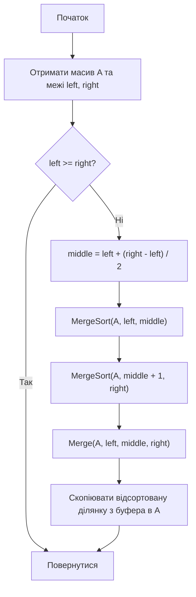
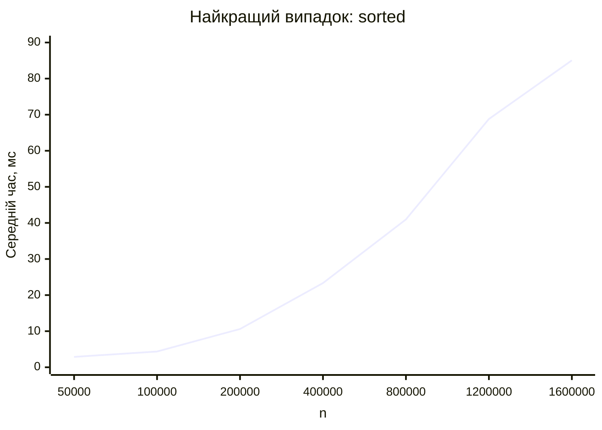
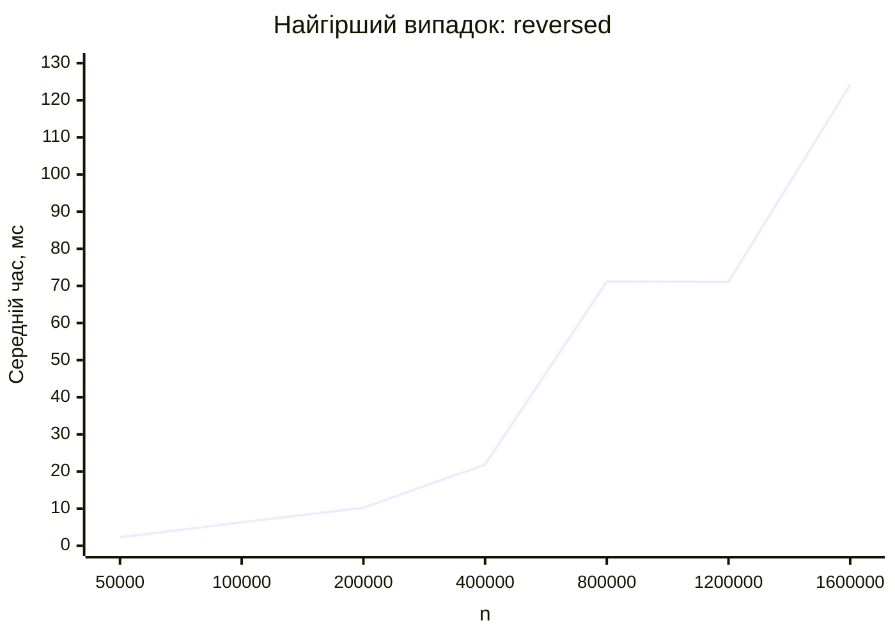
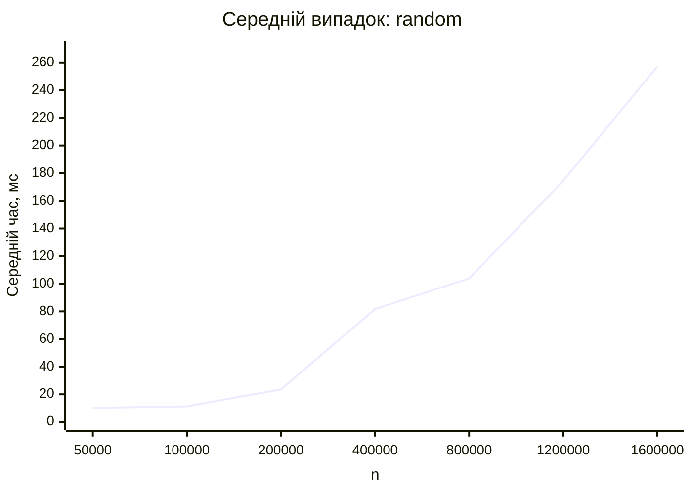

<div align="center">

# Вінницький національний технічний університет

Факультет інтелектуальних інформаційних технологій та автоматизації

<br><br><br><br><br><br><br><br>

## Звіт до лабораторної роботи №5

**«Програмування та відлагодження алгоритму внутрішнього сортування методом злиття. Визначення складності алгоритму та часу його виконання»**

<br><br>

**Дисципліна:** Теорія алгоритмів  
**Курс:** 1  
**Група:** 4КН-25б  

</div>

<br><br><br><br><br>

<div align="right">

**Виконав:** Саволюк Микола Миколайович  

**Викладач:** Перепелиця В&#96;ячеслав Ігорович

</div>

<br><br>

<div align="center">

**Рік:** 2026

</div>

<div style="page-break-after: always;"></div>

## Тема роботи

Програмування та відлагодження алгоритму внутрішнього сортування методом злиття. Визначення складності алгоритму та часу його виконання.

## Мета роботи

Проаналізувати та дослідити алгоритм сортування шляхом злиття, розглянути його рекурсивну структуру, реалізацію, теоретичну складність і практичний час виконання для різних типів вхідних даних.

## Порядок виконання роботи

1. Ознайомитися з принципом “розділяй і володарюй”.
2. Розглянути ідею сортування методом злиття.
3. Навести власний приклад роботи алгоритму на масиві з 10 чисел.
4. Подати алгоритм у графічному вигляді.
5. Записати псевдокод основних процедур `MergeSort` і `Merge`.
6. Реалізувати алгоритм мовою C#/.NET.
7. Оцінити теоретичну складність алгоритму в найкращому, найгіршому та середньому випадках.
8. Провести практичні вимірювання часу виконання для відсортованого, спадного та випадкового масивів.
9. Побудувати таблиці й графіки часу виконання.
10. Сформулювати порівняльний аналіз, переваги, недоліки, висновки та відповісти на контрольні питання.

---

## Короткі теоретичні відомості

Сортуванням називають упорядкування елементів за певним ключем. У внутрішньому сортуванні всі елементи розташовані в оперативній пам'яті, тому алгоритм може швидко звертатися до довільної позиції масиву.

Алгоритм сортування методом злиття належить до рекурсивних алгоритмів типу “розділяй і володарюй”. Загальна ідея цього підходу така:

1. Розділити початкову задачу на менші підзадачі.
2. Розв'язати кожну підзадачу окремо.
3. Об'єднати часткові результати в один загальний результат.

Для задачі сортування це означає, що масив послідовно ділиться на дві частини, кожна частина сортується окремо, а потім дві відсортовані частини зливаються в одну впорядковану послідовність.

---

## Ідея алгоритму сортування методом злиття

Алгоритм `MergeSort` працює рекурсивно. Якщо ділянка масиву містить один або нуль елементів, вона вже вважається відсортованою. Інакше ділянка ділиться навпіл, після чого алгоритм окремо сортує ліву й праву половини.

Найважливішою частиною є процедура `Merge`, яка зливає дві вже відсортовані частини. Для цього використовуються два індекси: один рухається по лівій частині, другий - по правій. На кожному кроці у допоміжний буфер записується менший з двох поточних елементів. Коли одна з частин закінчується, залишок другої частини просто додається до результату.

Якщо під час порівняння рівних елементів спочатку брати елемент з лівої частини, алгоритм зберігає відносний порядок однакових ключів, тобто є стійким.

---

## Власний приклад роботи алгоритму

Початковий масив:

```text
[37, 12, 45, 8, 29, 3, 18, 50, 21, 11]
```

### Рекурсивне розбиття

| Рівень | Ділянки масиву |
| -----: | -------------- |
| 0 | `[37, 12, 45, 8, 29, 3, 18, 50, 21, 11]` |
| 1 | `[37, 12, 45, 8, 29]` і `[3, 18, 50, 21, 11]` |
| 2 | `[37, 12, 45]`, `[8, 29]`, `[3, 18, 50]`, `[21, 11]` |
| 3 | `[37, 12]`, `[45]`, `[8]`, `[29]`, `[3, 18]`, `[50]`, `[21]`, `[11]` |
| 4 | `[37]`, `[12]`, `[45]`, `[8]`, `[29]`, `[3]`, `[18]`, `[50]`, `[21]`, `[11]` |

### Проміжні злиття

| Крок | Злиття | Результат |
| ---: | ------ | --------- |
| 1 | `[37] + [12]` | `[12, 37]` |
| 2 | `[12, 37] + [45]` | `[12, 37, 45]` |
| 3 | `[8] + [29]` | `[8, 29]` |
| 4 | `[12, 37, 45] + [8, 29]` | `[8, 12, 29, 37, 45]` |
| 5 | `[3] + [18]` | `[3, 18]` |
| 6 | `[3, 18] + [50]` | `[3, 18, 50]` |
| 7 | `[21] + [11]` | `[11, 21]` |
| 8 | `[3, 18, 50] + [11, 21]` | `[3, 11, 18, 21, 50]` |
| 9 | `[8, 12, 29, 37, 45] + [3, 11, 18, 21, 50]` | `[3, 8, 11, 12, 18, 21, 29, 37, 45, 50]` |

Результат сортування:

```text
[3, 8, 11, 12, 18, 21, 29, 37, 45, 50]
```

---

## Графічний алгоритм



---

## Псевдокод алгоритму

```text
MERGE_SORT(A, left, right)
    if left >= right
        return

    middle = left + (right - left) / 2

    MERGE_SORT(A, left, middle)
    MERGE_SORT(A, middle + 1, right)
    MERGE(A, left, middle, right)


MERGE(A, left, middle, right)
    i = left
    j = middle + 1
    k = left

    while i <= middle and j <= right
        if A[i] <= A[j]
            buffer[k] = A[i]
            i = i + 1
        else
            buffer[k] = A[j]
            j = j + 1
        k = k + 1

    while i <= middle
        buffer[k] = A[i]
        i = i + 1
        k = k + 1

    while j <= right
        buffer[k] = A[j]
        j = j + 1
        k = k + 1

    for index = left to right
        A[index] = buffer[index]
```

---

## Вихідний код програми

Нижче наведено C#/.NET-програму, яка реалізує сортування методом злиття та виконує практичні вимірювання для трьох типів входів. Допоміжний буфер у бенчмарку створюється до запуску таймера, щоб вимірювати саме рекурсивне сортування та операції злиття.

```csharp
using System.Diagnostics;
using System.Globalization;

internal static class Program
{
    private static readonly int[] Sizes =
    [
        50_000,
        100_000,
        200_000,
        400_000,
        800_000,
        1_200_000,
        1_600_000
    ];

    private const double TargetMilliseconds = 2_200.0;

    private static void Main()
    {
        Console.WriteLine("case,n,repeats,total_ms,average_ms,sorted_ok");

        foreach (var inputKind in new[] { "sorted", "reversed", "random" })
        {
            foreach (var size in Sizes)
            {
                var source = CreateInput(inputKind, size);
                var data = new int[size];
                var buffer = new int[size];

                Array.Copy(source, data, size);
                MergeSort(data, buffer);

                GC.Collect();
                GC.WaitForPendingFinalizers();
                GC.Collect();

                long totalTicks = 0;
                int repeats = 0;
                bool sortedOk = true;

                do
                {
                    Array.Copy(source, data, size);

                    var stopwatch = Stopwatch.StartNew();
                    MergeSort(data, buffer);
                    stopwatch.Stop();

                    totalTicks += stopwatch.ElapsedTicks;
                    repeats++;
                    sortedOk &= IsSorted(data);
                }
                while (TicksToMilliseconds(totalTicks) < TargetMilliseconds);

                var totalMs = TicksToMilliseconds(totalTicks);
                var averageMs = totalMs / repeats;

                Console.WriteLine(string.Join(',',
                    inputKind,
                    size.ToString(CultureInfo.InvariantCulture),
                    repeats.ToString(CultureInfo.InvariantCulture),
                    totalMs.ToString("F3", CultureInfo.InvariantCulture),
                    averageMs.ToString("F3", CultureInfo.InvariantCulture),
                    sortedOk.ToString().ToLowerInvariant()));
            }
        }
    }

    private static int[] CreateInput(string inputKind, int size)
    {
        var result = new int[size];

        switch (inputKind)
        {
            case "sorted":
                for (var i = 0; i < size; i++)
                    result[i] = i;
                break;

            case "reversed":
                for (var i = 0; i < size; i++)
                    result[i] = size - i;
                break;

            case "random":
                var random = new Random(20_260_505 + size);
                for (var i = 0; i < size; i++)
                    result[i] = random.Next();
                break;
        }

        return result;
    }

    private static void MergeSort(int[] array)
    {
        if (array.Length <= 1)
            return;

        var buffer = new int[array.Length];
        MergeSort(array, buffer);
    }

    private static void MergeSort(int[] array, int[] buffer)
    {
        if (array.Length <= 1)
            return;

        MergeSort(array, buffer, 0, array.Length - 1);
    }

    private static void MergeSort(int[] array, int[] buffer, int left, int right)
    {
        if (left >= right)
            return;

        var middle = left + (right - left) / 2;

        MergeSort(array, buffer, left, middle);
        MergeSort(array, buffer, middle + 1, right);
        Merge(array, buffer, left, middle, right);
    }

    private static void Merge(int[] array, int[] buffer, int left, int middle, int right)
    {
        var i = left;
        var j = middle + 1;
        var k = left;

        while (i <= middle && j <= right)
        {
            if (array[i] <= array[j])
                buffer[k++] = array[i++];
            else
                buffer[k++] = array[j++];
        }

        while (i <= middle)
            buffer[k++] = array[i++];

        while (j <= right)
            buffer[k++] = array[j++];

        for (var index = left; index <= right; index++)
            array[index] = buffer[index];
    }

    private static bool IsSorted(int[] array)
    {
        for (var i = 1; i < array.Length; i++)
        {
            if (array[i - 1] > array[i])
                return false;
        }

        return true;
    }

    private static double TicksToMilliseconds(long ticks)
    {
        return ticks * 1_000.0 / Stopwatch.Frequency;
    }
}
```

---

## Теоретична оцінка складності

Сортування злиттям на кожному рівні рекурсії обробляє всі `n` елементів під час злиття. Кількість рівнів рекурсії приблизно дорівнює `log2(n)`, бо на кожному кроці масив ділиться навпіл.

Рекурентне співвідношення:

```text
T(n) = 2T(n / 2) + O(n)
```

Звідси:

```text
T(n) = O(n log n)
```

| Випадок | Тип вхідного масиву | Теоретична складність | Пояснення |
| ------- | ------------------- | --------------------- | --------- |
| Найкращий | Масив уже відсортований | `O(n log n)` | Алгоритм усе одно ділить масив і виконує злиття на кожному рівні |
| Найгірший | Масив упорядкований у спадному порядку | `O(n log n)` | Кількість рівнів рекурсії та сумарна довжина злиттів не змінюються |
| Середній | Випадковий масив | `O(n log n)` | Для довільного входу структура рекурсивного дерева така сама |

Додаткова пам'ять становить `O(n)` для допоміжного буфера. Також використовується стек рекурсії глибиною `O(log n)`.

---

## Практична оцінка складності

Вимірювання виконано локально за допомогою `.NET 10` у конфігурації `Release`. Для кожної точки вхідний масив відновлювався до початкового стану поза таймером. Для випадкового масиву використано фіксований seed. Усі запуски завершились із `sorted_ok=true`.

### Найкращий випадок: масив уже відсортований

| n | Повторень | Сумарний час, мс | Середній час, мс |
| -: | --------: | ---------------: | ---------------: |
| 50 000 | 765 | 2200.050 | 2.876 |
| 100 000 | 504 | 2200.468 | 4.366 |
| 200 000 | 208 | 2206.004 | 10.606 |
| 400 000 | 95 | 2216.648 | 23.333 |
| 800 000 | 54 | 2212.982 | 40.981 |
| 1 200 000 | 32 | 2201.501 | 68.797 |
| 1 600 000 | 26 | 2211.421 | 85.055 |



### Найгірший випадок: масив упорядкований у спадному порядку

| n | Повторень | Сумарний час, мс | Середній час, мс |
| -: | --------: | ---------------: | ---------------: |
| 50 000 | 962 | 2201.936 | 2.289 |
| 100 000 | 348 | 2201.160 | 6.325 |
| 200 000 | 215 | 2206.705 | 10.264 |
| 400 000 | 101 | 2209.365 | 21.875 |
| 800 000 | 31 | 2206.809 | 71.187 |
| 1 200 000 | 31 | 2203.543 | 71.082 |
| 1 600 000 | 18 | 2235.847 | 124.214 |



### Середній випадок: випадковий масив

| n | Повторень | Сумарний час, мс | Середній час, мс |
| -: | --------: | ---------------: | ---------------: |
| 50 000 | 216 | 2205.835 | 10.212 |
| 100 000 | 195 | 2200.761 | 11.286 |
| 200 000 | 94 | 2220.220 | 23.619 |
| 400 000 | 27 | 2206.026 | 81.705 |
| 800 000 | 22 | 2285.237 | 103.874 |
| 1 200 000 | 13 | 2269.223 | 174.556 |
| 1 600 000 | 9 | 2315.602 | 257.289 |



---

## Порівняльний аналіз теоретичних і практичних результатів

Теоретично сортування злиттям має однаковий порядок складності `O(n log n)` у найкращому, найгіршому та середньому випадках. Практичні графіки підтверджують цю властивість: зі збільшенням розміру масиву час виконання зростає значно повільніше, ніж для квадратичних алгоритмів сортування.

На відміну від сортування вставками або бульбашкового сортування, уже відсортований масив не дає merge sort лінійного часу. Алгоритм однаково будує рекурсивне дерево й виконує злиття на кожному рівні. Через це найкращий випадок теж має порядок `O(n log n)`.

Випадковий масив у практичних вимірюваннях виконувався повільніше, ніж відсортований або спадний. Це пояснюється більш непередбачуваними порівняннями під час злиття, роботою кешу процесора та природним шумом вимірювання часу в операційній системі. Однак загальна форма залежності все одно відповідає очікуваному росту `n log n`.

---

## Переваги та недоліки алгоритму

| Переваги | Недоліки |
| -------- | -------- |
| Гарантована складність `O(n log n)` для будь-якого входу | Потребує додаткового буфера `O(n)` |
| Алгоритм є стійким за умови правильного злиття рівних елементів | Має рекурсивні виклики і пов'язаний із ними накладний час |
| Добре підходить для великих масивів | Для малих масивів прості алгоритми можуть бути швидшими через менші константи |
| Природно описується принципом “розділяй і володарюй” | Класична реалізація не є внутрішньо in-place у строгому сенсі |
| Зручно адаптується для зовнішнього сортування | Потребує копіювання елементів між масивом і буфером |

Моя оцінка: merge sort є одним із найнадійніших загальних алгоритмів сортування, коли важлива передбачувана швидкодія. Його головна плата за стабільність і гарантований `O(n log n)` - додаткова пам'ять.

---

## Відповіді на контрольні питання

### 1. Чому задача сортування є однією з найцікавіших і показових задач для курсу теорії алгоритмів?

Задача сортування є показовою, бо для неї існує багато різних алгоритмічних підходів: вставки, вибір, обміни, злиття, швидке сортування, пірамідальне сортування, підрахунок, порозрядне сортування. На прикладі сортування зручно порівнювати складність, стійкість, використання пам'яті, поведінку в найкращому й найгіршому випадках, а також різницю між теоретичною оцінкою та практичним часом роботи.

### 2. Що таке стійкість алгоритму сортування?

Стійкість означає, що елементи з однаковими ключами після сортування зберігають той самий відносний порядок, який вони мали у вхідному масиві. Наприклад, якщо два студенти мають однаковий бал, стійке сортування за балом не поміняє їх місцями відносно початкового списку. Merge sort може бути стійким, якщо під час рівності ключів у процедурі `Merge` спочатку брати елемент з лівої частини.

### 3. За якими критеріями можна класифікувати алгоритми сортування?

Алгоритми сортування можна класифікувати за місцем виконання, складністю, стійкістю, використанням пам'яті, способом порівняння елементів і основною ідеєю роботи. Наприклад, розрізняють внутрішнє та зовнішнє сортування, стійкі й нестійкі алгоритми, алгоритми з додатковою пам'яттю та in-place алгоритми, сортування порівняннями й непорівняльні методи.

### 4. Наведіть класифікацію алгоритмів сортування.

За основною ідеєю можна виділити сортування вставками, вибором, обміном, злиттям, розподілом, деревоподібні та гібридні алгоритми. За складністю поширені групи: квадратичні алгоритми `O(n^2)`, наприклад insertion sort, selection sort, bubble sort; алгоритми `O(n log n)`, наприклад merge sort, quicksort у середньому випадку, heapsort; псевдолінійні алгоритми, наприклад counting sort, radix sort і bucket sort за певних обмежень на дані.

### 5. Перерахуйте та порівняйте відомі алгоритми сортування за псевдолінійний час.

До алгоритмів із псевдолінійним часом належать counting sort, radix sort і bucket sort. Counting sort працює за `O(n + k)`, де `k` - діапазон значень ключів, тому він ефективний для цілих чисел із невеликим діапазоном. Radix sort сортує числа або рядки за розрядами і має складність приблизно `O(d(n + k))`, де `d` - кількість розрядів. Bucket sort розподіляє елементи по “кошиках” і за рівномірного розподілу може працювати близько до `O(n)`, але в найгіршому випадку може погіршитися.

### 6. Чому при оцінці складності алгоритму найчастіше цікавить робота у найгіршому випадку?

Найгірший випадок дає верхню межу часу роботи алгоритму. Це важливо, бо дозволяє оцінити, скільки ресурсів може знадобитися в найнеприємнішій ситуації. Для практичних систем така гарантія часто важливіша за оптимістичний сценарій, адже вона допомагає уникати несподівано довгого виконання.

### 7. Виконайте детальний аналіз алгоритму сортування методом злиття.

Merge sort ділить масив розміру `n` на дві приблизно рівні частини, рекурсивно сортує кожну з них і зливає два відсортовані фрагменти. На одному рівні рекурсії процедура злиття сумарно переглядає всі `n` елементів, тобто потребує `O(n)`. Кількість рівнів рекурсії дорівнює приблизно `log2(n)`. Тому загальний час роботи становить `O(n log n)`.

Рекурентне співвідношення має вигляд `T(n) = 2T(n/2) + O(n)`. За основною теоремою про рекурентні співвідношення воно дає `T(n) = O(n log n)`. Алгоритм має однаковий асимптотичний порядок у найкращому, середньому та найгіршому випадках. Пам'ять: `O(n)` для буфера та `O(log n)` для стеку рекурсії.

### 8. Наведіть переваги та недоліки алгоритму сортування методом злиття.

Основні переваги merge sort: гарантована складність `O(n log n)`, стійкість, добра поведінка на великих наборах даних, зручність для зовнішнього сортування та природна рекурсивна структура. Основні недоліки: потреба в додатковій пам'яті `O(n)`, накладні витрати на рекурсію й копіювання, а також те, що для малих масивів простіші алгоритми часто мають кращі константи.

---

## Висновки

У лабораторній роботі було розглянуто алгоритм сортування методом злиття. Я проаналізував його зв'язок із принципом “розділяй і володарюй”, навів приклад рекурсивного розбиття масиву з 10 чисел, показав послідовність проміжних злиттів і отримав відсортований результат.

Було складено блок-схему, псевдокод і програмну реалізацію мовою C#/.NET. Реалізація використовує допоміжний буфер і зберігає стійкість сортування, оскільки під час рівності елементів перевага надається лівій частині.

Теоретичний аналіз показав, що merge sort має складність `O(n log n)` у найкращому, найгіршому та середньому випадках. Практичні вимірювання для відсортованих, спадних і випадкових масивів підтвердили очікуваний характер росту часу. Порівняно з квадратичними алгоритмами, сортування злиттям значно краще масштабується для великих масивів, але потребує додаткової пам'яті `O(n)`.
