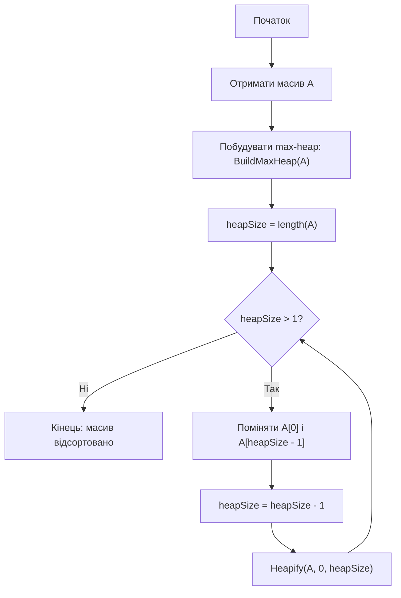
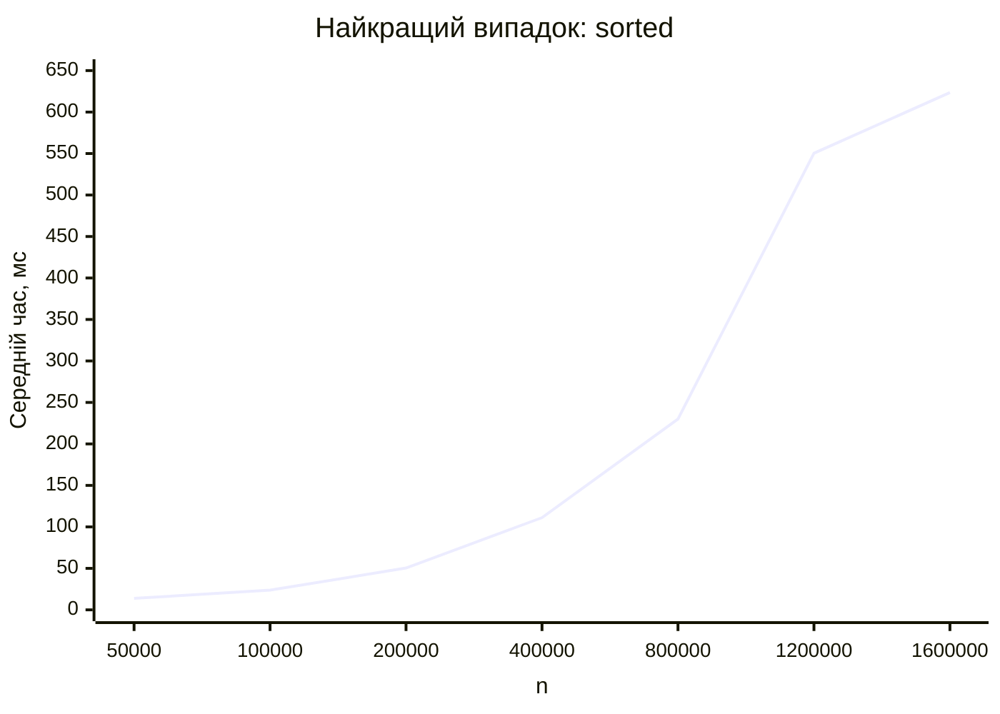
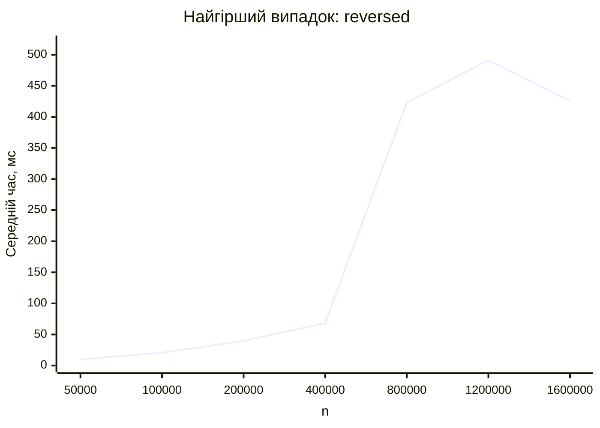
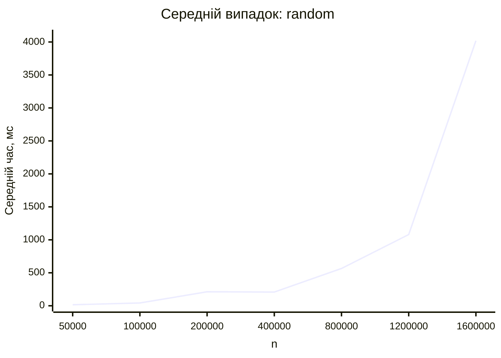

<div align="center">

# Вінницький національний технічний університет

Факультет інтелектуальних інформаційних технологій та автоматизації

<br><br><br><br><br><br><br><br>

## Звіт до лабораторної роботи №7

**«Програмування та аналіз алгоритму сортування за допомогою купи. Пірамідальне сортування. Обчислення часу виконання алгоритму»**

<br><br>

**Дисципліна:** Теорія алгоритмів  
**Курс:** 1  
**Група:** 4КН-25б  

</div>

<br><br><br><br><br>

<div align="right">

**Виконав:** Саволюк Микола Миколайович  

**Викладач:** Перепелиця В&#96;ячеслав Ігорович

</div>

<br><br>

<div align="center">

**Рік:** 2026

</div>

<div style="page-break-after: always;"></div>

## Тема роботи

Програмування та аналіз алгоритму сортування за допомогою купи. Пірамідальне сортування. Обчислення часу виконання алгоритму.

## Мета роботи

Проаналізувати та дослідити алгоритм сортування методом купи, розглянути його ідею, операції над двійковою купою, теоретичну складність і практичний час виконання для різних типів вхідних даних.

## Порядок виконання роботи

1. Ознайомитися з поняттям двійкової купи.
2. Розглянути головну властивість max-heap.
3. Проаналізувати процедури `Heapify`, `BuildMaxHeap` і `HeapSort`.
4. Навести власний приклад сортування масиву з 10 чисел.
5. Подати алгоритм у графічному вигляді.
6. Реалізувати алгоритм мовою C#/.NET.
7. Оцінити теоретичну складність алгоритму.
8. Провести практичні вимірювання часу виконання для відсортованого, спадного та випадкового масивів.
9. Побудувати таблиці й графіки часу виконання.
10. Сформулювати порівняльний аналіз, переваги, недоліки, висновки та відповісти на контрольні питання.

---

## Короткі теоретичні відомості

Двійкова купа - це масив, який можна розглядати як майже повне двійкове дерево. Для max-heap виконується головна властивість: значення кожного батьківського вузла не менше за значення його дітей. Тому найбільший елемент купи завжди розташований у корені.

Якщо масив індексується з нуля, то для вершини з індексом `i`:

```text
left(i) = 2i + 1
right(i) = 2i + 2
parent(i) = floor((i - 1) / 2)
```

Пірамідальне сортування використовує max-heap. Спочатку з довільного масиву будується купа. Потім найбільший елемент, який стоїть у корені, міняється місцями з останнім елементом поточної купи. Розмір купи зменшується на один, а для кореня знову виконується `Heapify`, щоб відновити головну властивість купи.

---

## Ідея алгоритму heapsort

Алгоритм складається з двох основних етапів:

1. `BuildMaxHeap` перетворює вхідний масив на max-heap.
2. `HeapSort` багаторазово переносить максимум у кінець масиву та відновлює властивість купи для решти елементів.

Процедура `Heapify` працює з вершиною, для якої ліве й праве піддерева вже є купами. Вона порівнює елемент у поточній вершині з дітьми, знаходить найбільший елемент і, якщо потрібно, міняє його з поточним. Після цього процес повторюється нижче по дереву.

Оскільки висота двійкової купи дорівнює `O(log n)`, одна операція `Heapify` має складність `O(log n)`. Побудова купи виконується за `O(n)`, а основний цикл сортування виконує `n - 1` вилучень максимуму, кожне з яких потребує `O(log n)`.

---

## Власний приклад роботи алгоритму

Початковий масив:

```text
[37, 12, 45, 8, 29, 3, 18, 50, 21, 11]
```

### Побудова max-heap

| Крок | Дія | Стан масиву |
| ---: | --- | ----------- |
| 0 | Початковий масив | `[37, 12, 45, 8, 29, 3, 18, 50, 21, 11]` |
| 1 | `Heapify(i = 4)` | `[37, 12, 45, 8, 29, 3, 18, 50, 21, 11]` |
| 2 | `Heapify(i = 3)` | `[37, 12, 45, 50, 29, 3, 18, 8, 21, 11]` |
| 3 | `Heapify(i = 2)` | `[37, 12, 45, 50, 29, 3, 18, 8, 21, 11]` |
| 4 | `Heapify(i = 1)` | `[37, 50, 45, 21, 29, 3, 18, 8, 12, 11]` |
| 5 | `Heapify(i = 0)` | `[50, 37, 45, 21, 29, 3, 18, 8, 12, 11]` |

Після побудови купи найбільший елемент `50` розташований у корені.

### Вилучення максимумів

| Крок | Розмір купи після вилучення | Стан масиву |
| ---: | --------------------------: | ----------- |
| 1 | 9 | `[45, 37, 18, 21, 29, 3, 11, 8, 12, 50]` |
| 2 | 8 | `[37, 29, 18, 21, 12, 3, 11, 8, 45, 50]` |
| 3 | 7 | `[29, 21, 18, 8, 12, 3, 11, 37, 45, 50]` |
| 4 | 6 | `[21, 12, 18, 8, 11, 3, 29, 37, 45, 50]` |
| 5 | 5 | `[18, 12, 3, 8, 11, 21, 29, 37, 45, 50]` |
| 6 | 4 | `[12, 11, 3, 8, 18, 21, 29, 37, 45, 50]` |
| 7 | 3 | `[11, 8, 3, 12, 18, 21, 29, 37, 45, 50]` |
| 8 | 2 | `[8, 3, 11, 12, 18, 21, 29, 37, 45, 50]` |
| 9 | 1 | `[3, 8, 11, 12, 18, 21, 29, 37, 45, 50]` |

Результат сортування:

```text
[3, 8, 11, 12, 18, 21, 29, 37, 45, 50]
```

---

## Графічний алгоритм



---

## Псевдокод алгоритму

```text
HEAPSORT(A)
    BUILD_MAX_HEAP(A)
    heapSize = length(A)

    while heapSize > 1
        swap A[0] and A[heapSize - 1]
        heapSize = heapSize - 1
        HEAPIFY(A, 0, heapSize)


BUILD_MAX_HEAP(A)
    for i = floor(length(A) / 2) - 1 downto 0
        HEAPIFY(A, i, length(A))


HEAPIFY(A, i, heapSize)
    while true
        left = 2i + 1
        right = 2i + 2
        largest = i

        if left < heapSize and A[left] > A[largest]
            largest = left

        if right < heapSize and A[right] > A[largest]
            largest = right

        if largest == i
            return

        swap A[i] and A[largest]
        i = largest
```

---

## Сирець програми

Нижче наведено C#/.NET-програму, яка реалізує heapsort та виконує практичні вимірювання для трьох типів входів. Підготовка масивів не входить у вимірюваний час.

```csharp
using System.Diagnostics;
using System.Globalization;

internal static class Program
{
    private static readonly int[] Sizes =
    [
        50_000,
        100_000,
        200_000,
        400_000,
        800_000,
        1_200_000,
        1_600_000
    ];

    private const double TargetMilliseconds = 2_200.0;

    private static void Main()
    {
        Console.WriteLine("case,n,repeats,total_ms,average_ms,sorted_ok");

        foreach (var inputKind in new[] { "sorted", "reversed", "random" })
        {
            foreach (var size in Sizes)
            {
                var source = CreateInput(inputKind, size);
                var data = new int[size];

                Array.Copy(source, data, size);
                HeapSort(data);

                GC.Collect();
                GC.WaitForPendingFinalizers();
                GC.Collect();

                long totalTicks = 0;
                int repeats = 0;
                bool sortedOk = true;

                do
                {
                    Array.Copy(source, data, size);

                    var stopwatch = Stopwatch.StartNew();
                    HeapSort(data);
                    stopwatch.Stop();

                    totalTicks += stopwatch.ElapsedTicks;
                    repeats++;
                    sortedOk &= IsSorted(data);
                }
                while (TicksToMilliseconds(totalTicks) < TargetMilliseconds);

                var totalMs = TicksToMilliseconds(totalTicks);
                var averageMs = totalMs / repeats;

                Console.WriteLine(string.Join(',',
                    inputKind,
                    size.ToString(CultureInfo.InvariantCulture),
                    repeats.ToString(CultureInfo.InvariantCulture),
                    totalMs.ToString("F3", CultureInfo.InvariantCulture),
                    averageMs.ToString("F3", CultureInfo.InvariantCulture),
                    sortedOk.ToString().ToLowerInvariant()));
            }
        }
    }

    private static int[] CreateInput(string inputKind, int size)
    {
        var result = new int[size];

        switch (inputKind)
        {
            case "sorted":
                for (var i = 0; i < size; i++)
                    result[i] = i;
                break;

            case "reversed":
                for (var i = 0; i < size; i++)
                    result[i] = size - i;
                break;

            case "random":
                var random = new Random(20_260_509 + size);
                for (var i = 0; i < size; i++)
                    result[i] = random.Next();
                break;
        }

        return result;
    }

    private static void HeapSort(int[] array)
    {
        BuildMaxHeap(array);

        for (var heapSize = array.Length; heapSize > 1; heapSize--)
        {
            Swap(array, 0, heapSize - 1);
            Heapify(array, 0, heapSize - 1);
        }
    }

    private static void BuildMaxHeap(int[] array)
    {
        for (var i = array.Length / 2 - 1; i >= 0; i--)
            Heapify(array, i, array.Length);
    }

    private static void Heapify(int[] array, int index, int heapSize)
    {
        while (true)
        {
            var left = 2 * index + 1;
            var right = 2 * index + 2;
            var largest = index;

            if (left < heapSize && array[left] > array[largest])
                largest = left;

            if (right < heapSize && array[right] > array[largest])
                largest = right;

            if (largest == index)
                return;

            Swap(array, index, largest);
            index = largest;
        }
    }

    private static void Swap(int[] array, int first, int second)
    {
        (array[first], array[second]) = (array[second], array[first]);
    }

    private static bool IsSorted(int[] array)
    {
        for (var i = 1; i < array.Length; i++)
        {
            if (array[i - 1] > array[i])
                return false;
        }

        return true;
    }

    private static double TicksToMilliseconds(long ticks)
    {
        return ticks * 1_000.0 / Stopwatch.Frequency;
    }
}
```

---

## Теоретична оцінка складності

| Етап | Складність | Пояснення |
| ---- | ---------- | --------- |
| `Heapify` | `O(log n)` | Елемент може опускатися вниз не більше ніж на висоту купи |
| `BuildMaxHeap` | `O(n)` | Купа будується знизу вгору; сумарна робота всіх `Heapify` лінійна |
| Основний цикл `HeapSort` | `O(n log n)` | Виконується `n - 1` вилучень максимуму, кожне з `Heapify` |
| Додаткова пам'ять | `O(1)` | Сортування виконується на місці |

Для heapsort кількість основних операцій мало залежить від початкового порядку елементів. Тому асимптотична оцінка однакова для трьох випадків:

| Випадок | Тип вхідного масиву | Теоретична складність |
| ------- | ------------------- | --------------------- |
| Найкращий | Масив уже відсортований | `O(n log n)` |
| Найгірший | Масив упорядкований у спадному порядку | `O(n log n)` |
| Середній | Випадковий масив | `O(n log n)` |

---

## Практична оцінка складності

Вимірювання виконано локально за допомогою `.NET 10` у конфігурації `Release`. Генерація та копіювання масивів не входили до вимірюваного часу сортування. Для випадкового масиву використано фіксований seed. Усі запуски завершились із `sorted_ok=true`.

### Найкращий випадок: масив уже відсортований

| n | Повторень | Сумарний час, мс | Середній час, мс |
| -: | --------: | ---------------: | ---------------: |
| 50 000 | 160 | 2209.590 | 13.810 |
| 100 000 | 93 | 2204.899 | 23.709 |
| 200 000 | 44 | 2218.449 | 50.419 |
| 400 000 | 20 | 2222.398 | 111.120 |
| 800 000 | 11 | 2529.797 | 229.982 |
| 1 200 000 | 4 | 2201.593 | 550.398 |
| 1 600 000 | 4 | 2494.087 | 623.522 |



### Найгірший випадок: масив упорядкований у спадному порядку

| n | Повторень | Сумарний час, мс | Середній час, мс |
| -: | --------: | ---------------: | ---------------: |
| 50 000 | 223 | 2209.312 | 9.907 |
| 100 000 | 106 | 2203.101 | 20.784 |
| 200 000 | 56 | 2222.758 | 39.692 |
| 400 000 | 33 | 2252.876 | 68.269 |
| 800 000 | 6 | 2539.191 | 423.198 |
| 1 200 000 | 5 | 2454.577 | 490.915 |
| 1 600 000 | 6 | 2554.830 | 425.805 |



### Середній випадок: випадковий масив

| n | Повторень | Сумарний час, мс | Середній час, мс |
| -: | --------: | ---------------: | ---------------: |
| 50 000 | 144 | 2204.336 | 15.308 |
| 100 000 | 52 | 2215.193 | 42.600 |
| 200 000 | 11 | 2329.975 | 211.816 |
| 400 000 | 11 | 2289.874 | 208.170 |
| 800 000 | 4 | 2261.766 | 565.441 |
| 1 200 000 | 3 | 3240.376 | 1080.125 |
| 1 600 000 | 1 | 4019.212 | 4019.212 |



---

## Порівняльний аналіз теоретичних і практичних результатів

Теоретично heapsort має складність `O(n log n)` у найкращому, найгіршому та середньому випадках. Практичні вимірювання також показують зростання часу зі збільшенням розміру масиву, причому залежність значно ближча до `n log n`, ніж до квадратичної.

Відсортований і спадний входи не дають heapsort принципової асимптотичної переваги, бо алгоритм у будь-якому разі будує купу і виконує послідовні вилучення максимуму. Випадковий масив на великих розмірах працював повільніше. Це можна пояснити більш непередбачуваними переходами в `Heapify`, гіршою роботою кешу та загальним шумом вимірювання часу.

На відміну від merge sort, heapsort не потребує додаткового масиву `O(n)`, але має менш послідовний доступ до пам'яті. Саме тому на практиці він може поступатися швидкому сортуванню або добре оптимізованому сортуванню злиттям, хоча має сильну теоретичну гарантію найгіршого випадку.

---

## Переваги та недоліки алгоритму

| Переваги | Недоліки |
| -------- | -------- |
| Гарантована складність `O(n log n)` у найгіршому випадку | Не є стійким алгоритмом сортування |
| Працює на місці та потребує лише `O(1)` додаткової пам'яті | Має менш зручний для кешу доступ до пам'яті |
| Не залежить критично від початкового порядку елементів | На практиці часто повільніший за quicksort |
| Використовує корисну структуру даних - двійкову купу | Реалізація складніша за insertion sort або bubble sort |
| Добре показує зв'язок між структурами даних і алгоритмами | Для малих масивів має відносно великі константні витрати |

Моя оцінка: heapsort є дуже корисним алгоритмом для вивчення, бо поєднує сортування зі структурою даних “купа”. Його головна практична перевага - передбачувана складність `O(n log n)` без додаткового масиву.

---

## Відповіді на контрольні питання

### 1. Чому задача сортування є однією з найцікавіших і показових задач для курсу теорії алгоритмів?

Сортування є показовою задачею, бо для неї існує багато різних алгоритмів з різними ідеями, складністю, використанням пам'яті та поведінкою на практиці. На сортуванні легко порівнювати квадратичні алгоритми, алгоритми `O(n log n)`, непорівняльні методи та вплив структури даних на ефективність.

### 2. Що таке стійкість алгоритму сортування?

Стійкість означає, що елементи з однаковими ключами після сортування зберігають той самий відносний порядок, який мали у вхідному масиві. Наприклад, якщо два записи мають однаковий ключ, стійке сортування не поміняє їх місцями. Heapsort у класичній реалізації не є стійким, бо під час обмінів елементи можуть переставлятися через великі відстані.

### 3. За якими критеріями можна класифікувати алгоритми сортування?

Алгоритми сортування можна класифікувати за місцем виконання, стійкістю, використанням додаткової пам'яті, часовою складністю, способом порівняння елементів і основною ідеєю роботи. Наприклад, розрізняють внутрішнє та зовнішнє сортування, стійкі й нестійкі алгоритми, in-place алгоритми та алгоритми з додатковою пам'яттю.

### 4. Наведіть класифікацію алгоритмів сортування.

За основною ідеєю можна виділити сортування вставками, вибором, обміном, злиттям, купою, швидке сортування, а також лінійні методи на зразок counting sort і radix sort. За складністю прості алгоритми на кшталт bubble sort, insertion sort і selection sort зазвичай мають `O(n^2)`, а merge sort, heapsort і quicksort у середньому випадку мають `O(n log n)`.

### 5. Перерахуйте та порівняйте відомі алгоритми сортування за псевдолінійний час.

До псевдолінійних алгоритмів належать counting sort, radix sort і bucket sort. Counting sort працює за `O(n + k)`, де `k` - діапазон ключів, тому він ефективний для цілих чисел із невеликим діапазоном. Radix sort сортує за розрядами й має складність приблизно `O(d(n + k))`. Bucket sort розподіляє елементи по кошиках і може працювати близько до `O(n)` за рівномірного розподілу.

### 6. Чому при оцінці складності алгоритму найчастіше цікавить робота у найгіршому випадку?

Найгірший випадок дає гарантію верхньої межі часу роботи. Це важливо для практичних систем, де потрібно розуміти, скільки ресурсів алгоритм може вимагати в найскладнішій ситуації. Для heapsort така гарантія особливо корисна, бо його найгірший випадок все одно має `O(n log n)`.

### 7. Наведіть основні операції над купою.

Основні операції над купою: `Heapify`, побудова купи `BuildMaxHeap`, вилучення максимуму `ExtractMax`, вставка нового елемента `Insert`, збільшення ключа `IncreaseKey`, отримання максимуму `Maximum` і сортування `HeapSort`. У лабораторній роботі основними є `Heapify`, `BuildMaxHeap` і `HeapSort`.

### 8. Як працює процедура збереження головної властивості купи?

Процедура `Heapify` припускає, що ліве та праве піддерева поточної вершини вже є купами, але сама вершина може порушувати властивість max-heap. Вона порівнює поточний елемент із лівою та правою дитиною, знаходить найбільший з трьох і, якщо найбільшим є не поточний елемент, міняє їх місцями. Після цього процедура продовжується для тієї дитини, куди було переміщено елемент.

### 9. Як з довільного масиву побудувати купу? Скільки часу потребує така процедура?

Купу будують знизу вгору. Починають з останньої внутрішньої вершини `floor(n/2)-1` і для кожної вершини до кореня виконують `Heapify`. Листки вже є купами з одного елемента, тому їх обробляти не потрібно. Хоча один виклик `Heapify` може коштувати `O(log n)`, сумарна складність `BuildMaxHeap` дорівнює `O(n)`.

### 10. Наведіть власний приклад сортування за допомогою купи.

Для масиву `[37, 12, 45, 8, 29, 3, 18, 50, 21, 11]` після побудови max-heap отримуємо `[50, 37, 45, 21, 29, 3, 18, 8, 12, 11]`. Далі корінь `50` міняється з останнім елементом, розмір купи зменшується, і виконується `Heapify`. Після повторення цієї операції для всіх елементів отримуємо відсортований масив `[3, 8, 11, 12, 18, 21, 29, 37, 45, 50]`.

### 11. Наведіть переваги та недоліки алгоритму сортування методом купи.

Переваги heapsort: гарантована складність `O(n log n)`, робота на місці з додатковою пам'яттю `O(1)`, відсутність погіршення до `O(n^2)` і корисність купи як окремої структури даних. Недоліки: алгоритм не є стійким, має менш послідовний доступ до пам'яті, часто програє quicksort на практиці та складніший для реалізації, ніж прості квадратичні методи.

---

## Розширені висновки

У лабораторній роботі було досліджено алгоритм пірамідального сортування. Я розглянув двійкову купу як масивне подання майже повного дерева, головну властивість max-heap і основні процедури `Heapify`, `BuildMaxHeap` та `HeapSort`.

На власному прикладі з 10 чисел було показано два етапи роботи алгоритму: побудову max-heap і послідовне вилучення максимумів. Після завершення всіх вилучень масив був відсортований за зростанням.

Теоретичний аналіз показав, що heapsort має складність `O(n log n)` у найкращому, найгіршому та середньому випадках. Побудова купи виконується за `O(n)`, а основний цикл сортування - за `O(n log n)`. Додаткова пам'ять становить `O(1)`.

Практичні вимірювання для відсортованих, спадних і випадкових масивів підтвердили, що час виконання зростає зі збільшенням розміру входу. Випадкові масиви на великих розмірах показали більший час через особливості роботи `Heapify`, кешу та шум вимірювання, але загальний порядок росту відповідає теоретичній оцінці.

Отже, пірамідальне сортування є надійним алгоритмом із сильною гарантією найгіршого випадку та малою додатковою пам'яттю. Його особливо корисно вивчати, бо воно показує, як структура даних може безпосередньо визначати ефективність алгоритму.
