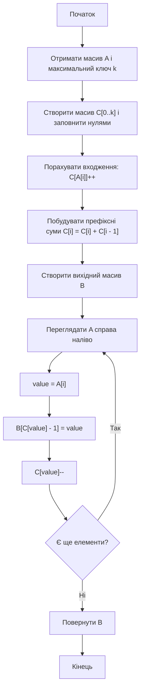
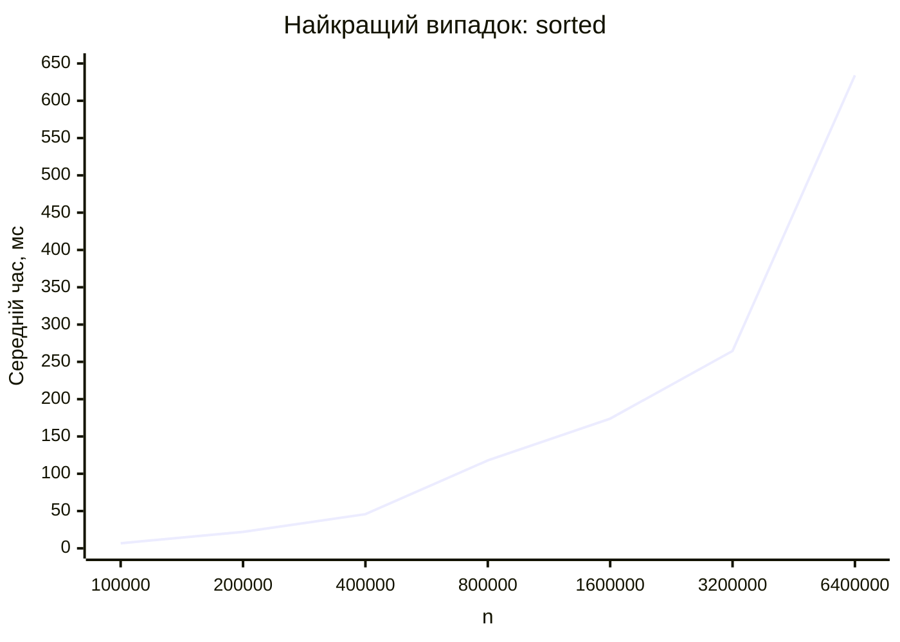
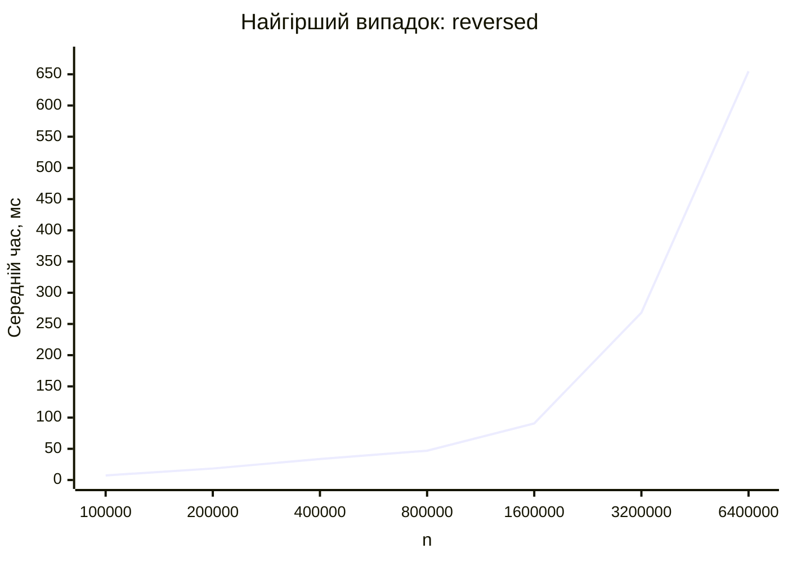
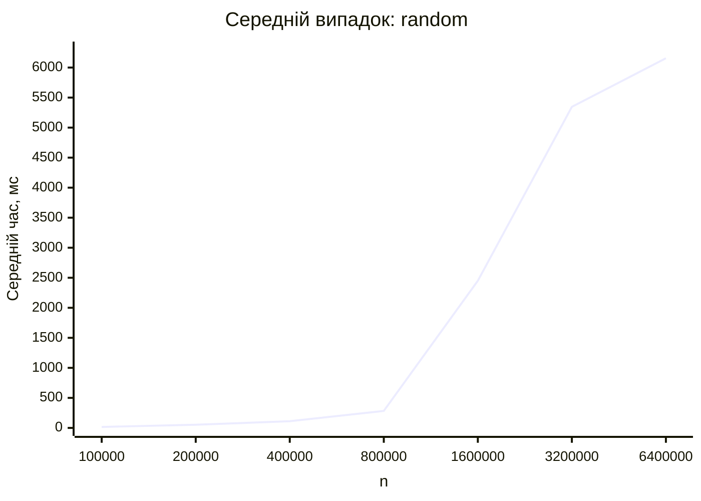

<div align="center">

# Вінницький національний технічний університет

Факультет інтелектуальних інформаційних технологій та автоматизації

<br><br><br><br><br><br><br><br>

## Звіт до лабораторної роботи №8

**«Програмування та аналіз алгоритму сортування лінійного рівня складності»**

<br><br>

**Дисципліна:** Теорія алгоритмів  
**Курс:** 1  
**Група:** 4КН-25б  

</div>

<br><br><br><br><br>

<div align="right">

**Виконав:** Саволюк Микола Миколайович  

**Викладач:** Перепелиця В&#96;ячеслав Ігорович

</div>

<br><br>

<div align="center">

**Рік:** 2026

</div>

<div style="page-break-after: always;"></div>

## Тема роботи

Програмування та аналіз алгоритму сортування лінійного рівня складності.

## Мета роботи

Проаналізувати та дослідити алгоритми сортування за лінійний час, детально реалізувати сортування підраховуванням і практично оцінити його час виконання для різних типів вхідних даних.

## Порядок виконання роботи

1. Ознайомитися з алгоритмами сортування, що не обмежуються тільки попарними порівняннями.
2. Розглянути сортування підраховуванням, цифрове сортування та сортування вичерпуванням.
3. Обрати алгоритм для реалізації: сортування підраховуванням.
4. Навести власний приклад роботи counting sort на масиві з 10 чисел.
5. Подати алгоритм у графічному вигляді.
6. Записати псевдокод і реалізувати алгоритм мовою C#/.NET.
7. Оцінити теоретичну складність алгоритму.
8. Провести практичні вимірювання часу виконання для відсортованого, спадного та випадкового масивів.
9. Побудувати таблиці й графіки часу виконання.
10. Сформулювати порівняльний аналіз, переваги, недоліки, висновки та відповісти на контрольні питання.

---

## Короткі теоретичні відомості

У попередніх лабораторних роботах досліджувалися алгоритми сортування порівняннями: вставками, обміном, злиттям і купою. Для таких алгоритмів у загальному випадку існує нижня межа `Ω(n log n)`, бо вони отримують інформацію про порядок елементів через попарні порівняння.

Алгоритми лінійного сортування працюють інакше: вони використовують додаткову інформацію про структуру ключів. Наприклад, якщо відомо, що всі ключі є цілими числами з невеликого діапазону, можна підрахувати кількість входжень кожного значення і не порівнювати елементи між собою.

У методичці розглянуто три алгоритми:

| Алгоритм | Ідея | Типова складність | Умова ефективності |
| -------- | ---- | ----------------- | ------------------ |
| Сортування підраховуванням | Підраховує кількість ключів кожного значення | `O(n + k)` | Ключі - цілі числа з діапазону `0..k` |
| Цифрове сортування | Сортує ключі за розрядами, зазвичай від молодшого до старшого | `O(d(n + k))` | Є фіксована кількість розрядів `d`, а сортування за розрядом стійке |
| Сортування вичерпуванням | Розкладає числа по кошиках і сортує всередині кошиків | Середній час `O(n)` | Дані рівномірно розподілені, зазвичай на `[0, 1)` |

Для практичної реалізації у цій роботі обрано сортування підраховуванням.

---

## Ідея алгоритму сортування підраховуванням

Нехай вхідний масив `A` містить `n` цілих невід'ємних чисел, кожне з яких належить діапазону `0..k`. Алгоритм створює допоміжний масив `C` розміру `k + 1`, у якому зберігається кількість входжень кожного значення.

Після цього масив `C` перетворюється на масив префіксних сум: `C[i]` показує, скільки елементів у вхідному масиві не перевищують `i`. Завдяки цьому можна визначити позицію кожного елемента у вихідному масиві `B`.

Щоб алгоритм був стійким, елементи вхідного масиву переглядаються справа наліво. Якщо два елементи мають однаковий ключ, той, що стояв правіше, буде записаний пізніше, а відносний порядок однакових ключів збережеться.

---

## Власний приклад роботи алгоритму

Початковий масив:

```text
A = [4, 2, 2, 8, 3, 3, 1, 7, 4, 0]
```

Діапазон ключів: `0..8`, тобто `k = 8`.

### Підрахунок кількостей

| Значення | 0 | 1 | 2 | 3 | 4 | 5 | 6 | 7 | 8 |
| --------: | -: | -: | -: | -: | -: | -: | -: | -: | -: |
| Кількість | 1 | 1 | 2 | 2 | 2 | 0 | 0 | 1 | 1 |

### Префіксні суми

| Значення | 0 | 1 | 2 | 3 | 4 | 5 | 6 | 7 | 8 |
| --------: | -: | -: | -: | -: | -: | -: | -: | -: | -: |
| `C[i]` | 1 | 2 | 4 | 6 | 8 | 8 | 8 | 9 | 10 |

Після побудови префіксних сум значення `C[i]` показує останню позицію, на яку може потрапити ключ `i` у відсортованому масиві.

### Формування вихідного масиву справа наліво

| Крок | Поточний елемент | Позиція у вихідному масиві | Частковий результат |
| ---: | ---------------: | -------------------------: | ------------------- |
| 1 | 0 | 1 | `[0, _, _, _, _, _, _, _, _, _]` |
| 2 | 4 | 8 | `[0, _, _, _, _, _, _, 4, _, _]` |
| 3 | 7 | 9 | `[0, _, _, _, _, _, _, 4, 7, _]` |
| 4 | 1 | 2 | `[0, 1, _, _, _, _, _, 4, 7, _]` |
| 5 | 3 | 6 | `[0, 1, _, _, _, 3, _, 4, 7, _]` |
| 6 | 3 | 5 | `[0, 1, _, _, 3, 3, _, 4, 7, _]` |
| 7 | 8 | 10 | `[0, 1, _, _, 3, 3, _, 4, 7, 8]` |
| 8 | 2 | 4 | `[0, 1, _, 2, 3, 3, _, 4, 7, 8]` |
| 9 | 2 | 3 | `[0, 1, 2, 2, 3, 3, _, 4, 7, 8]` |
| 10 | 4 | 7 | `[0, 1, 2, 2, 3, 3, 4, 4, 7, 8]` |

Результат сортування:

```text
B = [0, 1, 2, 2, 3, 3, 4, 4, 7, 8]
```

---

## Графічний алгоритм



---

## Псевдокод алгоритму

```text
COUNTING_SORT(A, k)
    створити масив C[0..k], заповнений нулями
    створити масив B[0..length(A)-1]

    for i = 0 to length(A)-1
        C[A[i]] = C[A[i]] + 1

    for i = 1 to k
        C[i] = C[i] + C[i - 1]

    for i = length(A)-1 downto 0
        value = A[i]
        B[C[value] - 1] = value
        C[value] = C[value] - 1

    return B
```

---

## Сирець програми

Нижче наведено C#/.NET-програму, яка реалізує стійке сортування підраховуванням і виконує практичні вимірювання для трьох типів входів. Для кожного розміру використано діапазон ключів `0..n-1`, тобто `k ≈ n`.

```csharp
using System.Diagnostics;
using System.Globalization;

internal static class Program
{
    private static readonly int[] Sizes =
    [
        100_000,
        200_000,
        400_000,
        800_000,
        1_600_000,
        3_200_000,
        6_400_000
    ];

    private const double TargetMilliseconds = 2_200.0;

    private static void Main()
    {
        Console.WriteLine("case,n,k,repeats,total_ms,average_ms,sorted_ok");

        foreach (var inputKind in new[] { "sorted", "reversed", "random" })
        {
            foreach (var size in Sizes)
            {
                var maxValue = size - 1;
                var source = CreateInput(inputKind, size, maxValue);
                var output = new int[size];
                var count = new int[maxValue + 1];

                CountingSort(source, output, count, maxValue);

                GC.Collect();
                GC.WaitForPendingFinalizers();
                GC.Collect();

                long totalTicks = 0;
                int repeats = 0;
                bool sortedOk = true;

                do
                {
                    var stopwatch = Stopwatch.StartNew();
                    CountingSort(source, output, count, maxValue);
                    stopwatch.Stop();

                    totalTicks += stopwatch.ElapsedTicks;
                    repeats++;
                    sortedOk &= IsSorted(output);
                }
                while (TicksToMilliseconds(totalTicks) < TargetMilliseconds);

                var totalMs = TicksToMilliseconds(totalTicks);
                var averageMs = totalMs / repeats;

                Console.WriteLine(string.Join(',',
                    inputKind,
                    size.ToString(CultureInfo.InvariantCulture),
                    (maxValue + 1).ToString(CultureInfo.InvariantCulture),
                    repeats.ToString(CultureInfo.InvariantCulture),
                    totalMs.ToString("F3", CultureInfo.InvariantCulture),
                    averageMs.ToString("F3", CultureInfo.InvariantCulture),
                    sortedOk.ToString().ToLowerInvariant()));
            }
        }
    }

    private static int[] CreateInput(string inputKind, int size, int maxValue)
    {
        var result = new int[size];

        switch (inputKind)
        {
            case "sorted":
                for (var i = 0; i < size; i++)
                    result[i] = i;
                break;

            case "reversed":
                for (var i = 0; i < size; i++)
                    result[i] = maxValue - i;
                break;

            case "random":
                var random = new Random(20_260_509 + size);
                for (var i = 0; i < size; i++)
                    result[i] = random.Next(maxValue + 1);
                break;
        }

        return result;
    }

    private static void CountingSort(int[] input, int[] output, int[] count, int maxValue)
    {
        Array.Clear(count, 0, maxValue + 1);

        for (var i = 0; i < input.Length; i++)
            count[input[i]]++;

        for (var i = 1; i <= maxValue; i++)
            count[i] += count[i - 1];

        for (var i = input.Length - 1; i >= 0; i--)
        {
            var value = input[i];
            output[count[value] - 1] = value;
            count[value]--;
        }
    }

    private static bool IsSorted(int[] array)
    {
        for (var i = 1; i < array.Length; i++)
        {
            if (array[i - 1] > array[i])
                return false;
        }

        return true;
    }

    private static double TicksToMilliseconds(long ticks)
    {
        return ticks * 1_000.0 / Stopwatch.Frequency;
    }
}
```

---

## Теоретична оцінка складності

Нехай `n` - кількість елементів, а `k` - найбільший можливий ключ. Алгоритм виконує такі етапи:

| Етап | Складність |
| ---- | ---------- |
| Ініціалізація масиву `C[0..k]` | `O(k)` |
| Підрахунок входжень елементів | `O(n)` |
| Побудова префіксних сум | `O(k)` |
| Формування вихідного масиву | `O(n)` |

Загальна складність:

```text
T(n, k) = O(n + k)
```

Якщо `k = O(n)`, то:

```text
T(n, k) = O(n)
```

Додаткова пам'ять:

```text
O(n + k)
```

Початковий порядок елементів не змінює асимптотичну складність counting sort, тому для відсортованого, спадного та випадкового масивів порядок росту однаковий.

---

## Практична оцінка складності

Вимірювання виконано локально за допомогою `.NET 10` у конфігурації `Release`. Для кожного розміру `k = n`, тобто ключі належать діапазону `0..n-1`. Усі запуски завершилися з `sorted_ok=true`.

У практичній частині використано три типи входу:

| Назва випадку | Тип масиву |
| ------------- | ---------- |
| Найкращий | Вже відсортований масив |
| Найгірший | Масив у спадному порядку |
| Середній | Випадковий масив із фіксованим seed |

Для counting sort ці назви позначають тип входу, але теоретично всі три випадки мають однакову складність `O(n + k)`.

### Найкращий випадок: масив уже відсортований

| n | k | Повторень | Сумарний час, мс | Середній час, мс |
| -: | -: | --------: | ---------------: | ---------------: |
| 100 000 | 100 000 | 322 | 2202.666 | 6.841 |
| 200 000 | 200 000 | 103 | 2271.056 | 22.049 |
| 400 000 | 400 000 | 50 | 2289.092 | 45.782 |
| 800 000 | 800 000 | 19 | 2239.547 | 117.871 |
| 1 600 000 | 1 600 000 | 13 | 2260.397 | 173.877 |
| 3 200 000 | 3 200 000 | 9 | 2381.623 | 264.625 |
| 6 400 000 | 6 400 000 | 4 | 2536.757 | 634.189 |



### Найгірший випадок: масив упорядкований у спадному порядку

| n | k | Повторень | Сумарний час, мс | Середній час, мс |
| -: | -: | --------: | ---------------: | ---------------: |
| 100 000 | 100 000 | 300 | 2205.161 | 7.351 |
| 200 000 | 200 000 | 120 | 2216.327 | 18.469 |
| 400 000 | 400 000 | 66 | 2217.430 | 33.597 |
| 800 000 | 800 000 | 47 | 2206.554 | 46.948 |
| 1 600 000 | 1 600 000 | 25 | 2267.977 | 90.719 |
| 3 200 000 | 3 200 000 | 9 | 2412.288 | 268.032 |
| 6 400 000 | 6 400 000 | 4 | 2619.108 | 654.777 |



### Середній випадок: випадковий масив

| n | k | Повторень | Сумарний час, мс | Середній час, мс |
| -: | -: | --------: | ---------------: | ---------------: |
| 100 000 | 100 000 | 139 | 2242.856 | 16.136 |
| 200 000 | 200 000 | 42 | 2203.600 | 52.467 |
| 400 000 | 400 000 | 20 | 2232.937 | 111.647 |
| 800 000 | 800 000 | 8 | 2263.878 | 282.985 |
| 1 600 000 | 1 600 000 | 1 | 2449.796 | 2449.796 |
| 3 200 000 | 3 200 000 | 1 | 5345.062 | 5345.062 |
| 6 400 000 | 6 400 000 | 1 | 6154.626 | 6154.626 |



---

## Порівняльний аналіз теоретичних і практичних результатів

Теоретично counting sort має складність `O(n + k)`. У проведених вимірюваннях було обрано `k = n`, тому очікувана складність дорівнює `O(n)`. Практичні результати загалом підтверджують лінійну природу алгоритму: при зростанні `n` збільшується і час виконання.

Для відсортованого та спадного масивів часи близькі між собою, що відповідає теорії: алгоритм не порівнює сусідні елементи й майже не залежить від початкового порядку. Випадковий масив на великих розмірах працював помітно повільніше. Причина полягає не в іншій асимптотичній складності, а у практичних факторах: випадкові звернення до масиву `count`, гірша локальність кешу, більші витрати на пам'ять і шум вимірювання.

Отже, counting sort справді може працювати за лінійний час, але тільки за умови, що діапазон ключів не надто великий. Якщо `k` значно перевищує `n`, додаткова пам'ять і час ініціалізації масиву `C` можуть зробити алгоритм невигідним.

---

## Переваги та недоліки алгоритму

| Переваги | Недоліки |
| -------- | -------- |
| Працює за `O(n + k)`, а при `k = O(n)` - за `O(n)` | Потребує знати діапазон ключів |
| Є стійким за правильної реалізації справа наліво | Потребує додаткової пам'яті `O(n + k)` |
| Не використовує попарні порівняння елементів | Погано підходить для дуже великого діапазону значень |
| Добре підходить для цілих ключів із невеликим діапазоном | Не є універсальним алгоритмом для довільних типів даних |
| Може бути базовим стабільним сортуванням для radix sort | Для випадкових великих ключів може мати слабку локальність пам'яті |

Моя оцінка: counting sort дуже ефективний, коли задача природно має невеликий діапазон цілих ключів, наприклад оцінки, вікові групи, байтові значення або розряди чисел. Для загального сортування довільних об'єктів краще використовувати універсальні алгоритми порівнянь.

---

## Відповіді на контрольні питання

### 1. Чому задача сортування є однією з найцікавіших і показових задач для курсу теорії алгоритмів?

Сортування є показовою задачею, бо для неї існує багато алгоритмів з різними підходами, складністю, пам'яттю та практичною поведінкою. На прикладі сортування добре видно різницю між алгоритмами порівнянь, лінійними алгоритмами, стійкими та нестійкими методами.

### 2. Що таке стійкість алгоритму сортування?

Стійкість означає, що елементи з однаковими ключами після сортування зберігають той самий відносний порядок, який мали у вхідному масиві. Counting sort може бути стійким, якщо під час формування вихідного масиву переглядати вхід справа наліво.

### 3. За якими критеріями можна класифікувати алгоритми сортування?

Алгоритми сортування можна класифікувати за місцем виконання, використанням пам'яті, стійкістю, складністю, принципом роботи та типом даних. Також важливий критерій - чи є алгоритм сортуванням порівнянь, чи використовує внутрішню структуру ключів.

### 4. Наведіть класифікацію алгоритмів сортування.

За ідеєю роботи виділяють сортування вставками, вибором, обміном, злиттям, купою, швидке сортування, сортування підраховуванням, цифрове сортування та сортування вичерпуванням. За складністю можна виділити квадратичні алгоритми `O(n^2)`, алгоритми `O(n log n)` і лінійні або псевдолінійні алгоритми `O(n + k)`.

### 5. Перерахуйте та порівняйте відомі алгоритми сортування за лінійний час.

До таких алгоритмів належать counting sort, radix sort і bucket sort. Counting sort працює за `O(n + k)` для цілих ключів з обмеженого діапазону. Radix sort сортує за розрядами й використовує стійке сортування для кожного розряду. Bucket sort має середній лінійний час для рівномірно розподілених чисел, але в найгіршому випадку може працювати значно повільніше.

### 6. Чому при оцінці складності алгоритму найчастіше цікавить робота у найгіршому випадку?

Найгірший випадок дає гарантію верхньої межі часу роботи. Це важливо, бо дозволяє оцінити ризики використання алгоритму в реальних системах. Для деяких алгоритмів середній час може бути добрим, але найгірший випадок неприйнятним.

### 7. Охарактеризуйте особливості алгоритмів сортування, що працюють за лінійний час.

Лінійні алгоритми сортування зазвичай не є універсальними. Вони працюють швидко тому, що використовують додаткові припущення про ключі: обмежений діапазон, розрядну структуру або рівномірний розподіл. Їхня швидкість часто купується додатковою пам'яттю та обмеженнями на тип даних.

### 8. Наведіть та поясніть основні властивості алгоритму сортування підраховуванням.

Counting sort працює з цілими ключами з відомого діапазону `0..k`, має складність `O(n + k)` і потребує додаткової пам'яті `O(n + k)`. Алгоритм не порівнює елементи між собою, а підраховує кількість входжень кожного ключа. За правильної реалізації він є стійким.

### 9. Назвіть сфери застосування цифрового сортування.

Radix sort застосовують для сортування цілих чисел, рядків фіксованої довжини, дат, кодів, номерів, байтових ключів і записів із кількома полями. Він особливо корисний, коли ключ можна розбити на невелику кількість розрядів, а сортування за одним розрядом виконується швидко й стабільно.

### 10. Наведіть власний приклад алгоритму цифрового сортування.

Нехай потрібно відсортувати числа `[329, 457, 657, 839, 436, 720, 355]`. LSD radix sort спочатку стабільно сортує їх за одиницями, потім за десятками, потім за сотнями. Після проходів за всіма трьома розрядами отримаємо `[329, 355, 436, 457, 657, 720, 839]`.

### 11. Який час роботи алгоритму сортування вичерпуванням у найгіршому випадку? Яка проста модифікація зберігає лінійний середній час і зменшує найгірший випадок до `O(n log n)`?

Bucket sort має середній час `O(n)` за рівномірного розподілу, але в найгіршому випадку всі елементи можуть потрапити в один кошик. Якщо всередині кошика використовується insertion sort, найгірший час може стати `O(n^2)`. Проста модифікація - сортувати кожен кошик алгоритмом із гарантованою складністю `O(m log m)`, наприклад merge sort або heapsort. Тоді середній час зберігається близьким до лінійного, а найгірший випадок зменшується до `O(n log n)`.

---

## Розширені висновки

У лабораторній роботі було розглянуто алгоритми сортування, що можуть працювати за лінійний або псевдолінійний час: сортування підраховуванням, цифрове сортування та сортування вичерпуванням. На відміну від сортувань порівняннями, ці алгоритми використовують структуру ключів і тому можуть обходити нижню межу `Ω(n log n)`.

Для реалізації було обрано сортування підраховуванням. Було розглянуто його ідею, побудовано приклад на масиві з 10 чисел, подано блок-схему, псевдокод і C#/.NET-реалізацію. Алгоритм є стійким, якщо вихідний масив формується справа наліво.

Теоретичний аналіз показав, що counting sort має складність `O(n + k)`, де `k` - розмір діапазону ключів. Якщо `k = O(n)`, алгоритм працює за `O(n)`, але потребує додаткової пам'яті `O(n + k)`.

Практичні вимірювання для відсортованого, спадного та випадкового масивів підтвердили, що час виконання зростає разом із розміром входу. Для випадкових даних час був більшим через особливості доступу до пам'яті, але асимптотична ідея алгоритму залишається лінійною за умови обмеженого діапазону ключів.

Отже, counting sort є дуже ефективним спеціалізованим алгоритмом. Його варто використовувати тоді, коли ключі є цілими числами з відносно малим діапазоном, а стійкість і швидкість важливіші за універсальність.
